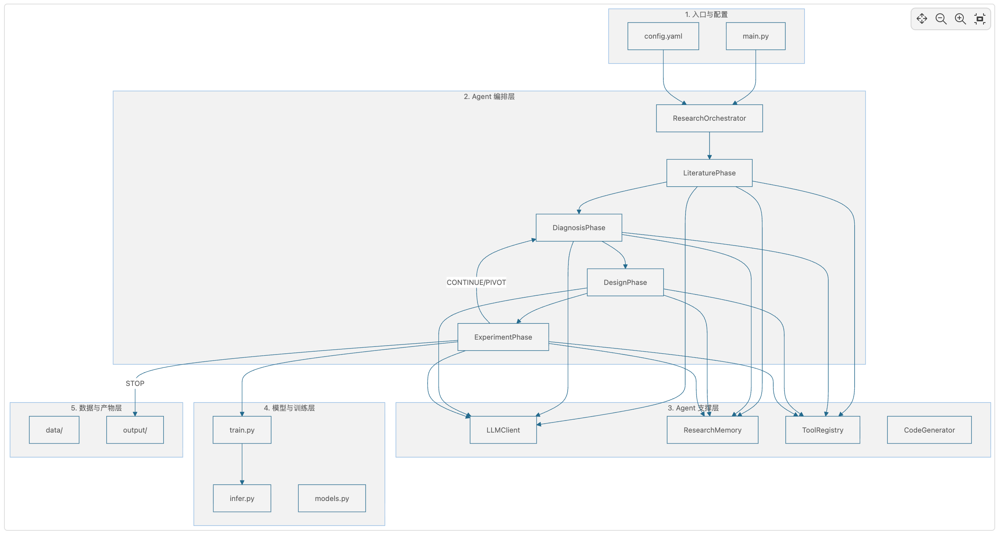
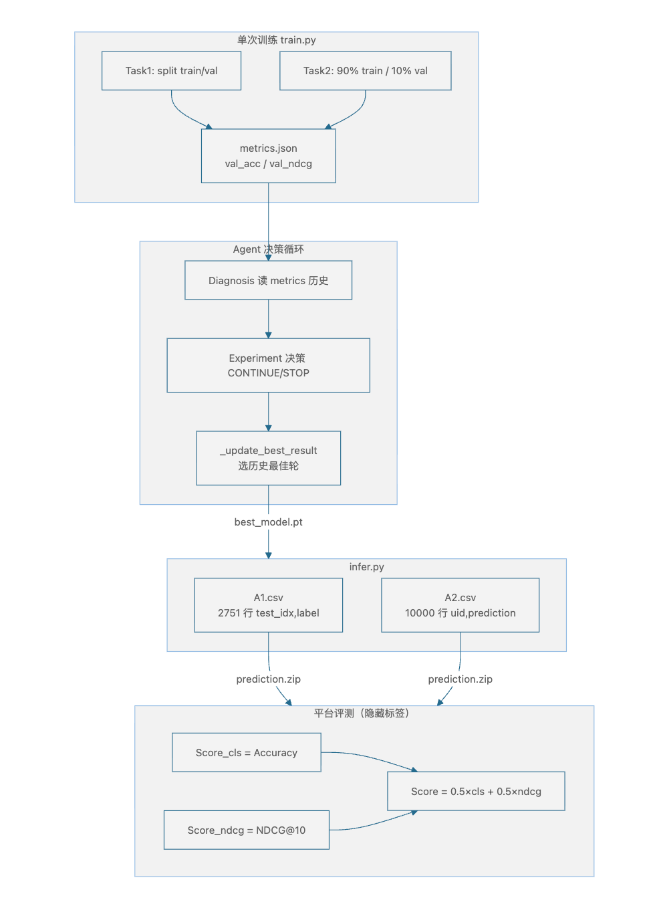

# AFAC 竞赛｜稀疏反馈 Baseline 框架学习笔记

> **赛题全称**：稀疏反馈下的自动化实验控制（AFAC 金融场景图学习）  
> **代码路径**：`framework/`  
> **核心任务**：Task 1 产品分类（图节点分类）+ Task 2 产品推荐（序列推荐）  
> **评测指标**：Accuracy（分类）+ NDCG@10（推荐），加权平均为最终得分

## 一、一句话总结

这个 Baseline 把 **大语言模型（LLM）** 和 **四阶段科研闭环** 结合起来，在有限实验预算内自动完成「读数据 → 诊断瓶颈 → 改配置/代码 → 跑训练 → 记记忆 → 决定下一步」，最终输出 `A1.csv` 与 `A2.csv` 并打包为 `prediction.zip`；Agent 不发明新算法，而是在 **GCN/GraphSAGE/GAT** 与 **GRU4Rec/SASRec** 等候选模型间做定向搜索与超参优化。

## 二、符号与术语定义

- **$\mathcal{F}$（搜索空间）**：
  - **含义**：Agent 可尝试的全部实验配置集合。
  - **组成**：模型类型（`model_type`）、隐藏维度（`hidden_dim`）、学习率（`lr`）、Dropout、训练轮数（`epochs`）等超参数，以及少量代码修改。
- **$b$（Budget，实验预算）**：
  - **含义**：每个任务允许运行的最大实验轮数。
  - **默认**：`config.yaml` 中 `research.budget = 10`。
- **$o_t$（稀疏反馈 / Observation）**：
  - **含义**：第 $t$ 轮实验后 Agent 能观察到的信号，**不是**测试集真实标签。
  - **Task 1 示例**：`val_acc`、`val_loss`、`train_acc`（来自内部验证集划分）。
  - **Task 2 示例**：`val_ndcg`、`val_hit`、`val_mrr`。
- **$a_t$（动作 / Action）**：
  - **含义**：Agent 在第 $t$ 轮决定的下一轮实验调整。
  - **实现**：写入 `config_update.json`，或通过 LLM 生成代码 diff。
- **决策三元组 $\{CONTINUE, PIVOT, STOP\}$**：
  - **CONTINUE**：当前方向有效，继续沿同一路径优化（回到 Diagnosis）。
  - **PIVOT**：方向不对，换策略重新分析（回到 Literature）。
  - **STOP**：已达最优或预算耗尽，终止并打包提交。

## 三、问题定义

赛题将金融模型研发中的实验优化过程，抽象为一个**受控的序列决策问题**。

**1. 数学上的定义（用术语怎么说）：**

要在有限预算 $B$ 内，从配置空间 $\mathcal{F}$ 中找到使验证指标最大化的实验序列 $\{\theta_1, \theta_2, \dots, \theta_T\}$，最终在测试集上输出最优预测：

$$
\theta^* = \arg\max_{\theta \in \mathcal{F}} \mathcal{M}(\theta, \mathcal{D}_{test})
$$

其中 $\mathcal{M}$ 为评测指标（Task 1 为 Accuracy，Task 2 为 NDCG@10），$\mathcal{D}_{test}$ 为隐藏标签的测试集。

*通俗说*：在只能跑有限次实验、每次只能看到验证集反馈的条件下，自动找到「当前最好的模型配置」，并生成提交文件。

**2. 赛题设定的三大核心约束：**

- **约束一：有限预算（Limited Budget）**
  - 每任务最多 `budget` 轮实验，禁止无限调参。
  - **后果**：Agent 必须在「探索新方向」与「深挖当前方向」之间做权衡。

- **约束二：稀疏反馈（Sparse Feedback）**
  - 训练节点/用户的历史信息较少；测试标签完全隐藏。
  - Agent 只能依赖 `metrics.json` 中的验证指标、训练日志、错误信息。
  - **后果**：决策带有不确定性，需要记忆系统积累跨轮经验。

- **约束三：禁止并行（No Parallelism）**
  - 每轮只能串行执行一个实验配置。
  - **后果**：搜索效率低于传统 AutoML 的并行网格搜索，更强调决策质量。

**3. 从控制论视角的 POMDP 建模：**

| 要素 | 本框架中的对应 |
|------|---------------|
| 状态空间 $\mathcal{S}$ | 当前实验配置 + 历史记忆（`ResearchMemory`） |
| 观察空间 $\mathcal{O}$ | `val_acc` / `val_ndcg`、训练耗时、错误日志 |
| 动作空间 $\mathcal{A}$ | 超参调整、模型切换、代码修改 |
| 奖励函数 $R$ | 验证集指标提升量 |
| 终止条件 | budget 耗尽 / 早停 / LLM 建议 STOP |

> **总结赛题定义的问题**：如何在**不访问测试标签、不并行跑实验**的前提下，构建一个能自主组织多轮实验、利用稀疏反馈、形成优化策略并输出高质量预测结果的 Agent 系统。

## 四、相关工作

将现有「自动化 ML 实验」方案分为三大流派，并对比本 Baseline 的定位：

| 流派 | 代表方法 | 他们的做法 | 本 Baseline 的差异 |
| :--- | :--- | :--- | :--- |
| **传统 AutoML 派** | 网格搜索、贝叶斯优化、Optuna | 在固定搜索空间中自动寻优超参数，通常假设可并行、反馈密集 | 本框架是**串行决策循环**，每轮由 LLM 推理「为什么改、改什么」，而非盲搜 |
| **多 Agent 协作派** | R&D-Agent、AutoML-Agent、AlphaLab | Researcher 提想法 + Developer 写代码，或多 Agent 并行探索 | 本框架采用**单 Agent 四阶段串行**，结构更紧凑，适合竞赛预算约束 |
| **记忆增强搜索派** | MLEvolve、I-MCTS | 图结构记忆 + MCTS 树搜索，实现探索-利用平衡 | 本框架用 **CONTINUE/PIVOT/STOP** + `ResearchMemory` 实现轻量记忆，依赖 LLM 语义判断而非 UCT |

**本 Baseline 在生态位中的定位：**

| 维度 | 本框架 | 对比参考 |
|------|--------|---------|
| Agent 架构 | 单 Agent 四阶段串行 | R&D-Agent 双 Agent 并行 |
| 优化粒度 | 配置超参为主 + 轻量代码修改 | MLEvolve 全算法发现 |
| 记忆机制 | 结构化 JSON + 趋势分析 | MLEvolve 图参考边 + 动态记忆 |
| 鲁棒性 | LLM 降级 + 启发式后备 | 多数工作假设 LLM 始终可用 |
| 应用场景 | 竞赛型图分类 + 推荐 | AlphaLab 覆盖 CUDA/预训练等 |

## 五、框架核心贡献

本 Baseline 的核心价值，是将「人类研究员的实验优化流程」工程化为可自动执行的 Agent 系统，主要创新点如下：

#### 创新点 1：四阶段科研闭环（核心骨架）

- **之前的同行**：AutoML 只做超参搜索，不涉及「理解数据、诊断瓶颈、设计修改」。
- **本框架的做法**：将科研过程拆解为四个可执行阶段，形成完整闭环：

```
Literature → Diagnosis → Design → Experiment
    ↑                              ↓
    └──────── PIVOT ───────────────┘
                   CONTINUE（回到 Diagnosis）
                   STOP（打包提交）
```

- **关键突破**：每一轮实验的决策（CONTINUE/PIVOT/STOP）由 LLM 结合历史记忆推理得出，而非固定规则。

#### 创新点 2：结构化实验记忆（克服「无记忆搜索」）

- **之前的同行**：每轮实验独立，历史经验无法复用。
- **本框架的做法**：`ResearchMemory` 实现三层记忆：
  1. **实验记录层**：`ExperimentRecord` 记录每轮配置、指标、决策
  2. **最佳结果追踪层**：`get_best_iteration()` 跨轮追踪最优
  3. **阶段性知识持久化层**：文献摘要、诊断报告、设计笔记均存为 JSON，支持 `--resume` 恢复

#### 创新点 3：LLM 是加速器而非必需品（优雅降级）

- **之前的同行**：LLM API 失败则整个流程中断。
- **本框架的做法**：所有 LLM 调用失败时返回空值，各阶段均有启发式后备逻辑：
  - LiteraturePhase → 默认总结
  - DiagnosisPhase → 「首次实验」默认假设
  - DesignPhase → 正则提取 `config_update.json`
  - ExperimentPhase → 基于指标趋势的规则决策

#### 创新点 4：两层代码分离（Agent 系统 vs 预测器代码）

- `agent/`：Agent 编排与决策逻辑，修改需谨慎
- `code/`：模型与训练代码，**Agent 主要优化对象**，可自由改写

## 六、系统算法与流程

### 6.1 整体架构（五大模块）



| 模块 | 目录/文件 | 职责 |
|------|-----------|------|
| **1. 入口与配置** | `main.py`, `config.yaml`, `agent/config.py` | 解析参数、加载配置、启动系统 |
| **2. Agent 编排层** | `orchestrator.py`, `phases.py` | 四阶段调度、迭代决策、停止条件、提交打包 |
| **3. Agent 支撑层** | `llm_client.py`, `memory.py`, `tools.py`, `code_generator.py` | LLM 调用、实验记忆、工具执行、代码生成 |
| **4. 模型与训练层** | `code/*.py` | 算法实现、训练推理（Agent 优化对象） |
| **5. 数据与产物层** | `data/`, `output/` | 竞赛数据、日志、提交文件 |

### 6.2 主编排器：`ResearchOrchestrator`

**单任务执行流程：**

```
Phase 1 Literature（仅第 1 次）
    ↓
while decision in (CONTINUE, PIVOT):
    Phase 2 Diagnosis
    Phase 3 Design(diagnosis_result)
    Phase 4 Experiment(iteration)
    → 更新 decision、best_results
    ↓
_finalize(task_id) → output/submission/A{N}.csv
```

**停止条件（`_should_stop`）：**

| 条件 | 触发规则 |
|------|---------|
| budget 耗尽 | `iteration >= budget` |
| 全局超时 | `elapsed >= time_limit`（默认 3600s） |
| 早停 | 连续 `early_stop_patience` 轮无提升 |
| LLM 建议 STOP | `decision == "STOP"` |
| 连续 PIVOT 过多 | `pivot_count >= 3` |

### 6.3 四阶段详解

#### Phase 1：LiteraturePhase（文献解析）

| 步骤 | 方法 | 输出 |
|------|------|------|
| 读 README | `_read_readme()` | 赛题说明文本 |
| 探查数据 | `tools.inspect_data()` | 节点数、特征维度、类别数等 |
| 审查代码 | `tools.summarize_code()` | 类/函数结构摘要 |
| LLM 总结 | `llm.chat()` | `literature_summary.json` |

#### Phase 2：DiagnosisPhase（瓶颈诊断）

| 步骤 | 方法 | 输出 |
|------|------|------|
| 读历史 | `memory.get_history("task{N}")` | 实验记录列表 |
| 趋势分析 | `_analyze_trend()` | 上升/停滞/下降 |
| LLM 诊断 | `llm.chat_json()` | 瓶颈 + 1~3 个假设 |
| 持久化 | `_save_phase_output()` | `diagnosis_report.json` |

假设结构示例：

```json
{
  "description": "增大 hidden_dim（128→256）",
  "expected_improvement": "提升模型表达能力",
  "test_method": "对比实验"
}
```

#### Phase 3：DesignPhase（代码设计）

| 步骤 | 方法 | 输出 |
|------|------|------|
| 取主假设 | `hypotheses[0]` | 优化方向 |
| LLM 生成修改 | `_generate_code_changes()` | diff 或配置说明 |
| 应用变更 | `_apply_code_changes()` | `config_update.json` |
| 语法验证 | `tools.validate_code()` | AST 检查 |
| Smoke Test | `tools.smoke_test_model()` | 前向传播测试 |

> **实现特点**：当前以**配置参数更新**为主（写入 `config_update.json`），LLM 生成的 diff 通常不直接写回 `code/` 文件。

#### Phase 4：ExperimentPhase（实验验证）

| 步骤 | 命令/方法 | 产物 |
|------|----------|------|
| 合并配置 | TaskConfig + config_update.json | 完整训练参数 |
| 训练 | `tools.run_training()` → `train.py` | `best_model.pt`, `metrics.json` |
| 推理 | `infer.py` | `A{N}.csv` |
| LLM 决策 | `llm.analyze_experiment()` | CONTINUE/PIVOT/STOP |
| 写记忆 | `memory.add_record()` | 实验记录 |

### 6.4 Agent 支撑组件

#### `LLMClient`（`agent/llm_client.py`）

- 兼容 OpenAI Chat Completions API（DashScope / DeepSeek 等）
- API 失败返回空字符串，不抛异常
- 关键方法：`chat()`、`chat_json()`、`analyze_experiment()`、`generate_code()`

#### `ResearchMemory`（`agent/memory.py`）

```python
memory.add_record(task, round, phase, config, metrics, feedback, duration)
memory.get_history("task1")       # Diagnosis 读取历史
memory.get_best_iteration(task_id)  # 获取最佳轮次
memory.is_improving(window=3)     # 早停判断
memory.save(task_id)              # 持久化 research_memory.json
```

最佳结果比较优先级：`val_acc` > `val_ndcg` > `val_mrr` > 其他数值指标。

#### `ToolRegistry`（`agent/tools.py`）

| 工具名 | 功能 |
|--------|------|
| `inspect_data` | 探查 npz/csv/json 数据结构 |
| `summarize_code` | AST 分析代码结构 |
| `validate_code` | `ast.parse` 语法检查 |
| `smoke_test_model` | 模型前向传播测试 |
| `run_training` | 执行 `code/train.py` |
| `run_inference` | 执行 `code/infer.py` |
| `analyze_log` | 解析训练日志中的 loss/acc/ndcg |

### 6.5 预测器代码层（`code/`）

#### Task 1：图节点分类

| 模型 | 类名 | 核心机制 |
|------|------|---------|
| GCN | `GCNLayer` + `GNNClassifier` | 对称归一化邻接矩阵传播 |
| GraphSAGE | `SAGELayer` + `GNNClassifier` | 均值聚合 + 拼接（**默认**） |
| GAT | `GATLayer` + `GNNClassifier` | 单头图注意力 |

数据流：`A1.npz` → `GraphDataset.load()` → 全图前向 → 验证集 Accuracy → `A1.csv`

#### Task 2：序列推荐

| 模型 | 类名 | 核心机制 |
|------|------|---------|
| GRU4Rec | `GRU4Rec` | GRU 编码序列 + 点积打分（**默认**） |
| SASRec | `SASRec` | Self-Attention 序列建模 |

数据流：`rec_data/` → `load_rec_data()` → BPR/CE 训练 → 验证集 NDCG@10 → `A2.csv`

## 七、评估方法

### 7.1 竞赛官方评测指标

#### Task 1：分类准确率（Accuracy）

- **定义**：测试节点上预测类别与真实类别一致的平均比例。
- **内部验证**：Agent 使用 `train_idx` 自行划分验证集，以 `val_acc` 作为稀疏反馈信号。
- **提交格式**：`test_idx,label`，共 2751 行预测（A 榜）。

#### Task 2：归一化折损累积增益（NDCG@10）

- **定义**：对每个测试用户，检查隐藏目标 item 是否出现在 Top-10 推荐列表中及其排位，再对全部用户取平均。
- **内部验证**：以 `val_ndcg` 作为稀疏反馈信号。
- **提交格式**：`uid,prediction`，共 10000 行，每行 10 个 item id（逗号分隔）。

#### 最终得分

$$
Score_{final} = 0.5 \times Score_{cls} + 0.5 \times Score_{ndcg}
$$

### 7.2 提交文件校验规则

| 文件 | 校验项 | 常见失败原因 |
|------|--------|-------------|
| `A1.csv` | 列名 `test_idx,label`；2751 行；label 为合法类别整数 | 行数不对、列名错误 |
| `A2.csv` | 列名 `uid,prediction`；10000 行；每行 10 个合法 iid | **仅表头无数据**（训练失败） |
| `prediction.zip` | 仅含 `A1.csv` + `A2.csv` | 多余文件、A2 为空 |

### 7.3 Agent 过程评估（B 榜 / 复审）

过程日志 `trajectory_B{N}.json` 需记录（不参与 A 榜分数，用于复审）：

1. 实验轮次
2. 当前实验配置（模型架构、超参数）
3. Agent 接收的反馈信息（验证指标、训练日志）
4. 基于反馈的下一轮优化策略

### 7.4 Agent 内部评估信号（稀疏反馈）

Agent 每轮实验后读取的 `metrics.json`：

| 任务 | 主要反馈指标 | 辅助指标 |
|------|-------------|---------|
| Task 1 | `val_acc` | `val_loss`, `train_acc`, `learning_rate` |
| Task 2 | `val_ndcg` | `val_hit`, `val_mrr`, `train_loss` |

## 八、实验设置、模块拆解与关键发现

### 8.1 默认实验配置（`config.yaml`）

```yaml
llm:
  model: "deepseek-v4-flash"
  base_url: "https://api.deepseek.com"

research:
  budget: 10          # 每任务最大实验轮数
  time_limit: 3600    # 全局时间限制（秒）
  early_stop_patience: 3

tasks:
  task1:
    model_type: sage
    hidden_dim: 128
    lr: 0.01
    epochs: 100
  task2:
    model_type: gru4rec
    embedding_dim: 64
    lr: 0.001
    epochs: 30
```

### 8.2 数据集规模（A 榜）

| 任务 | 节点/用户数 | 特征维度 | 类别/物品数 | 测试规模 |
|------|------------|---------|------------|---------|
| Task 1 分类 | 13752 节点 | 767 维 | 10 类 | 2751 测试节点 |
| Task 2 推荐 | 50000 用户 | — | 2156 物品 | 10000 测试用户 |

### 8.3 Agent 在两个任务中分别优化什么

#### Task 1：产品分类

| 优化层次 | 具体内容 |
|---------|---------|
| L1 超参数 | `hidden_dim`, `lr`, `dropout`, `epochs`, `early_stop` |
| L2 模型架构 | `sage` ↔ `gat` ↔ `gcn` |
| L3 训练策略 | 验证集划分方式、学习率调度、早停 |
| L4 代码逻辑 | 通过 LLM 改 `models.py`（能力存在，当前较少触发） |

典型优化链路：

```
Diagnosis: "val_acc=0.59，过拟合"
    → Design: hidden_dim 128→256, lr 0.01→0.005
    → Experiment: train.py --model_type sage --hidden_dim 256 --lr 0.005
    → 决策: CONTINUE 或 STOP
```

#### Task 2：产品推荐

| 优化层次 | 具体内容 |
|---------|---------|
| L1 超参数 | `embedding_dim`, `hidden_dim`, `lr`, `batch_size`, `epochs` |
| L2 模型架构 | `gru4rec` ↔ `sasrec` |
| L3 训练策略 | BPR vs CE 损失、负采样数、序列最大长度 |
| L4 代码逻辑 | 推理 Top-K 策略、后处理 |

### 8.4 两任务对比一览

| 维度 | Task 1 分类 | Task 2 推荐 |
|------|-------------|-------------|
| 问题类型 | 图节点分类 | 序列推荐 / 链接预测 |
| 候选模型 | GCN, GraphSAGE, GAT | GRU4Rec, SASRec |
| 默认模型 | GraphSAGE (`sage`) | GRU4Rec (`gru4rec`) |
| 核心算法 | 图神经网络消息传递 | RNN / Self-Attention |
| 稀疏反馈 | `val_acc` | `val_ndcg` |
| 数据输入 | 单文件 `.npz` | 目录（csv 文件集） |
| 提交格式 | `test_idx,label` | `uid,prediction`（10 个 item） |

### 8.5 运行方式

**完整 Agent 流程：**

```bash
cd framework
python main.py --task 1 --task 2 --budget 10 --device cpu
```

**绕过 Agent，直接训练推理：**

```bash
# Task 1
python code/train.py --task task1 --data_path data/cls_data/A1.npz \
  --model_type sage --epochs 100 --output_dir output/task1
python code/infer.py --task task1 --data_path data/cls_data/A1.npz \
  --checkpoint output/task1/best_model.pt --output_path output/submission/A1.csv

# Task 2
python code/train.py --task task2 --data_path data/rec_data \
  --model_type gru4rec --epochs 30 --output_dir output/task2
python code/infer.py --task task2 --data_path data/rec_data \
  --checkpoint output/task2/best_model.pt --output_path output/submission/A2.csv

# 打包提交
cd output/submission && zip ../prediction.zip A1.csv A2.csv
```

### 8.6 输出目录结构

```
output/
├── task1/
│   ├── best_model.pt
│   ├── A1.csv
│   ├── metrics.json
│   └── task1/
│       ├── literature_summary.json
│       ├── diagnosis_report.json
│       ├── design_notes.json
│       ├── config_update.json
│       └── experiment_N_report.json
├── task2/                    # 结构同 task1
├── submission/
│   ├── A1.csv
│   ├── A2.csv
│   ├── trajectory.json
│   └── trajectory_task{N}.json
└── prediction.zip
```

### 8.7 已知问题与注意事项

| 问题 | 原因 | 影响 |
|------|------|------|
| A2.csv 为空（仅表头） | `config_update.json` 误写入 `model_type: "args"`，训练秒退 | 评测失败 |
| LLM 401 Unauthorized | 未加载 `config.yaml`，默认走 DashScope 端点 | LLM 阶段全部降级 |
| `config_update` 正则误匹配 | `model_type=args.model_type` 被解析为 `args` | Task 2 训练参数错误 |

**设计要点总结：**

1. **两层代码分离**：`agent/` 是系统本身；`code/` 是 Agent 可改写的预测器。
2. **配置驱动优化**：Design 阶段主要通过 `config_update.json` 调参，而非大规模重写代码。
3. **LLM 降级机制**：API 失败时各阶段有启发式后备，保证流程不中断。
4. **提交格式严格**：A1 需 2751 行；A2 需 10000 行 + 每行 10 个 item id。

### 8.8 延伸研究问题（RQ）

> **总问题 RQ**：如何构建一个能够在有限计算预算下，通过自主迭代实验自动优化 ML 模型性能的 LLM Agent 系统？

| 子问题 | 核心关切 | 本框架的回应 |
|--------|---------|-------------|
| **RQ1 决策机制** | LLM 如何将推理转化为可量化提升？ | 四阶段闭环 + CONTINUE/PIVOT/STOP |
| **RQ2 记忆积累** | 如何利用历史经验指导未来决策？ | `ResearchMemory` 三层记忆 + `--resume` |
| **RQ3 探索-利用** | 何时深挖、何时换方向？ | 早停 + PIVOT 限制 + LLM 语义判断 |
| **RQ4 过程评估** | 如何评估 Agent 科研过程质量？ | `trajectory_*.json` 轨迹记录 |

---


## 九、比赛的限制是什么？

> **核心结论**：赛题限制的**不是 LLM 调用次数**，而是 **实验轮次（budget）**、**串行执行**、**稀疏反馈** 和 **线上提交次数**。LLM 在代码里**没有硬性调用上限**，只受实验轮次和 API 成本间接约束。

### 9.1 两层约束体系

```
┌─────────────────────────────────────────────────────────────┐
│  第一层：官方竞赛规则（竞赛说明.txt，平台强制执行）            │
│  → 提交格式、每日提交次数、稀疏监督、禁止并行实验、代码体积   │
├─────────────────────────────────────────────────────────────┤
│  第二层：Baseline 框架内置约束（config.yaml + orchestrator）  │
│  → budget、time_limit、early_stop、训练超时、串行调度        │
└─────────────────────────────────────────────────────────────┘
```

两层约束**相互独立**：即使你把 `budget` 设为 100，官方仍要求你每天最多提交 3 次 `prediction.zip`；即使 LLM 调用无限次，框架也只会串行跑 `budget` 轮实验。

---

### 9.2 官方竞赛约束（平台规则）

来源：`竞赛说明.txt`

| 约束类型 | 官方规定 | 是否限制 LLM 次数 |
|---------|---------|------------------|
| **实验预算** | 强调「有限预算、稀疏反馈、禁止并行」 | ❌ 未规定 LLM 调用上限 |
| **稀疏反馈** | 测试标签隐藏；只能看验证集指标等间接信号 | ❌ |
| **禁止并行** | 每次只能运行一个实验，必须串行决策 | ❌ |
| **A 榜提交** | `prediction.zip`（A1.csv + A2.csv），**每天最多 3 次** | ❌ |
| **B 榜提交** | 预测结果 + `trajectory_B1/B2.json`，每天最多 3 次，单文件 ≤ 100MB | ❌ |
| **代码提交** | 压缩包 ≤ 1GB；预测器需轻量（GNN/序列模型，非本地大模型） | ❌ |
| **LLM API** | 赛题允许使用 Qwen 系列 API | ✅ 仅规定「可用」，无次数上限 |

**「有限预算」在官方语境中指什么？**

官方描述的是**实验轮次/计算资源**受限的科研场景（如只能跑 10~20 次训练），**不是** API token 配额。Baseline 用 `research.budget` 参数来模拟这一约束。

---

### 9.3 Baseline 框架内置约束（代码实现）

#### 9.3.1 实验轮次预算 `budget`（最核心的限制）

**配置入口**：

```yaml
# config.yaml
research:
  budget: 10   # 每任务最大实验轮数
```

```python
# main.py — 命令行可覆盖
parser.add_argument("--budget", type=int, default=10)
config.research.budget = args.budget
```

**执行逻辑**（`orchestrator.py`）：

```python
# run_task() 中的迭代循环
while decision in (CONTINUE, PIVOT):
    self._iteration_counters[task_id] = iteration + 1
    current_iter = self._iteration_counters[task_id]
    # ... Diagnosis → Design → Experiment ...

# _should_stop() 条件 1
budget = self._get_task_budget(task_id)
if iteration >= budget:
    return True  # 达到预算上限，停止
```

**含义**：
- `budget=10` 表示每个任务（Task 1 / Task 2）最多跑 **10 轮** `Diagnosis → Design → Experiment`
- 每轮 Experiment 会触发 **1 次完整训练**（`train.py`），可能耗时数分钟到数十分钟
- Literature 阶段**不计入** budget（只在任务开始时执行 1 次）

**与 `max_iterations` 的区别**：

```yaml
# config.yaml 中有此字段，但 orchestrator 并未使用！
max_iterations: 20
```

`max_iterations` 仅在 `main.py` 写入 `ResearchConfig`，**`orchestrator.py` 中没有任何引用**。实际控制迭代的是 `budget`，不是 `max_iterations`。这是配置里的一个「死字段」。

---

#### 9.3.2 全局时间限制 `time_limit`

```python
# orchestrator.py — _check_time_limit()
elapsed = time.time() - self.start_time
if elapsed >= time_limit:  # 默认 3600 秒 = 1 小时
    return True
```

- 从 `ResearchOrchestrator` 初始化时计时，**跨所有任务共享**
- Task 1 跑太久会导致 Task 2 被跳过（`run()` 里有 `if self._check_time_limit(): break`）
- 设为 `0` 表示无限制

---

#### 9.3.3 Agent 级早停 `early_stop_patience`

```python
# orchestrator.py — _check_early_stop()
patience = research_config.early_stop_patience  # 默认 3
# 检查最近 patience 轮的主要指标是否连续无提升
if no_improve_count >= patience:
    return True  # 触发早停
```

- 作用对象：**Agent 迭代轮次**（跨实验的 meta-level 早停）
- 与 `train.py` 里的 `EarlyStopping(patience=20)` **不是同一回事**（那是单次训练内的 epoch 早停）

**两套早停对比**：

| 早停类型 | 配置项 | 作用范围 | 代码位置 |
|---------|--------|---------|---------|
| Agent 迭代早停 | `research.early_stop_patience=3` | 连续 3 轮实验无提升则停 | `orchestrator._check_early_stop` |
| 单次训练早停 | `tasks.task1.early_stop=20` → `--patience 20` | 单次 train.py 内 epoch 无提升则停 | `code/utils.py EarlyStopping` |

---

#### 9.3.4 连续 PIVOT 限制

```python
# orchestrator.py — run_task() 迭代末尾
if decision == PIVOT:
    self._pivot_counters[task_id] += 1
    if self._pivot_counters[task_id] >= 3:
        decision = STOP  # 连续换方向 3 次，强制停止
else:
    self._pivot_counters[task_id] = 0  # CONTINUE 时重置
```

防止 Agent 在无效方向上反复「换策略」而浪费 budget。

---

#### 9.3.5 训练 / 推理超时（计算资源约束）

```python
# tools.py — _run_training()
exec_result = self._shell_exec(cmd, timeout=1800)  # 单次训练最长 30 分钟

# phases.py — ExperimentPhase 推理
subprocess.run(infer_cmd, timeout=300)  # 推理最长 5 分钟
```

```python
# llm_client.py
self.timeout = 120  # 单次 LLM API 请求最长 120 秒
```

---

#### 9.3.6 禁止并行（代码如何保证串行）

**任务级串行**：

```python
# orchestrator.py — run()
for task_id, task_config in tasks.items():
    result = self.run_task(task_id)  # Task 1 完成后才跑 Task 2
```

**实验级串行**：

```python
# run_task() 中的 while 循环
while decision in (CONTINUE, PIVOT):
    diag_result = diag_phase.run()      # 做完才进入 Design
    design_result = des_phase.run(...)  # 做完才进入 Experiment
    exp_result = exp_phase.run(...)     # 做完才决策下一轮
```

**训练级串行**：`tools.run_training()` 是阻塞调用，等 `train.py` 进程结束才返回，不会同时起多个训练进程。

---

### 9.4 LLM 调用：不受次数限制，但受轮次间接约束

#### 9.4.1 代码里没有 LLM 调用计数器

`LLMClient` 只有 `call_history` 用于**日志记录**，没有任何 `max_calls` 或配额检查：

```python
# llm_client.py
def chat(self, system_prompt, user_prompt, ...):
    if not self.api_key or not self.base_url:
        return ""  # 无 key 则跳过，不计入限制
    # ... 调用 API，记录到 call_history ...
```

#### 9.4.2 每轮迭代实际调用几次 LLM？

| 阶段 | 触发频率 | LLM 调用次数 | 代码位置 |
|------|---------|-------------|---------|
| Literature | 每任务 1 次 | **1 次** | `phases.py` → `_generate_literature_summary()` → `llm.chat()` |
| Diagnosis | 每迭代 1 次 | **2 次** | `_generate_diagnosis()` + `_extract_diagnosis_structured()` |
| Design | 每迭代 1 次 | **1 次** | `_generate_code_changes()` → `llm.chat()` |
| Experiment | 每迭代 1 次 | **1 次** | `_make_decision()` → `llm.chat()` |

**估算**（`budget=10`，跑两个任务）：

```
Task 1: 1 (Literature) + 10 × (2+1+1) = 41 次 LLM 调用
Task 2: 同上 = 41 次
合计约 82 次（LLM 可用时）
```

LLM 不可用时全部降级为启发式逻辑，**调用次数为 0，流程仍继续**。

#### 9.4.3 LLM 与 budget 的关系

```
budget ↑  →  迭代轮次 ↑  →  LLM 调用次数 ↑（线性关系）
budget ↓  →  迭代轮次 ↓  →  LLM 调用次数 ↓
```

**限制 LLM 开销的实际手段**：减小 `--budget`，而非配置 LLM 专用配额。

---

### 9.5 稀疏反馈约束（代码如何体现）

官方规定：测试集标签隐藏，Agent 只能利用有限中间反馈。

**Task 1 — 自行划分验证集**（`train.py`）：

```python
# train.py — train_task1()
train_idx, val_idx = split_train_val(data['train_idx'], val_ratio=args.val_ratio)
# 只在 train_idx 上训练，在 val_idx 上算 val_acc
# test_idx 的标签永远是 -1，不参与训练
```

**Task 2 — 从训练集划分验证集**（`train.py`）：

```python
# train.py — train_task2()
val_size = int(n_train * args.val_ratio)  # 默认 10%
# 从 train.csv 的 40000 用户中划出 4000 做验证
# test.csv 的目标 item 隐藏，只用于最终 infer.py 推理
```

**Agent 能看到的反馈**（`tools.py` → `ExperimentPhase`）：

```python
# tools.py — _run_training() 训练成功后
with open(metrics_path) as f:
    loaded = json.load(f)
    result["metrics"] = {k: v[-1] for k, v in loaded.items()}  # 取最后一轮指标
```

Agent **永远看不到**测试集真实标签，只能根据 `val_acc` / `val_ndcg` 做决策——这就是「稀疏反馈」在代码里的具体含义。

---

### 9.6 约束总结对照表

| 约束 | 官方要求 | Baseline 代码实现 | 配置项 |
|------|---------|------------------|--------|
| 实验预算 | 有限轮次 | `iteration >= budget` 停止 | `--budget 10` |
| 时间限制 | 未明确规定 | 全局 `time_limit` 秒 | `--time_limit 3600` |
| 禁止并行 | 串行决策 | `for` 循环 + 阻塞 `subprocess` | 硬编码 |
| 稀疏反馈 | 测试标签隐藏 | 内部 val 划分，`metrics.json` | `val_ratio=0.1` |
| LLM 次数 | **无上限** | 无计数器，随 budget 线性增长 | 无 |
| 线上提交 | 每天 3 次 | 框架不管（需选手自行控制） | 无 |
| 训练超时 | 未明确规定 | 1800 秒 | `tools._run_training` |
| 代码体积 | ≤ 1GB（复审） | 框架不管 | 无 |

---

## 十、评估方式详解（结合代码）

评估在这个赛题里分 **三层**，容易混淆，需要分开理解：

```
┌──────────────────────────────────────────────────────────┐
│  第三层：平台官方评测（决定榜单分数）                       │
│  → 用隐藏测试标签算 Accuracy / NDCG@10                    │
├──────────────────────────────────────────────────────────┤
│  第二层：Agent 内部验证（稀疏反馈，驱动下一轮决策）         │
│  → val_acc / val_ndcg，来自自行划分的验证集               │
├──────────────────────────────────────────────────────────┤
│  第一层：过程评估（B 榜日志 / 复审答辩，不参与 A 榜分数）   │
│  → trajectory_*.json 审查 Agent 决策质量                  │
└──────────────────────────────────────────────────────────┘
```

---

### 10.1 平台官方评测（榜单分数）

来源：`竞赛说明.txt` 评分规则

$$
Score_{final} = 0.5 \times Score_{cls} + 0.5 \times Score_{ndcg}
$$

#### Task 1：Accuracy

- **定义**：A 榜 2751 个测试节点上，预测类别与真实类别一致的比例
- **类别范围**：A 榜 0~9（10 类）
- **平台侧计算**，选手代码中**没有**测试集 Accuracy 的实现

#### Task 2：NDCG@10

- **定义**：对每个测试用户，看隐藏目标 item 在 Top-10 推荐列表中的排位，再对所有用户平均
- **K 固定为 10**

---

### 10.2 Agent 内部验证指标（代码实现）

Agent 用内部验证集指标作为「稀疏反馈」，驱动 Diagnosis / Experiment 决策。

#### Task 1 内部 Accuracy（`code/train.py`）

```python
# 验证阶段
model.eval()
with torch.no_grad():
    val_logits = model(features, adj)[val_idx_t]
    val_acc = compute_accuracy(val_logits, val_labels_t)

# 保存最优模型（以 val_acc 为准）
if val_acc > best_val_acc:
    torch.save({...}, 'best_model.pt')

# 写入 metrics.json
tracker.update(val_acc=val_acc, val_loss=val_loss, ...)
tracker.save(os.path.join(args.output_dir, 'metrics.json'))
```

`compute_accuracy`（`code/utils.py`）即标准分类准确率：

```python
def compute_accuracy(logits, labels):
    preds = torch.argmax(logits, dim=1)
    return (preds == labels).float().mean().item()
```

#### Task 2 内部 NDCG@10（`code/train.py` + `code/utils.py`）

```python
# 验证阶段：对每个验证样本生成 Top-10 推荐
val_ndcg = compute_ndcg(val_predictions, val_targets_list, k=10)
val_hit = compute_hit_rate(val_predictions, val_targets_list, k=10)
val_mrr = compute_mrr(val_predictions, val_targets_list)

# 以 val_ndcg 保存最优模型
if val_ndcg > best_val_ndcg:
    torch.save({...}, 'best_model.pt')
```

`compute_ndcg` 实现（`code/utils.py`）：

```python
def compute_ndcg(predictions, targets, k=10):
    for pred_list, target in zip(predictions, targets):
        dcg = 0.0
        for i, item in enumerate(pred_list[:k]):
            if item == target:
                dcg = 1.0 / math.log2(i + 2)  # 命中则按排位折损
                break
        ndcg_scores.append(dcg)
    return np.mean(ndcg_scores)
```

这与官方 NDCG@10 定义一致（单目标 item 的 NDCG）。

---

### 10.3 Agent 如何选「最佳实验」并打包提交

#### 10.3.1 每轮实验后更新最佳结果

```python
# orchestrator.py — _update_best_result()
metric_key = self._get_task_metric_key(task_id, current_metrics)
current_value = current_metrics.get(metric_key, 0.0)
best_value = best_metrics.get(metric_key, 0.0)

if current_value > best_value:
    self._best_results[task_id] = {
        "iteration": iteration,
        "metrics": current_metrics.copy(),
        "output_files": exp_result.get("output_files", [])
    }
```

#### 10.3.2 主要指标键的选择（注意代码不一致）

```python
# orchestrator.py — _get_task_metric_key()
if task_type == 'classification':
    return 'val_acc'   # ✅ 与竞赛一致
elif task_type == 'recommendation':
    return 'val_mrr'   # ⚠️ 默认用 MRR，而非 val_ndcg
```

```python
# phases.py — ExperimentPhase._get_primary_metric_key() 同样默认 mrr
elif task_type == "recommendation":
    return 'val_mrr' if 'val_mrr' in metrics else 'mrr'
```

但 `memory.py` 的优先级列表里 **`val_ndcg` 排在 `val_mrr` 前面**：

```python
# memory.py — _get_primary_score()
for key in ["acc", "ndcg", "mrr", ..., "val_acc", "val_ndcg", "val_mrr"]:
```

**实际影响**：`train.py` 按 `val_ndcg` 保存 `best_model.pt`，但 Agent 选「历史最佳轮次」时可能按 `val_mrr` 比较——若两者趋势不一致，`_best_results` 可能不是 NDCG 最优的那轮。这是代码层面的一个值得注意的偏差。

---

### 10.4 推理与提交文件生成（代码链路）

推理**不是每轮都跑**，有前置条件（`phases.py`）：

```python
# ExperimentPhase.run()
if exp_result.get("returncode") == 0 and result["metrics"]:
    checkpoint_path = os.path.join(output_dir, "best_model.pt")
    if os.path.exists(checkpoint_path):
        # 调用 infer.py 生成 A{N}.csv
        subprocess.run([sys.executable, "infer.py", ...], timeout=300)
```

**关键条件**：
1. 训练脚本返回码为 0
2. `metrics` 非空（训练失败或秒退则跳过推理）
3. `best_model.pt` 存在

#### Task 1 提交文件（`code/infer.py`）

```python
predictions = torch.argmax(test_logits, dim=1).cpu().numpy()
result_df = pd.DataFrame({
    'test_idx': test_idx,   # 必须与官方 test_idx 一致
    'label': predictions    # 0~9 整数
})
result_df.to_csv(args.output_path, index=False)  # 2751 行 + 表头
```

#### Task 2 提交文件（`code/infer.py` → `infer_task2_v2`）

```python
# 对每个测试用户：编码历史序列 → 全 item 打分 → 排除历史 → Top-10
_, top_indices = torch.topk(scores[0], k=args.topk)  # topk=10
rec_strs = [idx2iid.get(r, str(r)) for r in top_items]

result_rows.append({
    'uid': user_id,
    'prediction': ','.join(rec_strs)  # "i000481,i000909,..."
})
# 共 10000 行用户
```

#### 最终打包（`orchestrator.py` — `_finalize`）

```python
# 从 _best_results 复制最佳 A{N}.csv 到 submission/
shutil.copy2(best_file, submission_path)

# 若无结果，生成空占位文件（⚠️ 会导致评测失败）
self._create_empty_submission(task_id, submission_path)
# → 只写表头：uid,prediction（A2 仅 15 字节）

# 保存轨迹
self._save_trajectory(task_id, submission_dir)
```

---

### 10.5 过程评估：trajectory 日志（B 榜 / 复审）

A 榜：**只提交 `prediction.zip`**，trajectory 不参与分数。

B 榜：额外提交 `trajectory_B1.json` / `trajectory_B2.json`（≤ 100MB）。

框架自动生成的轨迹（`orchestrator.py` — `_save_trajectory`）：

```python
trajectory = {
    "task_id": task_id,
    "num_iterations": len(history),
    "records": [
        {
            "round": record["round"],
            "phase": record["phase"],       # literature/diagnosis/design/experiment
            "config": record["config"],     # 实验配置
            "metrics": record["metrics"],   # 稀疏反馈
            "feedback": record["feedback"],
            "duration": record["duration"]
        }
        for record in history
    ],
    "best_result": {
        "iteration": best["iteration"],
        "metrics": best["metrics"]
    }
}
```

复审考察的是：**Agent 是否真正利用了反馈做决策**，而非轨迹里的指标高低。

---

### 10.6 评估体系全景图


---

### 10.7 评估相关常见问题（结合真实运行）

| 现象 | 代码原因 | 对评测的影响 |
|------|---------|-------------|
| A2.csv 只有表头 | 训练失败 → `metrics={}` → 跳过 infer → `_create_empty_submission` | 平台校验失败，Score_ndcg=0 |
| val_acc 高但榜单分低 | 内部 val 与测试分布不同（过拟合） | 稀疏反馈误导 Agent 决策 |
| LLM 全失败但流程跑完 | `llm.chat()` 返回 `""` → 启发式后备 | 不影响提交文件生成，但决策质量下降 |
| 某轮 val_ndcg 最高但未被选为 best | `_get_task_metric_key` 用 `val_mrr` 而非 `val_ndcg` | 可能提交了非 NDCG 最优的 checkpoint |

