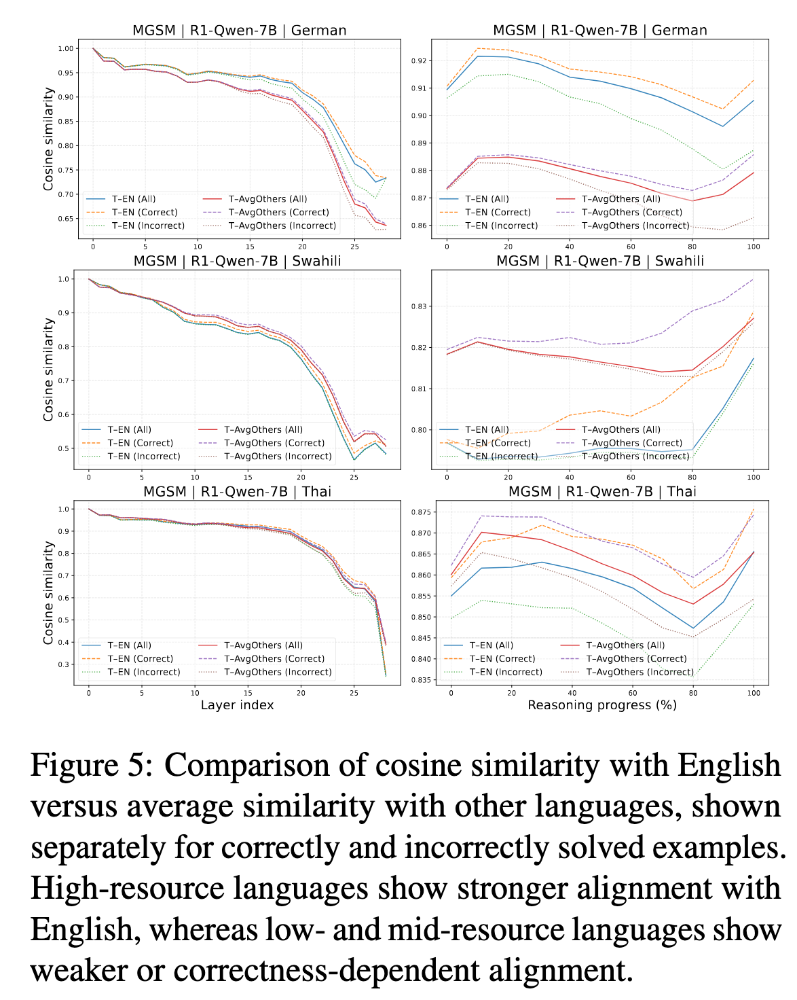
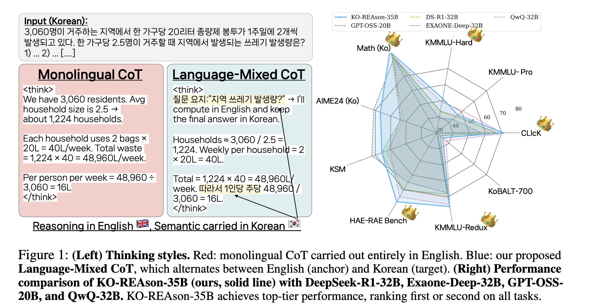
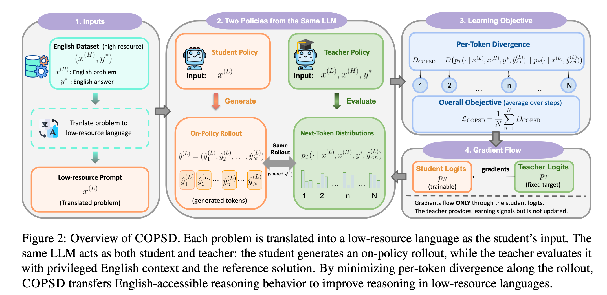
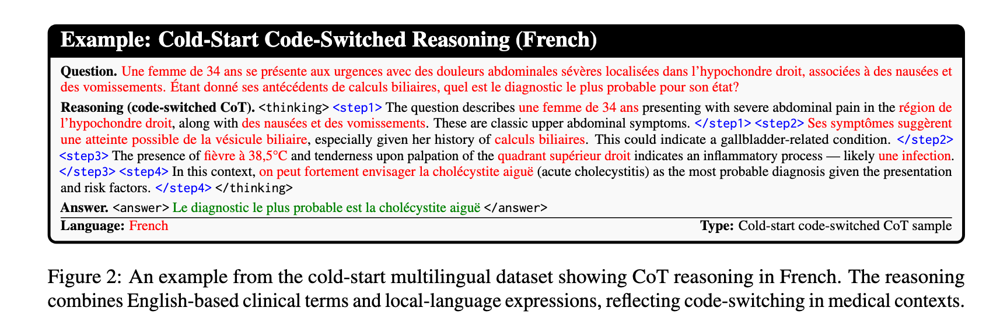

## 摘要

推理型大语言模型在数学、代码与科学任务中快速进步，但其训练数据、推理轨迹与评测长期以英语和少数高资源语言为中心。低资源语言用户面对的并不只是翻译质量下降，而是从题意解析、内部表示、推理轨迹到最终回答的整条能力链可能发生失配。本文以“英语推理中心化”为主线，综述跨语言模型蒸馏与推理研究，并将问题分为五个层次：模型宣称的语言覆盖究竟代表什么、语言输入能否进入共享推理空间、模型为何以及何时进行语码转换、教师的推理行为如何被迁移到目标语言学生、以及评测是否能区分推理正确性、语言忠实性和领域安全性。

全文按训练与评测链条组织：首先界定模型语言覆盖和语码转换，继而以答案相对可验证的数学任务分析跨语言推理差距与蒸馏机制，最后讨论对语言可及性、知识依据和安全边界要求更高的医疗场景。本文综合 PluraMath、Language-Mixed CoT、COPSD、CURE-Med、Med-CoReasoner 等工作，补充 LMU 研究者参与的语言混合与多语言潜在推理分析，并将 2024--2026 年 OPD、OPSD、MOPD 的发展置于统一的训练分布框架下。本文区分机制证据、消融证据与有限基准上的工程观察，避免将模型卡中的覆盖声明或单一排行榜增益直接解释为跨语言推理能力。

## 综述范围与方法

本文采用问题导向的叙述性综述，而非声称完成严格意义上的系统综述或元分析。检索与筛选围绕四组关键词展开：`multilingual/cross-lingual reasoning`、`code-switching/language mixing`、`knowledge/on-policy/self distillation`、`medical/math reasoning`。文献来源以 ACL Anthology、arXiv、官方技术报告和模型卡为主；本地 `Math-Beyond-English` 文献库用于建立种子集合，再沿论文引用与作者研究脉络补充工作。截止时间为 **2026 年 8 月 8 日**。

纳入正文的证据至少满足以下条件之一：提出可复现的方法或数据集；给出按语言、脚本或资源层分解的实验；提供内部表征、因果干预或消融分析；直接讨论部署风险或评测偏差。对尚未同行评审的 2026 年预印本，本文使用“作者报告”“初步证据”等措辞，不把排行榜增益视为稳定事实。模型语言数量则只记录开发者明确宣称的“支持”或“优化”范围，不用 tokenizer 能编码某种文字来推断能力。

这套方法仍有三项限制。第一，2026 年 OPD 文献更新极快，结论可能随实现和模型家族变化。第二，不同工作对“语言”“方言”“脚本”和“支持”的口径不同，因此数量只能用于描述产品定位，不能直接作为能力排名。第三，多语言医学评测仍缺少足够规模的母语临床专家验证，自动评委结果必须保守解释。

## 1. 跨语言推理不能简化为翻译

令问题语言为 $\ell_q$，中间推理语言为 $\ell_r$，最终回答语言为 $\ell_a$。一个跨语言推理系统通常被简化成“把 $\ell_q$ 翻译成英语，推理后再翻回 $\ell_a$”。这隐含了一个强假设：推理能力本身与语言无关，语言只是输入输出外壳。

现有证据并不支持这个假设。PluraMath 扩展了多语言数学评测到 18 种代表性不足语言，并在 27 个推理模型上观察到持续的高资源 - 低资源性能差距；英文 CoT 提示或回译并没有稳定消除该差距。[^pluramath] 语言混合研究则发现，模型越遇到困难的 STEM 任务，越倾向在英语、汉字或拉丁脚本之间切换；这种输出行为与中间层的脚本偏好相一致。[^langmix]

因此，跨语言推理应被写成一个链式问题，而不是单步翻译：

$$
x_{\ell_q}
\xrightarrow{\;E_{\ell_q}\;}
z
\xrightarrow{\;\pi(\ell_r,\,\mathcal{T})\;}
r_{\ell_r}
\xrightarrow{\;G_{\ell_a}\;}
y_{\ell_a}.
$$

其中 $E_{\ell_q}$ 是目标语言的输入表征，$z$ 是模型内部状态，$\pi$ 是在工具、提示或训练约束 $\mathcal{T}$ 下的推理策略，$G_{\ell_a}$ 负责最终生成。英语中心化可能发生在每一环：低资源语言无法稳定激活 $z$、推理策略偏好英语 $\ell_r$、或最终答案被英语模板覆盖。

这一区分带来三个直接后果：

1. **翻译正确不等于推理对齐。** 题目条件、数学符号、文化语境和医学术语在翻译链中都可能失真。
2. **英语推理强不等于用户得到英语答案。** 中间语言可以是能力支架，但最终输出必须满足用户语言、术语和场景约束。
3. **教师输出不能只蒸馏最终答案。** 若能力差距来自中间表示或推理策略，学生模型还需要学习何时保持目标语言、何时借用高资源语言，以及如何生成符合目标语言约束的答案。

## 2. “原生支持多少语言”究竟说明什么

讨论跨语言推理前，必须先处理一个经常被混用的概念：**语言覆盖（coverage）不是语言能力（competence），语言能力也不是推理能力（reasoning competence）。** 模型卡中的“支持 $N$ 种语言”可能表示预训练语料包含这些语言、团队针对这些语言做过后训练、产品接口允许输入输出，或只是在少量通用基准上验证过。它通常不保证长链推理、工具调用、安全对齐和专业领域能力在各语言中等价。

截至 2026 年 8 月，若严格采用开发者公开口径，几个常用开放模型家族可以作如下比较：

| 模型家族 | 官方语言口径 | 语言举例 | 解释限制 |
|---|---:|---|---|
| Gemma 3 | 超过 140 种语言 | 官方模型卡未公布完整逐语言清单 | 模型卡承认其部分安全评测仍只使用英语；覆盖面不能替代逐语言验证[^gemma3] |
| Qwen3 | 119 种语言与方言 | 简繁中文、粤语、英语、马来语、印尼语、阿拉伯语多种方言、泰语、越南语等 | “方言”与“语言”合并计数；36T token 覆盖并不意味着各语种数据均衡[^qwen3] |
| Qwen2.5 | 29 种以上 | 中英法西葡德意俄、日、韩、越、泰、阿拉伯语等 | 较早一代的公开口径更窄，可用于观察模型代际中的广度扩张[^qwen25] |
| Aya Expanse | 优化 23 种语言 | 阿拉伯语、简繁中文、英语、希伯来语、印地语、印尼语、日语、韩语、乌克兰语、越南语等 | Aya 系列还存在覆盖 101 种语言的广度路线；23 种是“以深度换广度”的设计选择[^aya] |
| Llama 3.1 | 正式支持 8 种语言 | 英语、德语、法语、意大利语、葡萄牙语、印地语、西班牙语、泰语 | 预训练见过更多语言不等于正式支持；Meta 的模型卡明确列出这 8 种[^llama31] |
| Mistral Large 2 | 未给单一总数 | 英、法、德、西、意、葡、荷、俄、中、日、韩、阿拉伯语、印地语等 | 官方页面列出“预期表现较强”的语言，同时说明未列语言也可能可用；该清单不是逐语言能力保证[^mistral2] |
| DeepSeek-R1 | 未给出通用语言总数 | 官方评测重点报告英语和中文，并明确把 language mixing 列为 R1-Zero 的问题 | 不应据此写成“只支持中英双语”；更准确的说法是官方没有给出广覆盖承诺[^deepseekr1] |

这些数字不能直接用于模型排名。Gemma 3 的“140+”、Qwen3 的“119 种语言与方言”、Aya Expanse 的“23 种优化语言”和 Llama 3.1 的“8 种正式支持语言”分别描述不同层次的覆盖范围；将其横向比较，会混淆训练数据覆盖、产品支持、生成流利度与推理能力。

### 2.1 藏语、蒙古语、维吾尔语与壮语的单独核查

下表只判断开发者是否在官方材料中**明确列出**相应语言，不依据 tokenizer 可编码、零样本偶尔生成或第三方测试结果推断“官方支持”。其中“未列入”表示官方提供了封闭或逐项列举的支持清单，但该语言不在其中；“未确认”表示官方只给出总数、示例或非穷尽清单，因而不能据公开材料作肯定或否定判断。

| 模型家族 | 藏语 | 蒙古语 | 维吾尔语 | 壮语 | 判定依据 |
|---|---|---|---|---|---|
| Gemma 3 | 未确认 | 未确认 | 未确认 | 未确认 | 官方宣称覆盖 140 种以上语言，但未发布完整逐语言清单[^gemma3] |
| Qwen3 | 未列入 | 未列入 | 未列入 | 未列入 | 官方公布的 119 种语言与方言清单中没有这四种语言[^qwen3] |
| Qwen2.5 | 未确认 | 未确认 | 未确认 | 未确认 | 官方仅列举部分语言，并以“29 种以上”概括，公开页面不足以完成逐语言核验[^qwen25] |
| Aya Expanse | 未列入 | 未列入 | 未列入 | 未列入 | 四种语言均不在官方列出的 23 种优化语言中[^aya] |
| Llama 3.1 | 未列入 | 未列入 | 未列入 | 未列入 | 四种语言均不在模型卡明确支持的 8 种语言中[^llama31] |
| Mistral Large 2 | 未列入强性能清单 | 未列入强性能清单 | 未列入强性能清单 | 未列入强性能清单 | 官方清单只代表预期表现较强的语言，并明确说明其他语言仍可能可用，故不能写成“不支持”[^mistral2] |
| DeepSeek-R1 | 未确认 | 未确认 | 未确认 | 未确认 | 模型卡未给出通用支持语言清单，公开评测主要集中于英语和中文[^deepseekr1] |

这里还需要区分语言、脚本与变体。蒙古语至少涉及传统蒙古文与西里尔蒙古文；维吾尔语存在阿拉伯字母、拉丁字母等书写形式；藏语内部存在书面语与地域变体；壮语通常指以拉丁字母为基础的规范壮文。模型对其中一种脚本可生成，不能推出其对整个语言共同体具有稳定能力。

第三方评测提供了另一层证据，但不能反向改写模型卡。MC² 语料与 MiLiC-Eval 分别覆盖藏语、维吾尔语、哈萨克语和蒙古语，并显示开放模型在低资源文字、句法密集任务与文化知识上仍有明显缺口。[^mc2][^milic] TLUE 对藏语理解与安全进行大规模评测，报告多数受测模型低于随机基线。[^tlue] 壮语方面，ZHUANGBENCH 的直接提示结果显示，当时受测模型几乎不具备可用的壮汉翻译能力；论文的改进来自在上下文中提供语法书、词典和示例，而非证明基础模型原生支持壮语。[^zhuangbench]

因此，这四种语言在后续实验中应作为**独立报告组**，逐一给出脚本、token 膨胀率、理解、生成、推理、输出语言一致性和安全结果，不应并入“中文”或“亚洲语言”平均值。就目前列出的模型而言，没有一个家族能仅凭官方公开材料同时确认对四种语言的支持。

<!-- 编辑说明：此处不建议再插入“模型支持语言地图”。两张表已承载完整的比较信息，地图会弱化“未确认”和“未列入”的口径差异。 -->

### 2.2 从模型卡到研究评测：需要四层语言能力矩阵

更可靠的项目文档应为每种语言分别报告四层证据：

1. **可编码性**：tokenizer 能否高效表示文字，是否因切词膨胀导致成本和上下文不平等。
2. **基础语言能力**：理解、生成、翻译和指令遵循是否经母语者或可靠基准验证。
3. **推理能力**：在保持题目与难度等价时，数学、逻辑、代码和领域推理是否稳定。
4. **对齐与安全能力**：输出语言、拒答、安全策略和不确定性表达是否跨语言一致。

因此，本文后续不把“原生支持”当作二值属性，而把语言 $\ell$ 上的能力写成向量：

$$
\mathbf{c}_{\ell}
=
\big(c_{\text{token}},c_{\text{language}},c_{\text{reason}},c_{\text{align}},c_{\text{domain}}\big).
$$

一个模型可以在 $c_{\text{language}}$ 上流利，却在 $c_{\text{reason}}$ 或 $c_{\text{align}}$ 上明显落后。英语中心化讨论的正是这些维度之间的不对称，而不是模型是否“认识”某种语言。

## 3. 研究史：从跨语言表示对齐到推理语言控制

跨语言蒸馏可粗略分为四个阶段。

| 阶段 | 核心问题 | 代表路线 | 主要局限 |
|---|---|---|---|
| 表示蒸馏 | 小模型能否保留多语言表示 | mBERT/XLM-R 的 hidden state、attention 蒸馏 | 通常不涉及长推理与生成 |
| 翻译桥接 | 英语模型如何服务其他语言 | translate-test、回译、MT encoder + LLM | 延迟高，误差级联，容易丢失语境 |
| 推理蒸馏 | 如何迁移教师的 CoT / RL 行为 | 英语 CoT、mixed-CoT、rationale distillation、on-policy distillation | 容易把英语中心化固化为学生行为 |
| 推理机制与控制 | 模型为什么混语，如何选择推理语言 | script control、adaptive routing、latent probing、layer swap | 机制证据尚难直接转成通用训练法 |

早期 LightMBERT 说明，跨语言能力并不只存在于最终分类头，而分布在 embedding、attention 与隐藏表示中；保护和蒸馏这些对齐结构，可以让更小学生接近多语言教师的零样本迁移能力。[^lightmbert] 随后，Self-Distillation for Model Stacking 将 NLLB 类机器翻译编码器与英语 LLM 表征空间对齐，尝试让 200 多种语言直接进入 LLM 的知识空间，而不是在推理时先做完整机器翻译。[^model-stacking]

推理模型时代改变了问题：我们不再只关心“低资源输入能否被分类”，而要关心它是否能触发正确的长推理轨迹。英语 CoT、RLVR 和测试时扩展提供了强大能力，但也让训练语料和推理过程的英语中心性更加可见。[^crosslingual-scaling]

### 3.1 LMU 的贡献：从“现象”走到内部机制

以 Hinrich Schütze 为代表的 LMU 研究脉络至少直接贡献了两项关键问题：Language Mixing in Reasoning Language Models 系统测量混语何时发生、是否影响准确率及其内部脚本偏好；Large Reasoning Models Are (Not Yet) Multilingual Latent Reasoners 则进一步追问，模型是否在隐状态中已经形成跨语言的答案。[^langmix][^latent]

前者在 15 种输入语言、7 个难度等级与 18 个学科上发现：英语和中文经常充当内部 pivot，难题与 STEM 任务的混语熵更高；约束模型以拉丁或汉字脚本推理，在部分非拉丁/非汉字输入上可明显提高表现。[^langmix] 后者观察到多语言潜在推理表征，但其强度随语言资源水平和样本正确性变化；高资源语言更稳定地与英语方向对齐，低资源与中资源语言则表现出更弱或依赖正确性的对齐。[^latent]



*图 1　R1-Qwen-7B 在 MGSM 德语、斯瓦希里语与泰语样本上的余弦相似度。左列按网络层比较教师英语方向（T-EN）与其他语言平均方向（T-AvgOthers），右列展示相似度随推理进度的变化，并区分正确与错误样本。该图支持“英语对齐具有资源与正确性条件”这一较窄结论，不能据此将所有内部推理等同于英语。来源：Large Reasoning Models Are (Not Yet) Multilingual Latent Reasoners，Figure 5。[^latent]*

这两项工作将非预期英语输出从表面格式问题转化为一个可检验的机制假设：**高资源语言可能是模型较易访问的内部推理通道。** 这也是本文将英语中心化置于综述标题中的原因。

## 4. 语码转换：自然语言实践、推理策略与模型失效不能混为一谈

中文讨论中常把 code-switching、code-mixing 和 language mixing 都译作“语码转换”或“混语”，但它们在现有研究中至少指向四种不同现象。若不先区分，研究者很容易把用户的自然双语表达误判为噪声，又把模型失控后的语言侵入包装成“跨语言推理”。

| 现象 | 操作者与意图 | 例子 | 应关注的指标 |
|---|---|---|---|
| 社会语言学语码转换 | 用户主动转换，以表达身份、语用功能或适配语境 | “这个 diagnosis 我还是不太明白” | 自然度、语用适切性、结构约束 |
| 跨语言/混合推理 | 系统主动选择语言作为推理支架 | 韩语题目中保留实体、用英语展开形式推理 | 答案正确率、语义锚点保留、语言成本 |
| 无意语言侵入 | 模型偏离用户要求或在生成中突然换语 | 中文回答中无理由出现长段英语 | intrusion rate、脚本熵、指令遵循 |
| 输出语言错配 | 输入包含多种语言，模型误判用户希望的回答语言 | 英语指令附带韩语材料，却用韩语回答 | output-language accuracy、对话稳定性 |

### 4.1 语码转换首先是社会语言学行为，而非“污染数据”

Doğruöz 等人的综述指出，语码转换具有结构和社会功能：切换位置受语法约束，也可能标记身份、话题、引用、强调或参与者关系。计算研究长期偏重 language ID 和序列标注，却较少覆盖真实社区中的语用功能与多样类型。[^cs-survey] 这意味着，一个只追求“每个句子属于单一语言”的系统，可能在技术上减少混语，却在交互上损害真实双语用户。

2026 年的大规模综述将该领域扩展到 327 项研究、15 类以上 NLP 任务、30 多个数据集和 80 多种语言，并再次指出数据稀缺、评测偏差与多模态覆盖不足仍是主要瓶颈。[^cs-llm-survey] 语码转换研究由预训练模型之前的特殊 NLP 子任务，逐步扩展为 LLM 在对话、检索、推理、生成和安全对齐中的横向压力测试。

### 4.2 “能理解双语”不等于“能在双语条件下推理”

早期跨语言推理研究已经发现，模型在同一语言中迁移逻辑能力，和在上下文、问题语言不同的 code-switched setting 中推理，是两种难度。Structured Self-Attention 在 RuleTaker 与 LeapOfThought 的 code-switched 设置中分别带来最高约 14% 和 4% 的提升，说明显式促进跨语言注意力可以缓解表示断裂。[^structured-attn]

但 2026 年的受控研究给出了更不对称的结果：向英语语境插入非英语 token，通常降低理解与推理准确率；把英语嵌入非英语语境，有时反而提高表现。[^lost-mix] 这不是“混语普遍有利”的证据，而更符合英语中心化假设：英语片段可能向非英语上下文注入高资源表征，而反方向切换会把英语强路径拉离熟悉分布。

因此，应把语码转换收益写成条件函数，而不是常数：

$$
\Delta_{\text{CS}}
=
f(\ell_{\text{matrix}},\ell_{\text{embedded}},\text{task},\text{switch point},
\text{resource gap},\text{model}).
$$

其中 matrix language 决定主要句法框架，embedded language 提供局部术语或片段。只有在固定方向、切换位置、任务难度和语言资源差距后，才能判断混语究竟帮助了推理、只是提供了术语捷径，还是破坏了输入理解。

### 4.3 输出语言对齐是一项独立能力

OLA 基准把一个长期被忽视的问题单独提出：当用户在同一提示中使用多种语言时，模型必须从指令、内容和语用线索推断回答语言。该工作在韩英交互中发现，前沿模型仍会系统性误判输出语言，错误还能扩展到中英与印尼语场景；显式 CoT 提示并未解决，而约 1,000 个语码转换偏好样本的 DPO 已显著缓解错配。[^ola]

这组结果提供了一个重要反例：推理更长不等于语用更好。输出语言决策应被独立建模为

$$
\hat{\ell}_a
=
\arg\max_{\ell}
p(\ell\mid x,\text{instruction span},\text{quoted span},\text{dialogue history}),
$$

并单独评估，而不应期待模型在生成长 CoT 时“顺便理解”。对医疗等高风险系统尤其如此：回答语言错配会直接影响可理解性，即使临床结论本身正确。

### 4.4 对本文的术语约定

后文用“语码转换”指用户或自然语料中的社会语言学行为；用“混合推理”指训练或推理时设计的多语言轨迹；用“语言侵入”指违背预期的无意切换；用“输出语言错配”指模型未满足用户的回答语言。这四者需要不同的数据、奖励与评测，不应由单一 language-ID 比例替代。

## 5. 统一的研究问题与评测框架

围绕上述现象，现有文献可以归纳为下列五个研究问题。

### RQ1：差距发生在哪一层？

低资源性能下降究竟来自题意理解、翻译、内部推理、输出语言，还是数据与评测本身？PluraMath 的人工核验翻译和多提示设置，以及 LMU 的 hidden-state 分析，正是在把这些来源拆开。[^pluramath][^latent]

### RQ2：何时应该使用英语或混合语言推理？

对形式化数学，英语可能提供术语、模板和训练数据优势；对本地文化、法律或医疗语境，强制英语可能丢失关键信息。Language-Mixed CoT 将英语定义为 reasoning anchor、目标语言定义为 semantic anchor；这是一条具体的、可比较的中间路线。[^mixed-cot]

### RQ3：蒸馏什么，才能不只是复制英语答案？

候选蒸馏对象包括：最终答案 $y$、推理轨迹 $r$、教师 logits、跨语言表示 $z$、语言路由策略、或教师 - 学生之间的偏好/过程奖励。不同对象对应不同失效模式，不能用“蒸馏”一词一概而论。

### RQ4：如何证明能力迁移，而不是基准或翻译捷径？

评测至少应报告按语言资源等级、脚本、语族、任务类型和输出语言分层的结果，并区分目标语言 CoT、英语枢轴 CoT 与混合语言 CoT。只报告跨语言平均分，容易掩盖低资源语言的真实退化。

### RQ5：高风险领域的正确性还缺什么？

医学等领域不能只看答案匹配。还需分别验证语言可理解性、来源可追溯性、不确定性表达、危险信号覆盖和人工复核边界。CURE-Med 与 Med-CoReasoner 虽然在多语言医疗推理上前进了一步，但都不能被理解为临床部署结论。[^curemed][^medcoreasoner]

---

## 6. 数学推理：跨语言蒸馏的可验证试验场

数学推理的优势在于最终答案通常可验证，因此能在较少主观判断的条件下研究语言、推理轨迹和训练数据的作用。它不能代表所有语言任务，但能够为比较语言条件、推理轨迹和训练信号提供较清晰的实验环境。

### 6.1 从提示迁移到训练一致性：数学路线的历史过渡

跨语言数学推理并非一开始就以蒸馏或 RL 为中心。早期工作先问：一个主要在英语中学到 CoT 的模型，能否仅通过提示在其他语言复用能力？Cross-lingual Prompting 把流程拆成跨语言表征对齐提示和任务求解提示，并通过跨语言 self-consistency 聚合多条不同语言的路径。[^clp] 这条路线成本低，但其收益依赖模型已在预训练中形成足够共享的表示，也无法修复低资源语言在模型参数中的系统性缺口。

mCoT 随后把问题从 inference-time prompting 推进到 instruction tuning。它构建覆盖 11 种语言的 mCoT-MATH，并直接优化同一道题在多语言中的推理一致性；7B 模型的结果表明，有针对性的多语言推理监督可以缩小语言间方差，而不必完全依赖更大参数规模。[^mcot] 这构成了一条重要历史线索：

$$
\text{English CoT elicitation}
\rightarrow
\text{cross-lingual prompting}
\rightarrow
\text{multilingual CoT tuning}
\rightarrow
\text{mixed/target-language trajectory distillation}
\rightarrow
\text{on-policy transfer}.
$$

每一步都增加训练成本和控制力：提示方法只重排已有能力；instruction tuning 改变模型的语言条件分布；轨迹蒸馏规定中间推理形式；OPD/OPSD 则进一步在学生模型实际访问的状态上纠错。后文的 PluraMath、Language-Mixed CoT 和 COPSD 可放在这条演进线上理解。

### 6.2 先有评测鸿沟：PluraMath 纠正了“多语言”样本偏差

PolyMath、MGSM 等基准扩大了语言覆盖，但往往仍集中在高资源语言。PluraMath 在此基础上加入 18 种代表性不足语言，横跨六个语系，并由母语者核验预先翻译的题目。论文同时评估 Base、英文 CoT 与回译等提示策略。[^pluramath]

一项关键的负结果是：**英文 CoT 与回译并非稳定的通用补偿方法。** 较强模型总体表现更好，但性能提升与翻译能力只呈弱相关；提示模型在高资源语言中推理，也未显著弥合低资源差距。[^pluramath] 因而，“题目能够翻译为英语”不足以推出推理能力能够自动跨语言迁移。

<!-- 可选图 A：若需要强调样本覆盖，可依据 PluraMath Figure 1 原创重绘“语系 × 资源等级 × 脚本”的评测分布图，插在本段之后。正文已经说明核心结论，因此该图为可选项，不建议直接截取论文页面。详见 figures/README.md。 -->

### 6.3 英语枢轴的经验优势：测试时扩展与 quote-and-think

Crosslingual Reasoning through Test-Time Scaling 研究英文推理模型能否在非英语问题上通过增加思考预算获益。它发现，英文长 CoT 的训练能够迁移到多语言数学题，模型常以英语进行主干推理，同时引用原题中的非英语短语作为语义锚点，即所谓 quote-and-think 模式。[^crosslingual-scaling]

这一现象可以表述为目标语言词面与高资源语言推理支架之间的双通道关系：

$$
\text{target-language anchors}
\;\longleftrightarrow\;
\text{English reasoning scaffold}
\;\longrightarrow\;
\text{answer}.
$$

但该论文也显示，强制使用低资源目标语言推理常会降低准确率，且测试时扩展在非 STEM 任务上并不稳定。较为审慎的解释是：英语枢轴体现了当前训练分布下的经验优势，尚不能据此认定模型已经获得语言无关的推理机制。[^crosslingual-scaling]

### 6.4 语言混合：从“不合规输出”到可控变量

Language Mixing in Reasoning Language Models 将混语量化为推理轨迹中语言分布的熵，并使用 constrained decoding 对脚本进行因果控制。其发现可概括为三点：

1. 输入既非英语也非中文时，混语更普遍；英语、其次中文常充当 pivot。
2. 任务越难、越偏 STEM，混语越明显。
3. 输出脚本偏好与隐藏状态中的脚本偏好一致，说明混语并非纯粹的最后一层格式错误。[^langmix]

The Impact of Language Mixing on Bilingual LLM Reasoning 以中英双语为例进一步显示，混语的作用受任务而变：在某些数学任务中，约束为单一中文推理会伤害表现；在依赖中文本土语境的完形等任务中，混语又可能有害。[^impact-mixing] 因此，混语的效果需要在特定任务、语言对和输出目标下评估，不能由是否出现语言切换单独判定。

<!-- 可选图 B：依据 Language Mixing in Reasoning Language Models 原创重绘“输入语言 -> 隐层脚本偏好 -> 推理轨迹语言”的机制证据链。只有在能够准确复现论文实验变量时插入；不要直接裁剪论文页面。 -->

### 6.5 从现象到训练：Language-Mixed CoT 蒸馏

Pushing on Multilingual Reasoning Models with Language-Mixed Chain-of-Thought 给出了最直接的训练回答。该工作以韩语为案例，构建 YI-SANG：5.79M 本地韩语 prompts、3.7M 由 Qwen3-32B 生成的长推理轨迹，并筛出 260k 高收益样本训练 KO-REAson 系列。[^mixed-cot]

该方法为两种语言分配不同功能：英语承担逻辑与形式推理锚点，韩语保留实体、引用、术语和文化语义。论文报告该格式优于英语单语 CoT 与韩语单语 CoT，并指出其在推理密集任务上保留英语支架优势、在文化理解任务上降低纯英语路径的损失。[^mixed-cot]



*图 2　左侧比较纯英语 CoT 与 Language-Mixed CoT：后者使用英语展开主要计算，同时将韩语题面短语与韩语结论重新引入轨迹，体现推理锚点与语义锚点的分工。右侧雷达图是 KO-REAson-35B 与若干 20B--32B 模型的任务级结果；由于量表、任务集合与基线选择均受原论文实验设置约束，该图用于说明方法的覆盖面，不宜解释为一般性的模型排名。来源：Pushing on Multilingual Reasoning Models with Language-Mixed Chain-of-Thought，Figure 1。[^mixed-cot]*

从蒸馏角度，这可以被看作轨迹级监督：

$$
\mathcal{L}_{\text{traj}} =
-\mathbb{E}_{(x,r_{\text{mix}},y)\sim \mathcal{D}_T}
\log p_S(r_{\text{mix}},y\mid x),
$$

其中教师数据 $\mathcal{D}_T$ 不只包含答案，还包含经过语言设计的推理轨迹。相较于仅翻译最终答案，这一设计提供了更强的过程监督，也扩大了教师错误、英语模板和冗长轨迹被学生模型复制的风险。因此，数据过滤、按任务分层评测与保留目标语言原生问题均应纳入实验设计。

### 6.6 锚点的层次：从推理语言到双语术语约束

前文已经提到推理锚点（reasoning anchor）和语义锚点（semantic anchor）。部分 mixed CoT 方法并非允许模型任意切换语言，而是在轨迹中重复保留原词、双语词对或直接引文，以降低关键概念的翻译漂移。现有工作至少涉及四种粒度。

| Anchor 类型 | 典型形式 | 主要作用 | 代表证据 |
|---|---|---|---|
| 推理语言 anchor | 主要用英语或另一高资源语言展开逻辑 | 调用较强的推理模板与知识分布 | Language-Mixed CoT、test-time scaling[^mixed-cot][^crosslingual-scaling] |
| 词汇/实体 anchor | 在英语推理句中原样保留目标语言的实体、短语、单位或选项 | 避免翻译漂移，维持与题面 span 的指称对应 | quote-and-think、lexical retention[^crosslingual-scaling][^cognitive-cs] |
| 双语术语 anchor | `目标语术语（English term）` 或 `English term（目标语术语）` | 固定专业概念的双向对应，减少同一术语在长轨迹中反复改译 | parenthetical translation、terminology consistency[^cognitive-cs] |
| 输出/答案 anchor | 固定目标语言、答案 schema、符号或关键字段 | 防止推理语言泄漏到最终回答，便于 verifier 和用户理解 | CURE-Med 的语言奖励、OLA 的输出语言对齐[^curemed][^ola] |

#### 6.6.1 自发 anchor：quote-and-think 与 lexical retention

Crosslingual Reasoning through Test-Time Scaling 报告的 quote-and-think 不是研究者预先插入的固定词典，而是模型自发形成的行为：CoT 主体仍以英语为主，却把非英语题面的关键短语重新引入轨迹。论文进一步把句内混语细分为 extract-and-explain、insertional code-switching 与 clause-level code-switching；其中前两类最接近“锚定”，因为它们维持了推理步骤与原题词面的可追踪关系。[^crosslingual-scaling]

Lin 与 Jurgens 的 RaMEn 框架给出了更细的分析术语。它把 **lexical retention** 定义为在另一种主要推理语言中原样保留问题语言的词或短语，把 **parenthetical translation** 定义为紧邻原词给出括号翻译，同时单独评估 **language of direct quotes**、**language of technical terminology** 与 **consistency of terminology**。[^cognitive-cs] 由此，锚点不应被简化为“轨迹中出现两种语言”，而应定位到具体文本片段、功能及其跨步骤一致性。

#### 6.6.2 设计的 anchor：双语词对如何规范用词

在专业任务中，可以先从问题与证据中抽取锚点集合

$$
\mathcal{A}(x)=
\left\{
(s_i^{\ell_q},\,g_i^{\ell_h},\,\tau_i,\,\rho_i)
\right\}_{i=1}^{m},
$$

其中 $s_i^{\ell_q}$ 是目标语言原词，$g_i^{\ell_h}$ 是高资源语言对译，$\tau_i$ 是实体、术语、单位、否定条件、答案标签等类型，$\rho_i$ 标记 `copy`、`bilingual` 或 `translate-once` 约束。随后要求教师生成混合语言 CoT 时满足：

```text
Problem language: Korean
Reasoning language: English
Anchors:
- 심근경색 <-> myocardial infarction  [bilingual, keep consistent]
- 아스피린 <-> aspirin                [copy/canonical term]
- "복용 금기" <-> contraindication   [quote source span]

Use English for the reasoning scaffold. At first mention, write the
Korean source term with its English equivalent. Reuse the same pair;
do not invent a new translation. Return the final answer in Korean.
```

该格式旨在建立受控词汇表与原文回指。在长 CoT 中，同一概念若被先后译为多个近义词，模型可能将术语变化误判为概念变化；双语锚点限制表层形式的变动，使模型在调用高资源语言知识时仍保留目标语言中可核对的证据位置。

<!-- 建议图 1（优先）：原创绘制“目标语言问题 -> 高资源语言推理支架 -> 目标语言答案”的三段式图。在中间轨迹中分别标出原文引用、双语术语对、数值/单位和输出格式四类锚点；图注须区分模型自发的 lexical retention 与人为设计的双语词表。 -->

可以在轨迹损失之外加入 anchor 约束：

$$
\mathcal{L}
=
\mathcal{L}_{\text{traj}}
+\lambda_{\text{cov}}\mathcal{L}_{\text{coverage}}
+\lambda_{\text{cons}}\mathcal{L}_{\text{consistency}}
+\lambda_{\text{out}}\mathcal{L}_{\text{output-lang}}.
$$

这里 coverage 检查要求保留的 anchor 是否出现，consistency 检查同一概念是否始终复用同一词对，output-lang 则约束最终回答语言。机器翻译研究已表明，术语一致性需要独立指标而不能由 BLEU 等总体分数替代；在 mixed CoT 中也应采用同样原则。[^term-consistency]

#### 6.6.3 锚点的收益边界

锚点数量增加并不必然提高效果。若将整道题逐句双语化，token 成本、注意力竞争和错误翻译都会增加；过度强制术语复用，也可能妨碍一词多义、词形变化和语境化翻译。较为稳健的策略是只锚定高风险文本片段：专名、专业术语、数值与单位、否定或比较条件、文化概念、答案标签，以及验证器直接匹配的字段。

Anchor language 也不必固定为英语。Language-Mixed CoT 对俄/韩、中/韩、英/韩组合的比较表明，效果与 base model 的预训练语言分布和任务有关；因此应把 anchor 语言当作路由变量，而不是默认常数。[^mixed-cot] 最后，anchor 保留只证明词面连续性，不证明推理忠实性：模型完全可能正确复制术语却得出错误结论，所以仍需把答案、过程、术语与来源验证分开。

#### 6.6.4 应如何评测 anchor

建议至少报告五项指标，而不是只统计目标语言字符比例：

1. **Anchor coverage**：要求保留的原词或双语词对有多少进入了 CoT。
2. **Terminology consistency**：同一概念跨步骤是否稳定使用同一语言或同一词对。
3. **Referential fidelity**：引文、实体、单位与否定条件是否仍指向原题正确 span。
4. **Anchor precision**：被插入的 anchor 是否确实必要，是否存在错误或无关词对。
5. **Counterfactual dependence**：替换或移除 anchor 后答案是否改变，用于区分具有因果作用的锚点与装饰性复述。

前四项衡量格式与语义连续性，第五项用于初步检验因果作用。实验应比较 no-anchor、source-only、bilingual-pair 与 dynamically retrieved anchors，并在等 token 预算下报告正确率、术语一致性和最弱语言组表现。

### 6.7 从离线轨迹到同策略迁移：COPSD

Crosslingual On-Policy Self-Distillation for Multilingual Reasoning（COPSD）针对另一种瓶颈：低资源语言中正确轨迹极少，单纯使用最终答案奖励的 RL 容易稀疏且不稳定。它让模型利用自身高资源语言的推理行为，为低资源语言的 on-policy 轨迹提供跨语言蒸馏信号。[^copsd]

COPSD 的思想可抽象为：对语义等价的高资源问题 $x_h$ 和低资源问题 $x_l$，不仅奖励 $y_l$ 是否正确，也约束低资源策略接近高资源轨迹或偏好：

$$
\mathcal{L} = \mathcal{L}_{\text{RLVR}}(x_l)
+ \beta\,\mathcal{L}_{\text{XDistill}}
\big(\pi_S(\cdot\mid x_l),\,\pi_S(\cdot\mid x_h)\big).
$$



*图 3　英语问题与参考答案构成教师可见的 privileged context，低资源语言翻译作为学生输入；同一模型的学生策略先生成 on-policy rollout，教师策略再沿同一前缀提供逐 token 分布，梯度仅更新学生分支。该图说明 COPSD 迁移的是学生实际状态上的条件分布，而不是一组预生成的英语轨迹。来源：Crosslingual On-Policy Self-Distillation for Multilingual Reasoning，Figure 2。[^copsd]*

这一范式把“英语中心化”变成可利用的教师信号，但尚未解决一个规范性问题：学生学到的是可迁移的抽象推理，还是更强的英语依赖？要回答它，必须测试在去除英语提示、改变脚本、或使用非英语高资源教师时，迁移是否仍成立。

### 6.8 目标语言推理的再评估：层交换与匹配监督

Rethinking the Multilingual Reasoning Gap with Layer Swap 对“英语 CoT 必然更好”提出重要修正。该论文认为，过去观察到的目标语言推理劣势很可能混入了监督规模与质量不匹配。为各语言提供可比的目标语言推理监督后，英语枢轴与目标语言 CoT 的差距缩小到 1.9%--3.5%。[^layer-swap]

进一步的权重空间分析显示，中间层更接近语言无关的推理模块，前后层则表现出更强的语言特异性。作者据此提出 Layer Swap：保留目标语言专用模型的输入与输出层，并置换英语专用模型的中间推理层。[^layer-swap]

这一发现提示，蒸馏设计不必在“全部英语”与“全部目标语言”之间二选一。模块化迁移提供了一个可检验方向：蒸馏或共享中间推理模块，同时保留语言专属的编码与生成边界。

---

## 7. 医疗推理：同一语言问题在高风险场景下如何变化

医疗推理不能通过更换数学任务的数据集直接获得。数学答案常可由符号规则验证；医疗回答则同时依赖临床知识、语境、风险表达和用户理解。跨语言系统若仅借助英语推理通道，可能在面向患者或临床人员的最终输出中丢失本地术语、文化语境与安全边界。

### 7.1 医疗多语言推理的四个约束

对医疗回答 $y$，至少应区分：

$$
Q(y) =
\big(C_{\text{clinical}},\;F_{\text{language}},\;G_{\text{grounding}},\;S_{\text{safety}}\big),
$$

其中 $C_{\text{clinical}}$ 是临床正确性，$F_{\text{language}}$ 是目标语言与术语忠实性，$G_{\text{grounding}}$ 是证据可追溯性，$S_{\text{safety}}$ 是不确定性、红旗与人工复核边界。现有论文通常覆盖前两项的一部分，后两项仍明显不足。

### 7.2 CURE-Med：让推理可以混语，让最终回答必须本地化

CURE-Med 构建了 13 语言、15,774 条开放式医疗推理数据 CUREMed-Bench，并使用 code-switching SFT 加上从高资源到低资源语言的 GRPO 课程训练。它将逻辑正确性和最终答案语言一致性拆为独立目标。[^curemed]

其设计与数学 mixed-CoT 有相似性：允许中间推理借用英语医学术语与知识载体，却要求最终答案在提问语言中完成。图 4 的法语样例显示，目标语言症状短语与英语临床连接语交替出现，而答案重新受法语输出约束。该样例展示的是训练数据格式，而非证明混语轨迹本身具有临床忠实性。



*图 4　问题和最终答案为法语，中间轨迹混合使用法语症状表述与英语临床术语；颜色标注呈现了目标语言语义片段、英语推理连接和目标语言答案之间的分工。来源：CURE-Med，Figure 2。[^curemed]*

CURE-Med 进一步将语言一致性显式写入奖励：

$$
R = \lambda_{\text{acc}}R_{\text{acc}}
+ \lambda_{\text{lang}}R_{\text{lang}}
+ \lambda_{\text{fmt}}R_{\text{fmt}}.
$$

消融结果显示，在 32B 规模下，普通多语言 SFT 对逻辑正确性的提升有限；code-switching SFT 将该指标从 49.69% 提升至 66.34%，完整课程 GRPO 进一步提升至 70.04%。在该实验设置中，主要增益来自结构化的混合语言监督，强化学习提供的是后续增量，而非对监督学习的替代。[^curemed]

<!-- 可选补图：若后续需要展开训练细节，可依据 CURE-Med Figure 1 重绘“数据构建 -> code-switching SFT -> 分资源课程 GRPO”流程；当前图 4 已足以支撑本节的语码转换论点，因此博客版本不必再增加流水线图。 -->

### 7.3 Med-CoReasoner：英语脚手架与本地临床语境的双路径协作

Med-CoReasoner 提出另一条路线：对目标语言问题分别生成英语和目标语言的独立推理路径，将概念抽取、融合和知识检索建立在英语锚定的 scaffold 上，再生成目标语言答案。[^medcoreasoner]

它与 CURE-Med 的差别可概括如下：

| 方法 | 英语的角色 | 目标语言的角色 | 主要训练/推理机制 |
|---|---|---|---|
| CURE-Med | 中间推理中的医学术语与能力支架 | 问题与最终回答，语言一致性奖励 | mixed SFT + 课程 GRPO |
| Med-CoReasoner | 并行英语推理和融合 scaffold | 独立本地推理、语境细节与最终输出 | 双路径推理 + 概念融合 + 检索 |

二者均没有采用全程英语或全程目标语言的单一路径。CURE-Med 侧重训练时的推理策略迁移，Med-CoReasoner 侧重推理时的多路径协作。后续研究可以检验二者的组合：用目标语言真实医疗问题训练混合轨迹，并在推理阶段保留双语证据与概念对齐记录。

### 7.4 为什么医疗不能直接照搬数学结论

数学里“答案正确”往往是强信号；医疗里一个看似正确的诊断词不意味着安全。模型还需要说明条件、鉴别方向、何时不应继续自信回答、何时应建议专业帮助。因而，CURE-Med 和 Med-CoReasoner 的结果应理解为多语言医疗问答与推理的研究证据，而不是临床部署证明。[^curemed][^medcoreasoner]

特别需要警惕 LLM-as-a-judge。它能扩大开放答案评测，却可能将评委的语言偏好、医学知识盲点和提示词格式带入奖励。高风险场景至少应报告人工/专业复核子集、各语言的 judge 一致性、以及包含红旗和不确定性的问题集。

---

## 8. 按迁移对象划分的方法谱系

为避免将不同方法都叫作“跨语言蒸馏”，可以按被迁移对象分类。

| 蒸馏对象 | 典型方法 | 解决的问题 | 主要风险 |
|---|---|---|---|
| 表示 | LightMBERT、NLLB-LLM stacking | 让低资源输入进入跨语言知识空间 | 不保证生成与长推理能力 |
| 最终答案 | 翻译式 SFT、伪标签 | 快速扩充低资源监督 | 学生仅学会表面答案或继承翻译错误 |
| 推理轨迹 | Language-Mixed CoT、rationale KD | 迁移分解、验证与长思考格式 | CoT 幻觉、模板复制、语言依赖固化 |
| 过程/偏好 | COPSD、跨语言 RL | 在正确答案稀疏时引导轨迹 | reward hacking、教师偏差放大 |
| 模块/权重 | Layer Swap、专家模块 | 迁移推理核心并保留语言边界 | 结构依赖强，跨架构泛化未知 |
| 行为恢复 | TransLLM 的恢复蒸馏 | 目标语言适配后缓解英语 chat 能力遗忘 | 可能重新强化英语默认行为 |

一种组合方案是：先以跨语言表示蒸馏改善输入可达性，再以高质量目标语言或混合语言轨迹建立推理格式，随后引入过程奖励与语言忠实性约束，并视模型结构采用专家模块或层迁移保留语言专属能力。各阶段的增益仍需通过逐项消融确认。

### 8.1 跨语言蒸馏与训练方法的实验配置

下表汇总本文实际讨论、且包含参数训练或跨语言推理算法的工作。为避免把“换一种测试语言”泛化为分布外评测，本文采用三类标记：**XLT** 表示任务基本不变、仅发生零样本跨语言迁移；**H** 表示论文保留的测试集或未参与训练的任务，但不自动视为 OOD；**OOD** 仅用于论文明确如此定义，或评测在训练未见语言、领域、模态或独立基准上进行的情形。Med-CoReasoner 不更新参数，仍列入表中以与医疗训练方法进行边界比较。

| 方法 | 学生/基础模型 | 教师或辅助模型 | 训练数据与信号 | 评估数据（分布标记） | 评估方法 |
|---|---|---|---|---|---|
| LightMBERT[^lightmbert] | 6 层、768 维 mBERT 学生模型 | mBERT；同时蒸馏 embedding、hidden state、attention 与 prediction | 多语言 Wikipedia 蒸馏；下游用英语 MNLI 微调 | XNLI 非英语测试集（XLT，同任务跨语言） | 分类准确率；英语训练后的零样本跨语言迁移 |
| NLLB-LLM2Vec 模型堆叠[^model-stacking] | NLLB-200 distilled 600M encoder + Llama-3-8B LLM2Vec | LLM2Vec 作为任务无关和任务特定的自蒸馏教师 | 阶段 1：FineWeb 采样的 10B 英语 token；阶段 2：英语 MNLI、NusaX 与 Belebele 训练集 | XNLI、AmericasNLI、Kardeş-NLU、NusaX、Belebele（XLT；后三组还含独立数据集或域偏移，但论文未统一定义为 OOD） | NLI 与 Belebele 用准确率；NusaX 用 macro-F1；多随机种子报告 |
| Structured Self-Attention[^structured-attn] | mBERT、XLM-R | 无独立教师；跨语言 query 与结构化 attention dropout 为训练干预 | RuleTaker、LeapOfThought 的单语与结构化 code-switched 数据；跨语言 query 另以无监督混语数据预训练 | 九种语言的同语种与上下文/问题异语种设置（XLT/H） | 二分类准确率；分别报告单语迁移与两种 code-switched 方向 |
| mCoT[^mcot] | Mistral-7B | 无专用蒸馏教师；源数据部分由 GPT-4 等模型生成，Google Translate 用于扩展语言 | MetaMathQA + MathInstruct 约 580K 英语 CoT，翻译至 10 种目标语言；mCoT-MATH 共约 6.3M、11 种语言 | MGSM、MSVAMP（H；独立测试任务，论文未标为严格 OOD） | 最终答案准确率；跨语言推理一致性 |
| Language-Mixed CoT / KO-REAson[^mixed-cot] | 4B--35B、六个模型家族；主结果覆盖 Gemma、A.X、Kanana、Llama、KONI-Llama、Qwen2.5 | 主要教师 Qwen3-32B；另以 Qwen3-4B、DeepSeek-R1-32B、Gemini-2.5-Pro 做教师消融 | YI-SANG：5.79M 韩语提示、3.7M 混合语言长轨迹；YI-SANG-HQ：260K 筛选样本 | MCLM、KMMLU-Redux、HAE-RAE、ClinicalQA（H）；KMMLU-Hard/Pro、KSM、CLIC-K、KoBALT-700（H）；AIME25、GPQA 及视觉任务为跨语言/跨模态迁移（OOD） | 可验证答案用 Math-Verify；其余任务用任务准确率；主要结果报告三次试验的均值与标准误 |
| COPSD[^copsd] | Qwen3-1.7B、4B、8B；同参数教师与学生分支 | 同参数 privileged self-teacher，可额外看到英语问题与参考解 | OpenThoughts 500 道数学题；由 Gemini-3-Flash 翻译到 AfriMGSM 的 17 种低资源语言；学生 on-policy rollout 上做逐 token 蒸馏 | AfriMGSM（H/近分布）；PolyMath 8 语种更难题集（OOD，论文用于泛化评估） | pass@12、Math-Verify 最终答案、重复率；分别采用 4K/8K token 预算 |
| Layer Swap / 匹配监督[^layer-swap] | 各语言 Qwen3-8B-Base 专用模型 | 无蒸馏教师；Gemma-3-27B-it 仅用于数据翻译 | 从 Dolci-Think-SFT-32B 为英、法、德、西、中、斯瓦希里语构建每语种约 500K 样本，并匹配 10B--11B token 监督 | MGSM-Rev2、Global-MMLU-Lite、GPQA-Diamond、AIME24/25、HumanEvalPlus（H；训练未见的多任务评测，不作统一 OOD 宣称） | 各任务准确率及跨任务均值；常规任务 10 次采样、AIME 30 次采样 |
| CURE-Med[^curemed] | Qwen2.5-Instruct 1.5B、3B、7B、14B、32B | GPT-4o 生成数据；GPT-4.1/GPT-4o 分别参与数据或输出验证，不作为 logits 教师 | CUREMed-Bench 15,774 道开放式医疗题、13 种语言；80/20 切分，训练部分再用于 code-switching SFT 与资源课程 GRPO | CUREMed-Bench 测试集（H）；MMedBench、MedExpQA、MedQA（OOD，论文明确作为未见问题/语言或外部基准） | 逻辑正确性与语言一致性；自动验证器评分；三次运行均值 |
| Med-CoReasoner[^medcoreasoner] | GPT-4o、GPT-5.1、Qwen3-30B-Instruct、DeepSeek-v3.2 等推理骨干 | 无教师；BGE-M3 检索器/重排器与 MSD Manuals 知识库 | 无专门参数训练；推理时并行生成英语与目标语言路径，再做概念融合和检索 | Global-MMLU 医疗子集、MMLU-ProX；MultiMed-X NLI/LFQA（独立跨任务测试；参数训练 OOD 不适用） | 选择题/NLI 准确率；LFQA 由 GPT-4o 按质量、正确性、完整性、安全性和幻觉评分 |
| CS-DPO / OLA[^ola] | OLMo-3.1-32B-Instruct-DPO，全参数更新 | 无外部教师；偏好对主要来自基础模型采样，GPT-4o 用于混语查询构建与复杂输出分解 | 韩英 Simple 设置的 1,079 个 chosen/rejected 偏好对，仅训练一种句内混语形式 | 韩英 Simple（H）；韩英 Complex 与英中 Simple（OOD：未见结构或语言对）；KMMLU 用于能力保持检查 | response-level pass rate；fastText 句级多数投票；复杂输出使用 Decompose-and-Verify |
| TransLLM[^transllm] | Llama-2-Chat-7B、Llama-3-Instruct-8B、Llama-3.1-Instruct-8B 的目标语言版本 | 原始英语 chat LLM 生成恢复蒸馏数据；Google Translate 生成翻译 CoT | 目标语言 mC4 持续预训练；CCAligned/Tatoeba/OpenSubtitles 平行语料；Alpaca 52K 指令及恢复蒸馏信号 | MT-Bench、AlpacaEval、XCOPA、M3Exam、AdvBench 与 Aya-Test（XLT/H；未统一宣称为严格 OOD） | GPT-4 评分或胜/平/负；任务准确率；安全拒答人工标注；翻译用 COMET/BLEU |

表中的“教师”严格指蒸馏或行为生成环节中的信息来源，不把翻译模型、检索器、验证器和 LLM 评委一概视为教师。类似地，Cross-lingual Prompting 与 AdaMCoT 属于推理时提示或路由方法，未列为训练算法；OPD、OPSD 与两类 MOPD 的原始论文也并非跨语言实验，因此其一般性训练机制在第 9 节单独讨论，而不伪装成已经完成的跨语言证据。

## 9. 从 OPD 到 OPSD 与 MOPD：2024--2026 年的训练分布转向

近两年的推理蒸馏研究出现了一个共同转向：训练不再只让学生模型模仿教师预先生成的参考答案，而是先从学生当前策略采样，再由教师在这些前缀上提供反馈。这一变化可以用训练轨迹的来源来区分。

离策略蒸馏从固定数据集 $\mathcal{D}_T$ 学习：

$$
y\sim\pi_T(\cdot\mid x),
\qquad
\min_\theta -\log \pi_\theta(y\mid x).
$$

同策略蒸馏则从当前学生分布采样：

$$
\tau\sim\pi_\theta(\cdot\mid x),
\qquad
\min_\theta
\sum_t
D\!\left(
\pi_\theta(\cdot\mid x,\tau_{<t})
\,\|\,
\pi_T(\cdot\mid c_T,x,\tau_{<t})
\right).
$$

其中 $c_T$ 可以为空，也可以包含参考答案、跨语言翻译、成功或失败的同伴轨迹，或领域教师标识。由此，OPD 系列方法的主要设计变量包括教师来源、教师可见上下文、轨迹前缀的采样分布、散度形式与可信 token 的筛选规则。

### 9.1 OPD：从固定教师轨迹转向学生自己的状态分布

GKD 是现代 OPD 的重要起点。Agarwal 等人指出，自回归学生在部署时会访问自己诱导出的前缀，而传统 KD 多在教师或数据前缀上训练，形成 exposure bias。GKD 让学生生成部分或全部训练序列，再查询教师在这些状态上的分布，并允许使用前向/反向 KL 等不同散度。[^gkd]

OPD 的潜在优势来自纠错位置的变化：当学生模型在第 $t-1$ 步已经偏离正确路径时，教师仍可在该前缀上为第 $t$ 步提供稠密信号。相较于仅在序列末尾提供二元奖励，OPD 改善了信用分配；相较于先由教师自由生成、再进行 SFT，它也减轻了训练与推理时前缀分布的不一致。

后续研究表明，同策略采样本身并不能保证训练稳定。Revisiting OPD 指出，常见的 sampled-token 近似将全分布匹配压缩为单个采样 token；当长轨迹逐渐偏离教师熟悉的流形时，监督可靠性随之下降，tokenizer 与特殊 token 不一致也会引入实现偏差。该工作以 top-K 局部支持匹配和特殊 token masking 作为修正。[^opd-failure] 另一项机制研究将 OPD 描述为“探索催化剂”而非能力上限扩展器，并识别出师生能力差异与 length exploitation 两类问题：更强教师并不总是产生更有效的监督，按 token 累积的目标还可能被截断或冗长输出利用。[^opd-pathology]

现有证据支持一项较窄的结论：OPD 将监督施加于学生模型实际访问的状态，并提供比结果奖励更稠密的信号；其相对 RLVR 或离策略 KD 的收益，则取决于信号的可教性、局部可信度、长度偏差与实现兼容性。

### 9.2 OPSD：同一个模型如何同时成为教师与学生

Self-Distilled Reasoner（SDR）将师生之间的参数差异改为上下文差异：同一模型作为学生时只接收问题，作为教师时还可读取参考解或验证轨迹；学生在自身生成的 rollout 上学习教师的 token 分布。[^sdr] COPSD 则将 privileged context 设为跨语言信息：学生接收低资源语言问题，同参数教师额外接收英语问题和参考解，从而把模型自身的高资源语言推理行为转移到 17 种低资源非洲语言。[^copsd]

OPSD 具有三项方法学优势。其一，不需要常驻更大的外部教师，可降低显存占用与工程复杂度。其二，教师与学生共享 tokenizer 和参数空间，减少结构不兼容。其三，师生之间的信息差可由上下文精确控制，便于分析参考答案、检索证据或高资源语言分别提供了何种监督。

同参数自蒸馏也不保证性能提升。2026 年一项针对推理模型的研究报告，privileged self-distillation 在长推理任务上可能使平均准确率相对下降最多 17%；参考信息会改变高熵分叉位置的教师分布，并惩罚学生原本有价值的回溯、验证和自我修正 token。[^opself-rethink] EGRSD 因而根据教师熵调整 token 权重，而非对所有位置赋予相同信任。[^egrsd] 这些结果将 OPSD 的研究重点从“如何提供参考信息”推进到“在哪些位置，特权上下文教师的确定性构成可靠监督”。

### 9.3 OPCD 与黑盒 OPD：上下文教师与文本接口教师

On-Policy Context Distillation（OPCD）以同策略学习将上下文所提供的能力迁移到模型参数：教师读取历史成功经验或优化后的 system prompt，学生在自身轨迹上逼近该 context-conditioned teacher。作者在数学、文本游戏和领域任务中报告，该方法相较离策略基线保留了更多 OOD 能力，并支持跨模型规模迁移。[^opcd]

若无法访问教师 logits，GAD 训练判别器区分教师与学生的文本输出，再将随学生共同更新的判别器作为在线奖励。[^gad] 这一方法扩展了黑盒蒸馏的适用范围，也改变了“蒸馏”的操作定义：学生不再逐 token 匹配教师分布，而是在对抗目标下逼近可观察行为。因此，其稳定性、判别器偏差和高成本教师查询需要与白盒 OPD 分开报告。

### 9.4 两类同名 MOPD 方法的区分

2026 年出现了两篇都缩写为 MOPD 的工作，但它们解决的不是同一个问题。为避免后续笔记混乱，本文分别记作 **MOPD-MT**（Multi-Teacher）与 **MOPD-MR**（Multi-Rollout）。

| 方法 | 扩展的维度 | 教师上下文/来源 | 目标 | 主要风险 |
|---|---|---|---|---|
| MOPD-MT | 多领域教师 | 每个领域独立 RL 得到的专用教师 | 把数学、代码、工具等能力整合进一个学生模型 | 路由错误、教师冲突、最弱领域遗忘 |
| MOPD-MR | 同问题多条轨迹 | 学生的成功与失败同伴轨迹 | 让教师比较局部试错，产生更具诊断性的信号 | 验证器偏差、同伴上下文过长、错误轨迹污染 |

<!-- 可选补图：在此处原创绘制 OPD/OPSD/MOPD 统一框架。固定主干为“提示 -> 学生轨迹 -> 教师评分 -> 参数更新”，再分别标出外部教师、特权上下文自蒸馏、多教师路由和成功/失败同伴轨迹。图注需明确 MOPD-MT 与 MOPD-MR 是同名但不同的两项工作。 -->

MOPD-MT 从共同 checkpoint 出发并行训练各领域的 RL 教师，再根据 prompt 领域由学生生成 on-policy rollout，并由相应教师提供稠密 token 监督。作者在 Qwen3-30B-A3B 上报告该方法优于 Mix-RL、Cascade RL、Off-Policy Finetune 与参数合并，并将其用于 MiMo-V2-Flash 后训练。[^mopd-mt] 该框架将领域专家训练与能力整合分离，使不同教师可以并行优化，随后再统一蒸馏，减少多领域奖励在单次 RL 过程中的直接干扰。

MOPD-MR 对同一问题采样一组学生轨迹，用验证器划分成功和失败样本，再将其他轨迹作为教师的同伴上下文。成功轨迹提供可行路径，失败轨迹暴露局部误区；论文消融显示，二者混合通常比仅提供成功示例更有效。[^mopd-mr] 该方法将逐轨迹独立蒸馏改为**组内对比诊断**，适用于数学、代码和工具调用等结果可验证任务。

二者在形式上可以组合，但不应视为同一方法。可先根据领域 $d$ 选择专用教师 $T_d$，再从同一问题的轨迹集合 $G_x$ 构造教师上下文：

$$
\pi_{T_d}
\big(\cdot\mid x,\tau_{<t},G_x^{+},G_x^{-}\big).
$$

该组合会同时引入领域路由误差、验证器误差和师生能力差异，因此需要分层消融，不能仅报告最终平均分。

### 9.5 OPD 系列对跨语言研究提出了什么新问题

跨语言场景会放大 OPD 的三类风险。其一，教师的高概率 token 可能反映英语模板偏好，而非语言无关的推理改进；全分布 KL 会将二者一并迁移。其二，低资源语言的学生轨迹更容易偏离教师熟悉的语义流形，使学生状态上的监督出现 fidelity decay。其三，目标语言一致性、答案正确性和临床安全可能产生相互冲突的优化信号。

因此，跨语言 OPD 实验至少应比较固定英语教师、同参数 privileged self-teacher、非英语高资源教师与多教师方案，并同时报告答案正确性、目标语言一致性、语言侵入、tokenizer 膨胀、轨迹长度、师生 KL、最弱语言组和 OOD 保留。缺少这些对照时，难以区分推理能力迁移、翻译能力提升与英语默认偏好的增强。

### 9.6 当前证据能支持什么，仍不能支持什么

把上述文献放在一起，可以形成比“混语有效”“OPD 比 RL 好”更克制的判断。

| 命题 | 当前证据强度 | 依据 | 尚缺的证据 |
|---|---|---|---|
| 多语言流利度不等于多语言推理一致性 | 较强 | 多个数学基准、hidden-state 分析与语言分层结果方向一致 | 更广领域、方言与真实交互验证 |
| 英语常是当前模型的高资源推理枢轴 | 中等至较强 | 测试时扩展、语言混合、latent probing | 非英语强模型上的对照；排除 tokenizer 与数据量因素 |
| 设计良好的 mixed CoT 可优于纯英语或纯本地 CoT | 中等 | 韩语、医学与部分双语研究支持 | 更多语族、严格等 token 预算与人工质量对照 |
| OPD 能减轻 exposure bias 并提供稠密纠错 | 较强 | GKD 已经同行评审，后续多任务结果一致 | 长链稳定性、统一实现与成本核算 |
| OPSD 可用 privileged context 替代外部大教师 | 中等 | SDR、COPSD、OPCD 等预印本给出一致方向 | 强 thinking model 上存在反例；需多架构复现 |
| MOPD 能整合多领域或多轨迹信息 | 初步 | 两篇 2026 预印本及工业报告 | 独立复现、冲突教师、错误 verifier 和最坏组表现 |
| 数学中的跨语言训练收益可直接迁移到医疗 | 较弱 | CURE-Med、Med-CoReasoner 提供起点 | 母语临床专家、大规模真实病例、安全与校准评测 |

主要研究空白在于**因果拆分**。英语推理收益可能来自英语数据更多、token 更短、教师更强、评测模板偏英语，也可能来自较为语言中性的中间推理模块。现有研究分别控制了其中一部分，但尚无单一实验同时固定语义、token 预算、教师质量、脚本、领域知识与输出要求。因此，“英语是模型内部思维语言”仍应被视为受多项观察支持的机制假设，而非已经证明的本体结论。

## 10. 可检验的技术路线与研究问题

基于上述文献，后续研究可以将目标界定为可控、可解释、可逆的跨语言推理蒸馏，而非预设英语推理在所有任务上占优。

### 10.1 建议的系统框架

系统可以分为七个连续阶段：目标语言问题输入；语言、脚本、资源等级与术语密度诊断；在目标语言、英语枢轴、混合语言和平行协同推理之间路由；生成答案、可过滤轨迹与可验证证据；按正确性、语言忠实性、冗余和翻译一致性筛选；进行表示、轨迹与过程信号的联合训练；最后按语言、脚本、任务、领域、资源等级和 OOD 条件分层评估。

<!-- 编辑说明：此处不再单独插入“全系统路线图”。建议图 1--3 已分别解释锚点、医疗训练和 OPD 机制；第四张总览图会重复正文。若文章用于项目开题而非博客发表，再将本段重绘为一张横向流程图。 -->

### 10.2 研究问题

1. **RQ-A：英语枢轴收益来自哪里？** 在固定题意与输出语言后，比较英语 CoT、目标语言 CoT、混合语言 CoT 和无显式 CoT；再用 activation/probe 测试差异是否发生在中间层。
2. **RQ-B：路由能否优于固定策略？** 训练一个轻量路由器，根据语言资源、脚本、任务类型和不确定性选择推理语言；和 AdaMCoT 的固定候选语言路由作比较。[^adamcot]
3. **RQ-C：蒸馏能否避免英语依赖固化？** 使用英语教师、非英语高资源教师和混合教师分别训练学生模型，比较低资源目标语言测试、脚本控制测试和跨域测试。
4. **RQ-D：数学中的机制是否能迁移到医学？** 对同一语言集合，测试 mixed-CoT 是否提升医学结论正确性而不损害语言可理解性；同时增加人工专家复核。
5. **RQ-E：如何量化公平性？** 不只报告平均分，还报告最弱语言、不同脚本、不同资源层之间的最坏组性能与校准差距。

### 10.3 最小可行实验

第一阶段可从一个中资源语言和两个低资源语言开始，以控制变量数量：

1. 在 PluraMath 或其可复现子集上建立目标语言、英语枢轴、混合语言三个零训练基线。
2. 用同一教师生成三种格式的轨迹，严格控制题目、token 预算、筛选规则和学生参数量。
3. 评估最终答案、目标语言一致性、推理脚本比例、翻译一致性，以及按题目难度分层的表现。
4. 再将同一训练配置移到 CUREMed-Bench 或另一公开医疗问答子集；加入人工复核样本，而不把 LLM judge 当作唯一裁判。

该设计将“混语是否有效”具体化为可检验的问题：**在何种语言、任务和安全约束下，何种混语监督能够产生净收益。**

## 11. 未解决问题与研究伦理

### 11.1 英语枢轴的工程效用与知识权力问题

英语作为推理枢轴可能是当前训练语料和算力分布下的有效工程选择，但并非中性路径。若系统只能通过英语获得高质量推理，低资源语言用户就必须将问题、术语和知识体系投影进英语框架。研究应同时考察目标语言推理能力的增长与英语枢轴的效用，而不预设后者为最终方案。

### 11.2 可见 CoT 的解释边界

蒸馏长推理轨迹可以改善答案，却不能证明轨迹是模型真实因果过程。对用户可见的解释应以可验证、简明和领域安全为目标；对训练使用的内部轨迹则应接受质量审计，避免把未经验证的教师推测变成学生的确定性知识。

### 11.3 语言代码不足以表征方言与文化语境

同一 ISO 语言代码内部也有地域、书写系统、医学术语和教育背景差异。尤其医疗场景中，语言忠实性不能只用 language ID 衡量，还应考虑术语适配、健康素养与本地临床路径。

### 11.4 数据许可与社区参与

低资源语言的“数据不足”不应成为无边界抓取和未经同意数据合成的理由。可持续的数据治理需要本地研究者、母语者和领域专家参与数据构建、翻译核验、评测设计与收益分配。PluraMath 的母语者核验流程为评测数据提供了一个可复用的最低标准。[^pluramath]

## 12. 结论

现有研究多次观察到英语和其他高资源语言能够为部分任务提供较强的推理支架，但这种收益随任务、语言对、脚本和训练分布变化。跨语言推理蒸馏的关键问题，是在迁移高资源能力的同时保留目标语言的语义信息、表达约束与可验证性。

现有数学推理研究表明，翻译和英文 CoT 并非普遍有效的补偿方案；混语的作用随难度、任务和内部表征而变化，轨迹蒸馏、同策略迁移和模块化层交换对应不同的干预层次。医疗研究则进一步表明，即使逻辑正确性与语言一致性有所提升，临床安全、证据来源和人工监督仍需独立验证。

后续研究应将推理语言视为可学习、可评测的路由变量：模型需要根据任务与用户约束决定何时借用高资源语言、何时保持目标语言，并使证据与结论能够在目标语言中接受核验。

## 参考注脚

[^pluramath]: Daryna Dementieva et al., “[PluraMath: Extending Mathematical Reasoning Evaluation Beyond High-Resource Languages](https://arxiv.org/abs/2607.05992),” arXiv:2607.05992, 2026。
[^langmix]: Mingyang Wang et al., “[Language Mixing in Reasoning Language Models: Patterns, Impact, and Internal Causes](https://arxiv.org/abs/2505.14815),” arXiv:2505.14815, 2025。
[^lightmbert]: Jihyung Moon et al., “[LightMBERT: A Simple and Effective Multilingual BERT Distillation Method](https://aclanthology.org/2021.eacl-main.251/),” EACL, 2021。
[^model-stacking]: Yang Liu et al., “[Self-Distillation for Model Stacking Unlocks Cross-Lingual NLU in 200+ Languages](https://arxiv.org/abs/2406.12739),” arXiv:2406.12739, 2024。
[^crosslingual-scaling]: Hao Yong et al., “[Crosslingual Reasoning through Test-Time Scaling](https://arxiv.org/abs/2505.05408),” arXiv:2505.05408, 2025。
[^latent]: Yihong Liu et al., “[Large Reasoning Models Are (Not Yet) Multilingual Latent Reasoners](https://arxiv.org/abs/2601.02996),” arXiv:2601.02996, 2026。
[^impact-mixing]: Yihao Li et al., “[The Impact of Language Mixing on Bilingual LLM Reasoning](https://arxiv.org/abs/2507.15849),” arXiv:2507.15849, 2025。
[^mixed-cot]: Guijin Son et al., “[Pushing on Multilingual Reasoning Models with Language-Mixed Chain-of-Thought](https://arxiv.org/abs/2510.04230),” arXiv:2510.04230, 2026。
[^copsd]: “[Crosslingual On-Policy Self-Distillation for Multilingual Reasoning](https://arxiv.org/abs/2605.09548),” arXiv:2605.09548, 2026。
[^layer-swap]: Maxence Lasbordes, Amélie Chatelain, and Djamé Seddah, “[Rethinking the Multilingual Reasoning Gap with Layer Swap](https://arxiv.org/abs/2605.26735),” arXiv:2605.26735, 2026。
[^curemed]: Eric Onyame et al., “[CURE-Med: Curriculum-Informed Reinforcement Learning for Multilingual Medical Reasoning](https://arxiv.org/abs/2601.13262),” arXiv:2601.13262, 2026。
[^medcoreasoner]: Fan Gao et al., “[Med-CoReasoner: Reducing Language Disparities in Medical Reasoning via Language-Informed Co-Reasoning](https://arxiv.org/abs/2601.08267),” arXiv:2601.08267, 2026。
[^adamcot]: Weihua Zheng et al., “[AdaMCoT: Rethinking Cross-Lingual Factual Reasoning through Adaptive Multilingual Chain-of-Thought](https://arxiv.org/abs/2501.16154),” arXiv:2501.16154, 2025。
[^gemma3]: Google DeepMind, “[Gemma 3 Model Card](https://ai.google.dev/gemma/docs/core/model_card_3),” 2025。模型卡宣称支持 140 种以上语言，同时注明部分安全评测仅使用英语。
[^qwen3]: Qwen Team, “[Qwen3: Think Deeper, Act Faster](https://qwenlm.github.io/blog/qwen3/),” 2025。官方列出 119 种语言与方言及其语系分布。
[^qwen25]: Qwen Team, “[Qwen2.5: A Party of Foundation Models](https://qwenlm.github.io/blog/qwen2.5/),” 2024。
[^aya]: Cohere For AI, “[Aya 23: Open Weight Releases to Further Multilingual Progress](https://cohere.com/research/aya/aya-23-technical-report.pdf),” 2024；另见 [Aya Expanse 官方说明](https://docs.cohere.com/v2/docs/aya-expanse)。
[^llama31]: Meta, “[Llama 3.1 Model Card](https://huggingface.co/meta-llama/Llama-3.1-70B),” 2024。
[^mistral2]: Mistral AI, “[Supported Languages](https://docs.mistral.ai/resources/languages),” 2026 年 8 月访问。该页面将所列语言表述为“预期表现较强”的范围，并说明模型也可能在未列语言上取得较好表现。
[^deepseekr1]: DeepSeek-AI, “[DeepSeek-R1 Model Card](https://huggingface.co/deepseek-ai/DeepSeek-R1),” 2025。
[^mc2]: Chen Zhang et al., “[MC²: Towards Transparent and Culturally-Aware NLP for Minority Languages in China](https://aclanthology.org/2024.acl-long.479/),” ACL, 2024。该语料覆盖藏语、维吾尔语、哈萨克语和传统蒙古文，并强调书写系统差异。
[^milic]: Chen Zhang et al., “[MiLiC-Eval: Benchmarking Multilingual LLMs for China’s Minority Languages](https://aclanthology.org/2025.findings-acl.578/),” Findings of ACL, 2025。基准含 24K 样本、9 类任务，覆盖藏语、维吾尔语、哈萨克语与蒙古语。
[^tlue]: Fan Gao et al., “[TLUE: A Tibetan Language Understanding Evaluation Benchmark](https://aclanthology.org/2025.emnlp-main.1777/),” EMNLP, 2025。TLUE 同时评测语言理解与安全能力，作者报告多数受测模型低于随机基线。
[^zhuangbench]: Yihong Liu et al., “[Teaching Large Language Models an Unseen Language on the Fly](https://aclanthology.org/2024.findings-acl.519.pdf),” Findings of ACL, 2024。论文通过 ZHUANGBENCH 评测壮汉双向翻译，并以语法书、词典和示例的上下文学习提升近乎未见语言的翻译表现。
[^cs-survey]: A. Seza Doğruöz et al., “[A Survey of Code-switching: Linguistic and Social Perspectives for Language Technologies](https://aclanthology.org/2021.acl-long.131/),” ACL-IJCNLP, 2021。
[^cs-llm-survey]: Rajvee Sheth et al., “[Beyond Monolingual Assumptions: A Survey on Code-Switched NLP in the Era of Large Language Models across Modalities](https://aclanthology.org/2026.acl-long.386/),” ACL, 2026。
[^structured-attn]: Negar Foroutan et al., “[Breaking the Language Barrier: Improving Cross-Lingual Reasoning with Structured Self-Attention](https://aclanthology.org/2023.findings-emnlp.632/),” Findings of EMNLP, 2023。
[^lost-mix]: Amr Mohamed et al., “[Lost in the Mix: Evaluating LLM Understanding of Code-Switched Text](https://aclanthology.org/2026.acl-long.2080/),” ACL, 2026。
[^ola]: Juhyun Oh et al., “[OLA: Output Language Alignment in Code-Switched LLM Interactions](https://aclanthology.org/2026.acl-long.2162/),” ACL, 2026。
[^clp]: Libo Qin et al., “[Cross-lingual Prompting: Improving Zero-shot Chain-of-Thought Reasoning across Languages](https://aclanthology.org/2023.emnlp-main.163/),” EMNLP, 2023。
[^mcot]: Huiyuan Lai and Malvina Nissim, “[mCoT: Multilingual Instruction Tuning for Reasoning Consistency in Language Models](https://aclanthology.org/2024.acl-long.649/),” ACL, 2024。
[^gkd]: Rishabh Agarwal et al., “[On-Policy Distillation of Language Models: Learning from Self-Generated Mistakes](https://proceedings.iclr.cc/paper_files/paper/2024/hash/5be69a584901a26c521c2b51e40a4c20-Abstract-Conference.html),” ICLR, 2024。
[^opd-failure]: Yuqian Fu et al., “[Revisiting On-Policy Distillation: Empirical Failure Modes and Simple Fixes](https://arxiv.org/abs/2603.25562),” arXiv:2603.25562, 2026。
[^opd-pathology]: Rui Wang et al., “[Demystifying On-Policy Distillation: Roles, Pathologies, and Regulations](https://arxiv.org/abs/2607.13399),” arXiv:2607.13399, 2026。
[^sdr]: Siyan Zhao et al., “[Self-Distilled Reasoner: On-Policy Self-Distillation for Large Language Models](https://arxiv.org/abs/2601.18734),” arXiv:2601.18734, 2026。
[^opself-rethink]: Simran Kaur et al., “[Rethinking On-Policy Self-Distillation for Thinking Models](https://arxiv.org/abs/2607.05184),” arXiv:2607.05184, 2026。
[^egrsd]: Junlong Ke et al., “[Respecting Self-Uncertainty in On-Policy Self-Distillation for Efficient LLM Reasoning](https://arxiv.org/abs/2605.13255),” arXiv:2605.13255, 2026。
[^opcd]: Tianzhu Ye et al., “[On-Policy Context Distillation for Language Models](https://arxiv.org/abs/2602.12275),” arXiv:2602.12275, 2026。
[^gad]: Tianzhu Ye et al., “[Black-Box On-Policy Distillation of Large Language Models](https://arxiv.org/abs/2511.10643),” arXiv:2511.10643, 2025。
[^mopd-mt]: Wenhan Ma et al., “[MOPD: Multi-Teacher On-Policy Distillation for Capability Integration in LLM Post-Training](https://arxiv.org/abs/2606.30406),” arXiv:2606.30406, 2026。
[^mopd-mr]: Weichen Yu et al., “[Multi-Rollout On-Policy Distillation via Peer Successes and Failures](https://arxiv.org/abs/2605.12652),” arXiv:2605.12652, 2026。
[^cognitive-cs]: Eleanor M. Lin and David Jurgens, “[Let’s Think 一步一步: A Cognitive Framework for Characterizing Code-Switching in LLM Reasoning](https://openreview.net/forum?id=YzUYaY9A6F),” NeurIPS 2025 CogInterp Workshop, revised 2026。该文的 RaMEn taxonomy 显式区分 lexical retention、parenthetical translation、direct quotation、technical terminology 与 terminology consistency。
[^term-consistency]: Md Mahfuz ibn Alam et al., “[On the Evaluation of Machine Translation for Terminology Consistency](https://arxiv.org/abs/2106.11891),” arXiv:2106.11891, 2021。
[^transllm]: Xiang Geng et al., “[Why Not Transform Chat Large Language Models to Non-English?](https://arxiv.org/abs/2405.13923),” *Frontiers of Computer Science*, 2025。
