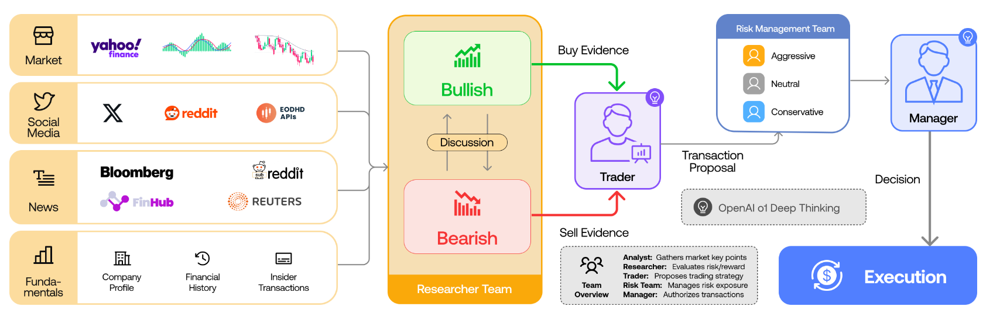

# 量化交易｜TradingAgents 论文学习笔记
> **论文全称**：TradingAgents: Multi-Agents LLM Financial Trading Framework  
> **作者**：Tauric Research（UCLA, MIT 等合作）  
> **发表**：arXiv (2024)  

## 一、一句话总结

这篇论文提出了 **TradingAgents**，一个**多智能体 LLM 交易框架**，通过模拟真实交易公司的组织架构（分析师团队、研究员团队、交易员、风险管理团队、基金经理），让不同角色的 LLM 代理各司其职、通过结构化沟通协作，最终做出更稳健的交易决策。实验表明，该框架在累积收益、夏普比率等指标上显著优于传统规则策略及其他 LLM 代理方法。


> **图 1：TradingAgents 整体架构概览**

---

## 二、符号定义

| 符号 | 含义 |
| :--- | :--- |
| **CR** | Cumulative Return（累积收益率） |
| **AR** | Annualized Return（年化收益率） |
| **SR** | Sharpe Ratio（夏普比率） |
| **MDD** | Maximum Drawdown（最大回撤） |
| **$V_{\text{end}}$** | 回测期末投资组合价值 |
| **$V_{\text{start}}$** | 回测期初投资组合价值 |
| **$\bar{R}$** | 投资组合平均收益率 |
| **$R_f$** | 无风险收益率 |
| **$\sigma$** | 投资组合收益率的标准差 |

---

## 三、问题定义

论文指出现有的 LLM 多智能体交易系统存在两个核心缺陷：

**缺陷一：缺乏真实的组织建模（Lack of Realistic Organizational Modeling）**
- 大多数框架仅让智能体独立处理特定任务，或简单地共享信息池，**未能模拟真实交易公司中不同角色（分析师、交易员、风控）之间的协作关系与工作流程**。
- 真实交易公司有明确的分工：基本面分析师、技术分析师、宏观研究员、交易员、风控经理等，各自拥有不同视角和风险偏好，通过交叉验证和辩论做出决策。

**缺陷二：低效的通信接口（Inefficient Communication Interfaces）**
- 现有系统多依赖纯自然语言对话进行通信，随着对话轮次增加，容易出现 **“电话游戏效应（Telephone Effect）”**——信息逐级丢失、状态被污染。
- 无结构的信息池（Unstructured Pool of Information）缺乏明确的指令格式，迫使智能体仅依赖检索来获取信息，破坏了数据的关系完整性。

> **总结论文要解决的问题**：如何构建一个**模拟真实交易公司组织架构**的多智能体 LLM 系统，通过**结构化的通信协议**来避免信息丢失，实现高效协作与稳健决策。

---

## 四、相关工作

论文将现有的 LLM 金融应用分为三大类：

| 类别 | 代表方法 | 核心做法 | 与本论文的关系 |
| :--- | :--- | :--- | :--- |
| **LLM 作为金融助手** | PIXIU (FinMA), FinGPT, BloombergGPT | 在金融数据上微调或从头训练 LLM，用于情感分析、信息检索、术语理解等辅助任务。 | 这些模型提供金融领域知识，但**不直接执行交易**。 |
| **LLM 作为交易员** | FinMem, FinAgent, TradingGPT, FinCon | 让 LLM 直接分析新闻、财报、社交媒体、技术指标，做出买卖决策。其中：<br>• **新闻驱动型**：基于情感得分做多空策略<br>• **推理驱动型**：通过记忆、反思、多智能体辩论增强决策<br>• **RL 驱动型**：用回测收益作为奖励进行对齐 | 这些方法已展示 LLM 做交易的潜力，但**组织架构单一、通信机制低效**。 |
| **LLM 作为因子挖掘者** | QuantAgent, AlphaGPT | 利用 LLM 生成 Alpha 因子代码（而非直接交易），通过内外双循环迭代优化因子。 | 属于**策略生成**层面，与本论文的**策略执行**层面形成互补。 |

论文的 **TradingAgents** 区别于以上所有方法：它**不微调任何 LLM**，而是通过**角色分工 + 结构化通信 + 多轮辩论**来直接做交易决策，更接近真实交易公司的决策流程。

---

## 五、论文贡献

这篇论文的核心贡献在于**将真实交易公司的组织架构“映射”到了 LLM 多智能体系统中**，并设计了**结构化的通信协议**来确保信息在长对话中不失真。

#### 创新点 1：提出“角色专业化（Role Specialization）”的多智能体架构

- **之前的同行**：让一个 LLM 或几个同质化的 LLM 独立处理所有金融数据。
- **这篇论文的创新**：定义了 **7 种截然不同的角色**，每个角色拥有独立的系统 Prompt（包括姓名、角色、目标、约束、技能和工具）：
  1. **基本面分析师（Fundamentals Analyst）**：分析财报、盈利能力、估值、内部人交易等。
  2. **情感分析师（Sentiment Analyst）**：抓取 Reddit、Twitter/X 等社交平台的情绪数据。
  3. **新闻分析师（News Analyst）**：抓取 Bloomberg、Yahoo、Finnhub 等新闻源。
  4. **技术分析师（Technical Analyst）**：计算 MACD、RSI、布林带等 60 种技术指标。
  5. **研究员团队（Researcher Team）**：分为 **多头（Bullish）** 和 **空头（Bearish）** 两方，进行多轮辩论。
  6. **交易员（Trader）**：综合分析师和研究员的报告，决定买卖时机和仓位。
  7. **风险管理团队（Risk Management Team）**：包含 **激进型（Risky）**、**中性（Neutral）**、**保守型（Conservative）** 三个代理，评估交易风险。
  8. **基金经理（Fund Manager）**：最终审批交易，更新投资组合状态。

#### 创新点 2：引入“结构化工单（Structured Communication Protocol）”

- **之前的同行**：所有智能体用纯自然语言在一个共享聊天历史中交流，信息会随时间流失（电话游戏效应）。
- **这篇论文的创新**：
  - 分析师团队产出**结构化的分析报告（Analysis Reports）**，而非零散的聊天消息。
  - 交易员产出 **结构化的决策信号（Decision Signals）** 和附带推理的报告。
  - 研究员和风控团队的多轮辩论虽使用自然语言，但**辩论的最终结论会被记录为结构化条目**，进入全局状态（Global State）。
  - 代理之间通过**查询全局状态**来获取所需信息，而非依赖记忆模糊的历史消息。

#### 创新点 3：异构 LLM 骨干网（Heterogeneous LLM Backbone）

- **快思考模型（Quick-thinking）**：如 `gpt-4o-mini`，用于低深度任务（数据检索、摘要、表格转文本）。
- **慢思考模型（Deep-thinking）**：如 `o1-preview`，用于高推理任务（决策报告、证据分析、多轮推理）。
- **优势**：按任务复杂度分配模型，在**效率与推理深度之间取得平衡**；且整个系统**无需 GPU**，仅依赖 API 调用，可轻松替换为任意开源或闭源模型。

---

## 六、算法（工作流）

TradingAgents 的工作流模拟真实交易公司**从信息采集到最终交易执行**的完整链条，分为五个层级：

#### 第一层：分析师团队（Analyst Team）—— 数据采集

四个分析师并行工作，各自产出结构化的分析报告：

| 分析师 | 数据来源 | 产出报告 |
| :--- | :--- | :--- |
| **基本面分析师** | 公司财报、盈利能力指标、估值、内部人交易、公司简介 | 基本面分析报告（含财务健康度、估值水平、内部人情绪） |
| **情感分析师** | Reddit, X/Twitter 帖子、情感得分（辅助 LLM 计算） | 社交媒体情绪报告（含时间序列情感得分和峰值检测） |
| **新闻分析师** | Bloomberg, Yahoo, EODHD, FinnHub, Reddit 新闻 | 宏观新闻报告（含地缘政治、行业动态、公司特定事件） |
| **技术分析师** | 60 种技术指标（MACD, RSI, ADX, 布林带, ATR, CCI 等） | 技术分析报告（含各指标的当前状态和趋势解读） |

**通信方式**：每个分析师产出**结构化报告文档**（包含关键指标、洞察和建议），存入全局状态供下游查询。

---

#### 第二层：研究员团队（Researcher Team）—— 多空辩论

- **多头研究员（Bullish Researcher）**：基于分析师报告，构建看多论点，强调积极信号和增长潜力。
- **空头研究员（Bearish Researcher）**：基于同一份报告，构建看空论点，强调风险和负面信号。
- **辩论流程**：两人进行 $n$ 轮（由辩论主持代理控制）的自然语言对话，交换论据、反驳对方观点。最终主持代理回顾辩论历史，选择**占上风的一方观点**，将其记录为结构化条目。
- **论文的核心哲学**：通过辩论暴露问题的两面性，避免单一视角导致的偏见决策。

---

#### 第三层：交易员（Trader）—— 决策合成

- **输入**：多头和空头研究员的最终报告 + 分析师的原始报告。
- **任务**：
  1. 综合评估定量数据（指标）和定性见解（逻辑）。
  2. 决定交易方向（买入/卖出/持有）、仓位大小和时机。
  3. 产出**决策信号（Decision Signal）**和**详细的推理报告**。
- **输出**：结构化的交易决策 + 附带推理的文本报告，存入全局状态。

---

#### 第四层：风险管理团队（Risk Management Team）—— 风险评估与调整

- **三个风险代理**：
  - **激进型（Risky Analyst）**：倾向于承担更高风险以博取更高回报，认为当前市场条件支持大胆行动。
  - **保守型（Safe Analyst）**：强调下行风险、估值过高、波动率上升，倾向于减仓或回避。
  - **中性（Neutral Analyst）**：在激进与保守之间寻找平衡，建议适度参与并设置止损。
- **辩论流程**：三个代理进行 $n$ 轮自然语言讨论，主持代理裁定最终的风险调整方案。
- **输出**：修正后的交易计划（可能调整仓位、设置止损线等），作为结构化条目更新。

---

#### 第五层：基金经理（Fund Manager）—— 最终审批与执行

- **输入**：风险管理团队调整后的交易计划 + 所有历史报告。
- **任务**：审核所有分析和风险评估，决定是否批准交易。
- **执行**：若批准，更新投资组合状态，记录交易；若拒绝，不执行任何操作。

---

### 整体伪代码流程

```
每日循环（for each trading day t）：
  1. 四个分析师并行：
     a. 获取当日的基本面/情感/新闻/技术数据
     b. 各自产出结构化分析报告 → 存入全局状态
  2. 研究员团队：
     a. 多头研究员基于报告构建看多论点
     b. 空头研究员基于报告构建看空论点
     c. 进行 n 轮辩论，主持人裁定胜方 → 存入全局状态
  3. 交易员：
     a. 综合分析师报告和研究员辩论结果
     b. 产出交易决策 + 推理报告 → 存入全局状态
  4. 风险管理团队：
     a. 激进/中性/保守三个代理进行讨论
     b. 主持人裁定风险调整方案 → 更新交易决策
  5. 基金经理：
     a. 审查所有信息，决定是否批准交易
     b. 执行或拒绝，更新投资组合状态
  6. 记录当日交易日志，计算绩效指标
```

---

## 七、评估方法

### 1. 交易绩效评估

| 指标 | 符号 | 定义 | 计算方法 |
| :--- | :--- | :--- | :--- |
| **累积收益率** | CR | 回测期内组合的总收益率 | $\text{CR} = \left( \frac{V_{\text{end}} - V_{\text{start}}}{V_{\text{start}}} \right) \times 100\%$ |
| **年化收益率** | AR | 将累积收益年化（便于跨策略比较） | $\text{AR} = \left( \left( \frac{V_{\text{end}}}{V_{\text{start}}} \right)^{\frac{1}{N}} - 1 \right) \times 100\%$，$N$ 为年数 |
| **夏普比率** | SR | 风险调整后收益，衡量单位风险获得的超额回报 | $\text{SR} = \frac{\bar{R} - R_f}{\sigma}$ |
| **最大回撤** | MDD | 组合净值从峰值到谷底的最大亏损幅度 | $\text{MDD} = \max_{t \in [0,T]} \left( \frac{\text{Peak}_t - \text{Trough}_t}{\text{Peak}_t} \right) \times 100\%$ |

### 2. 可解释性评估（定性）

- **决策透明**：每个交易决策都附带完整的推理链（思维过程）、工具调用记录和分析报告。
- **对比优势**：相比深度学习的“黑盒”交易系统，TradingAgents 的所有中间步骤均可追溯，便于调试和审计。
- **论文展示**：在附录中展示了完整的一天交易日志，涵盖所有分析师的报告、研究员的辩论、交易员的决策和风控团队的评估，证明了其高度的可解释性。

---

## 八、实验设置和实验结论

### 1. 数据集的选取

- **时间范围**：2024 年 1 月 1 日至 2024 年 3 月 29 日（约 3 个月）。
- **股票池**：以 **AAPL（苹果）、GOOGL（谷歌）、AMZN（亚马逊）** 为主要分析对象，此外还包括 Nvidia、Microsoft、Meta 等科技股。
- **数据类型（多模态）**：
  - 历史价格数据（OHLCV）
  - 新闻文章（Bloomberg, Yahoo, EODHD, FinnHub, Reddit）
  - 社交媒体帖子和情感得分（Reddit, X/Twitter）
  - 内部人交易和情绪数据（SEDI 及公司备案）
  - 财务报表和季度/年度报告
  - 60 种技术指标（MACD, RSI, 布林带, ADX, ATR 等）

### 2. 基线模型

| 基线 | 类型 | 核心策略 |
| :--- | :--- | :--- |
| **Buy & Hold（买入持有）** | 市场基准 | 等权持有所有股票，全程不动。 |
| **MACD** | 趋势跟踪 | 根据 MACD 线与信号线的交叉点生成买卖信号。 |
| **KDJ + RSI** | 动量策略 | 结合随机指标（KDJ）和相对强弱指标（RSI），识别超买超卖。 |
| **ZMR（零均值回归）** | 均值回归 | 基于价格偏离零参考线的反转信号交易。 |
| **SMA（简单移动平均线）** | 趋势跟踪 | 根据短期与长期移动平均线的交叉信号交易。 |

### 3. 关键超参数与约束

- **无未来数据（No Look-ahead Bias）**：代理仅使用截至当前交易日的可用数据做决策。
- **交易成本**：回测中计入了合理的交易成本（未在正文详述，但模拟环境包含买卖价差等）。
- **模型选择**：
  - **分析师**：统一使用 `o1-preview`（慢思考模型）以确保分析质量。
  - **数据检索**：使用 `gpt-4o-mini`（快思考模型）以提高效率。
  - **研究员和交易员**：使用 `o1-preview` 进行深度推理。
  - **风险管理和基金经理**：使用 `o1-preview` 进行多轮辩论和最终决策。

### 4. 实验结果

#### 实验 1：预测能力与交易表现对比

| 股票 | 指标 | Buy&Hold | MACD | KDJ+RSI | ZMR | SMA | **TradingAgents** | 提升幅度 |
| :--- | :--- | :--- | :--- | :--- | :--- | :--- | :--- | :--- |
| **AAPL** | CR (%) | -5.23 | -1.49 | 2.05 | 0.57 | -3.2 | **26.62** | +24.57% |
| | AR (%) | -5.09 | -1.48 | 2.07 | 0.57 | -2.97 | **30.58** | +28.43% |
| | SR | -1.29 | -0.81 | 1.64 | 0.17 | -1.72 | **8.21** | +6.57 |
| | MDD (%) | 11.90 | 4.53 | 1.09 | 0.86 | 3.67 | **10.91** | — |
| **GOOGL** | CR (%) | 7.78 | 6.20 | 0.40 | -0.58 | 6.23 | **24.36** | +16.58% |
| | AR (%) | 8.09 | 6.26 | 0.40 | 0.58 | 6.43 | **27.58** | +19.49% |
| | SR | 1.35 | 2.31 | 0.02 | 2.12 | 2.12 | **6.39** | +4.08 |
| | MDD (%) | 13.04 | 1.22 | 1.58 | 2.34 | 2.34 | **1.69** | — |
| **AMZN** | CR (%) | 17.11 | — | -0.77 | -0.77 | 11.01 | **23.21** | +6.10% |
| | AR (%) | 7.63 | — | -0.76 | -0.77 | 11.62 | **24.90** | +7.30% |
| | SR | 3.53 | — | -2.25 | -2.45 | 2.22 | **5.60** | +2.07 |
| | MDD (%) | 3.80 | — | 1.08 | 0.82 | 3.97 | **2.11** | — |

**关键发现**：
- TradingAgents 在三只股票上均取得**最高的累积收益和年化收益**，在苹果（AAPL）上尤为突出——在传统策略普遍亏损（Buy&Hold -5.23%）的情况下，TradingAgents 取得了 **26.62% 的累积收益**。
- **夏普比率**方面，TradingAgents 在所有测试股票上均达到 **5.6 ~ 8.21** 的极高值，远超基线（多数基线 SR < 2.5），证明其风险调整后收益具有显著优势。
- **最大回撤**方面，TradingAgents 控制在 1.69% ~ 10.91% 之间，虽在部分股票上略高于某些规则策略（如 KDJ+RSI 的 1.09%），但考虑到其收益水平，风险-收益权衡是合理的。

---

#### 实验 2：可解释性分析（定性）

- **全流程透明**：论文在附录中展示了 TradingAgents 在某个交易日为 AAPL 生成的完整日志，涵盖了：
  - 技术分析师的指标报告（RSI、ADX、布林带、MACD 等 8 个指标的详细解读）
  - 新闻分析师的宏观新闻汇总（地缘政治、行业动态、公司特定事件）
  - 情感分析师的社交媒体情绪时间序列（含每日情感得分和峰值检测）
  - 基本面分析师的财务健康度报告（含估值、盈利能力、内部人交易）
  - 多头 vs. 空头研究员的完整辩论记录
  - 激进/中性/保守风险代理的三方讨论
  - 基金经理的最终决策及完整推理链
- **对比优势**：该透明性使交易员可以追溯每个决策的出处，理解系统为何在特定时点做出买卖判断，便于调试和优化——这是传统深度学习方法（如 LSTM、Transformer）无法提供的。

---

#### 实验 3：消融研究与组件贡献（隐含分析）

论文未单独列示消融表，但从描述中可以归纳出各组件的贡献：

| 组件 | 贡献 |
| :--- | :--- |
| **多角色分析师团队** | 提供多维度的市场信息（基本面+情感+新闻+技术），避免单一视角偏见。 |
| **多空研究员辩论** | 通过对抗性辩论暴露风险，使决策更加平衡，避免过度乐观或过度悲观。 |
| **风险管理团队三方讨论** | 激进/中性/保守三方的博弈确保风险敞口被控制在可接受范围内，防止极端损失。 |
| **结构化工单通信** | 避免长对话中的信息丢失，保证全局状态的一致性和可追溯性。 |
| **异构 LLM 骨干** | 在推理深度和响应速度之间取得最优平衡，降低 API 调用成本。 |

---

## 九、论文总结与定位

### 与之前两篇因子挖掘论文的对比

| 维度 | **Alpha Jungle** | **FactorEngine** | **TradingAgents** |
| :--- | :--- | :--- | :--- |
| **核心任务** | 挖掘可解释的数学公式型因子 | 挖掘图灵完备的程序型因子 | 直接执行交易决策 |
| **主要方法** | LLM + MCTS 树搜索 | LLM 宏变异 + 贝叶斯微调 | 多角色 LLM 代理 + 结构化辩论 |
| **输出形式** | 数学公式（如 `Zscore(Ma(...))`） | Python 可执行代码 | 买卖信号 + 完整推理链 |
| **评估指标** | IC / RankIC / IR | IC / ICIR / 年化收益 | 累积收益 / 夏普 / 最大回撤 |
| **决策可解释性** | 中等（公式本身可读） | 高（代码逻辑可审计） | **极高（完整对话日志可追溯）** |
| **组织建模** | 无（单树搜索） | 无（单智能体进化） | **有（模拟真实交易公司）** |
| **通信机制** | 不适用 | 不适用 | **结构化工单 + 自然语言辩论** |

### 一句话总结

> **TradingAgents 将真实交易公司的组织架构“镜像”到了 LLM 多智能体系统中，让基本面分析师、技术分析师、多空研究员、风险经理等角色通过结构化报告和辩论协同决策，最终产出的交易信号在收益和稳健性上均优于传统规则策略，同时提供了深度学习模型无法匹敌的完整可解释性。它与 Alpha Jungle 和 FactorEngine 构成了 LLM 在量化金融中的三层完整图景：**因子发现 → 因子进化 → 策略执行**。**