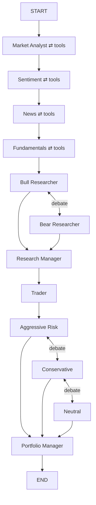
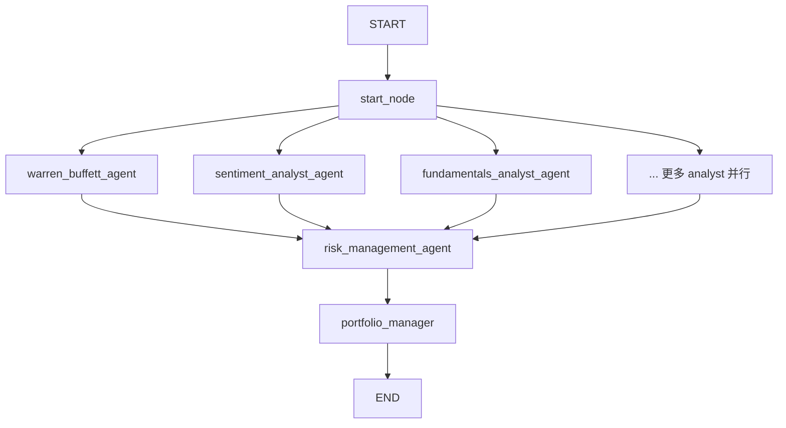
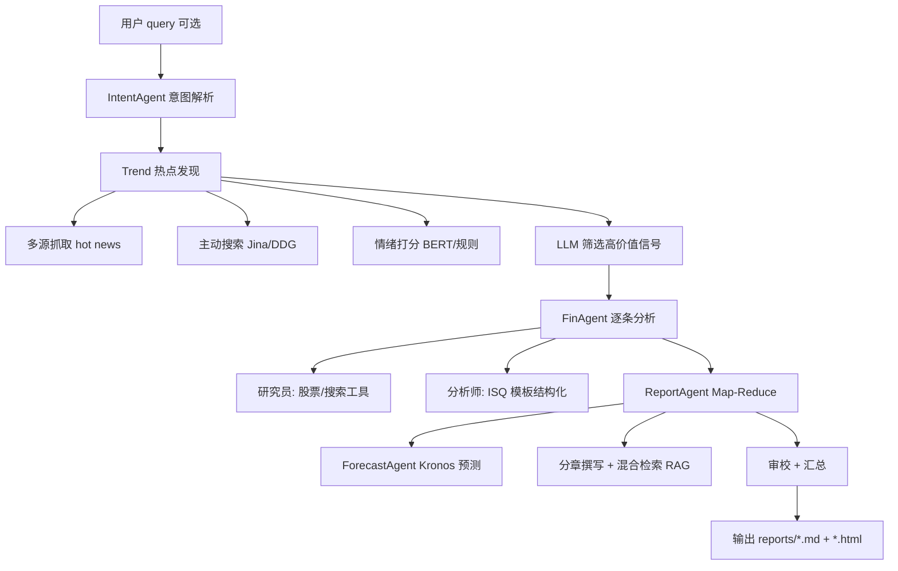
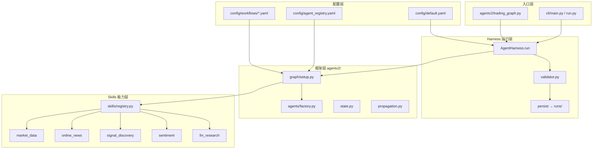

# 量化交易｜开源多智能体交易系统学习和复现（附思路）

>我自己实现的项目后续会开源，如果着急的话可以让gpt实现，关键思路已经在文章中分享了

# 一、TradingAgents

### 1. 项目定位

模拟**真实投研机构**的多角色协作：分析师团队 → 多空辩论 → 交易员 → 风险三角辩论 → 组合经理。偏 **research + decision pipeline**，有论文背书。

### 2. 代码结构

```
TradingAgents/
├── main.py                    # 最简入口：TradingAgentsGraph().propagate()
├── cli/                       # Typer/Rich 交互 CLI
├── tradingagents/
│   ├── default_config.py      # 全局配置 + TRADINGAGENTS_* 环境变量
│   ├── graph/                 # ★ 编排核心
│   │   ├── trading_graph.py   # 门面：TradingAgentsGraph
│   │   ├── setup.py           # GraphSetup：构图
│   │   ├── conditional_logic.py
│   │   ├── propagation.py
│   │   ├── checkpointer.py    # 断点续跑
│   │   ├── reflection.py      # 反思/记忆
│   │   └── signal_processing.py
│   ├── agents/                # ★ Agent 工厂
│   │   ├── analysts/          # market, news, sentiment, fundamentals
│   │   ├── researchers/       # bull, bear
│   │   ├── trader/
│   │   ├── managers/          # research_manager, portfolio_manager
│   │   ├── risk_mgmt/         # aggressive, neutral, conservative
│   │   └── utils/             # tools, state, memory, structured output
│   ├── dataflows/             # ★ 数据层（多 vendor 路由）
│   │   ├── interface.py       # route_to_vendor()
│   │   ├── y_finance.py, alpha_vantage*.py, reddit.py ...
│   │   └── config.py
│   └── llm_clients/           # 多 provider LLM 工厂
└── tests/                     # 覆盖广
```

### 3. Framework 核心

| 层 | 职责 |
|----|------|
| **TradingAgentsGraph** | 门面：`propagate(ticker, date)` |
| **GraphSetup** | 用 LangGraph 建图，注册所有 node/edge |
| **ConditionalLogic** | analyst 的 ReAct 条件边 + 辩论轮次控制 |
| **AgentState** | 继承 `MessagesState`，含 `market_report`、`investment_debate_state`、`risk_debate_state` 等 |
| **dataflows** | 工具背后的数据 API，按 config 路由 yfinance / Alpha Vantage |
| **agents/utils/*_tools.py** | LangChain `@tool`，供 analyst bind_tools |

### 4. 工作流拓扑（串行 + 辩论环）



**每个 analyst 的内部结构使用LangGraph自行决定是否调用工具（我的项目中借鉴了这个方法，同时升级了至少调用n次的guard）：**

```
Analyst → (有 tool_calls?) → ToolNode → Analyst
       → (无 tool_calls)  → Msg Clear → 下一个节点
```

### 5. 设计特点

- **ReAct + 条件边**：LLM 决定是否继续调工具
- **Msg Clear**：每个 analyst 结束后清 messages，报告留在 state 字段
- **多层辩论 state**：`InvestDebateState`、`RiskDebateState` 控制轮次
- **dataflows 与 agent 解耦**：vendor 可换，tool 接口稳定
- **工程化强**：checkpoint、memory log、structured output、Docker、多 LLM provider


# 二、ai-hedge-fund

### 1. 项目定位

**AI 模拟对冲基金**：多个「名人风格」分析师并行给信号 → 风险管理 → 组合经理下单。偏 **trading signal + portfolio execution**，带 CLI、Web UI、回测。

### 2. 代码结构

```
ai-hedge-fund/
├── src/                       # ★ 主逻辑（v1）
│   ├── main.py                # create_workflow() + run_hedge_fund()
│   ├── graph/state.py         # AgentState（极简）
│   ├── agents/                # 19+ 个 agent 函数
│   │   ├── warren_buffett.py, sentiment.py, fundamentals.py ...
│   │   ├── risk_manager.py
│   │   └── portfolio_manager.py
│   ├── tools/api.py           # Financial Datasets API
│   └── utils/analysts.py      # ANALYST_CONFIG 注册表
├── src/backtesting/           # 回测引擎
├── app/                       # FastAPI + React 可视化编排
├── v2/                        # 新一代（data client, portfolio optimizer）
└── tests/
```

### 3. Framework 核心

| 层 | 职责 |
|----|------|
| **create_workflow()** | 在 `main.py` 里直接建 LangGraph |
| **AgentState** | 只有 `messages` + `data` + `metadata` |
| **analyst_signals** | 所有 agent 输出写入 `state["data"]["analyst_signals"][agent_id][ticker]` |
| **Agent 函数** | 普通 Python 函数 `(state) -> partial state`，多数**不用 ReAct** |
| **tools/api.py** | 统一外部 API（价格、新闻、insider trades） |

### 4. 工作流拓扑（并行 fan-out）



关键代码（`src/main.py`）：

```100:129:trade_agent/ai-hedge-fund/src/main.py
def create_workflow(selected_analysts=None):
    workflow = StateGraph(AgentState)
    workflow.add_node("start_node", start)
    analyst_nodes = get_analyst_nodes()
    for analyst_key in selected_analysts:
        workflow.add_node(node_name, node_func)
        workflow.add_edge("start_node", node_name)   # 并行起点
    workflow.add_node("risk_management_agent", risk_management_agent)
    workflow.add_node("portfolio_manager", portfolio_management_agent)
    for analyst_key in selected_analysts:
        workflow.add_edge(node_name, "risk_management_agent")  # fan-in
    workflow.add_edge("risk_management_agent", "portfolio_manager")
    workflow.add_edge("portfolio_manager", END)
```

### 5. Agent 典型写法（函数式，非 ReAct）

以 `sentiment_analyst_agent` 为例：

- 从 `state["data"]` 读 tickers、日期
- 直接调 `get_insider_trades`、`get_company_news`（Python 函数，不是 LLM tool loop）
- 用规则/统计算 signal
- 写回 `analyst_signals`

### 6. 设计特点

- **Agent = 纯函数节点**，逻辑透明、易测
- **ANALYST_CONFIG 注册表**：一个 dict 管 display_name、order、agent_func
- **analyst_signals 契约**：统一 `{ticker: {signal, confidence, reasoning}}`
- **risk → portfolio 固定后置链**
- **回测 + Web UI**：从 research 延伸到 simulation

> 启发：针对一些简单的角色，可以通过python代码固定的方法进行实现。同时将不同特色的交易员通过skills方法实现。

### 7. 两者对比

| 维度 | TradingAgents | ai-hedge-fund |
|------|---------------|---------------|
| **目标** | 机构级 research pipeline | 对冲基金信号 + 下单 |
| **Agent 数量** | ~10+（含辩论角色） | 19+ analyst + risk + portfolio |
| **Agent 实现** | LLM + ReAct tool loop | 多数确定性 Python + 部分 LLM |
| **图结构** | 串行 analyst + 辩论环 | 并行 analyst → fan-in |
| **State** | 多 report 字段 + debate state | 极简，`data.analyst_signals` 为核心 |
| **工具/数据** | `dataflows/` 多 vendor 路由 | `tools/api.py` 单一 API |
| **配置** | YAML + env + CLI | Python dict `ANALYST_CONFIG` |
| **工程** | checkpoint、memory、structured output | backtesting、Web app、v2 演进 |
| **输出** | 研报 + 交易决策文本 | JSON 订单 `{action, quantity, confidence}` |


# 三、 DeepEar 项目分析

DeepEar（顺风耳）是一个**金融舆情 → 投资信号 → 研报**的开源框架，核心不是 LangGraph，而是 **Agno 多 Agent + 自研 Python 工作流编排**。


### 技术栈与系统架构

| 层级 | 技术 | 作用 |
|------|------|------|
| **Agent 框架** | [Agno](https://github.com/agno-agi/agno) (`agno.agent.Agent`) | 各 Agent 的工具调用、推理、结构化输出 |
| **工作流编排** | `src/main_flow.py` 中的 `SignalFluxWorkflow` | 顺序 Python 流水线（**不是** LangGraph） |
| **Web 服务** | FastAPI + Uvicorn | Dashboard 后端、Skill API |
| **前端** | React + Vite + WebSocket | 实时监控、历史、报告展示 |
| **LLM 路由** | `utils/llm/router.py` | 双模型：推理模型 + 工具模型 |
| **存储** | SQLite (`data/signal_flux.db`) | 新闻、信号、运行记录 |
| **检索** | BM25 + 向量（混合 RAG） | 研报写作时的信息召回 |
| **预测** | Kronos + 新闻投影层 | 新闻感知的 K 线预测 |
| **数据源** | NewsNow 等 15+ 源（微博、财联社、雪球等） | 在线抓取，非本地 CSV |
| **包管理** | `uv` + Python 3.12+ | 依赖在 `pyproject.toml` |

Roadmap 里提到未来可能迁移到 **LangGraph**，当前版本仍是 Agno + 手写 workflow。


### 1. 核心流程（`SignalFluxWorkflow`）

整体是**线性多阶段流水线**，带 checkpoint 断点续跑：



### 各阶段说明

1. **意图识别**（有 `--query` 时）  
   `IntentAgent` 解析关键词、是否特定事件、生成搜索词。

2. **趋势发现（Trend Discovery）**  
   - 从 financial / social / tech 等源抓取热点（`TrendAgent` + `NewsToolkit`）  
   - 有 query 时做主动 web 搜索  
   - 批量情绪分析  
   - LLM 或规则筛选 `high_value_signals`

3. **金融分析（Financial Analysis）**  
   对每条信号调用 `FinAgent.analyze_signal()`：  
   - 研究员 Agent：查股价、搜新闻、拉正文  
   - 分析师 Agent：按 **ISQ 模板** 输出 `InvestmentSignal`（传导链、评分等）  
   - 支持 `--concurrency` 多线程

4. **研报生成（Report Generation）**  
   `ReportAgent` 采用 Map-Reduce：规划 → 分章写作 → 编辑 → 组装；  
   `ForecastAgent` 用 Kronos 做预测并做 LLM 修正；  
   最终生成 Markdown + HTML（含图表、Draw.io 逻辑图等）。

5. **追踪更新（可选）**  
   `--update-from <run_id>` 基于旧 run 刷新行情并做对比分析。

Checkpoint 保存在 `reports/checkpoints/<run_id>/`，支持 `--resume`。


### 2. Agent 与 Tools 分层

```
src/
├── main_flow.py          # 总编排（类似 TradingAgents 的 trading_graph，但是 Python 类）
├── agents/               # Agno Agent 工厂
│   ├── intent_agent.py
│   ├── trend_agent.py    # scanner + evaluator 双 Agent
│   ├── fin_agent.py      # researcher + analyst 双 Agent
│   ├── forecast_agent.py
│   └── report_agent.py   # planner/writer/editor 多 Agent
├── tools/toolkits.py     # News / Stock / Search / Sentiment Toolkit
├── utils/                # LLM、DB、混合检索、Kronos 等
└── schema/               # InvestmentSignal、ISQ 模板等
```

每个 Agent 内部是 **Agno `Agent(model=..., tools=[...])`**，工具在 `tools/` 和 `utils/` 中，通过 Toolkit 暴露给 LLM。

`skills/deepear/` 是对外 **Skill 封装**（FastAPI 包装 `SignalFluxWorkflow`），不是核心运行时。

>蒸馏学习它的新闻抓取和处理的思路

# 四、 Harness 和 Skills
上述的三个框架都太过toy，不适合真实的实盘和复杂场景，实际中需要引入 `harness` 和 `skills`
## 一、Harness（缰绳/控制框架）

### 1.1 什么是 Harness？

**核心定义**：Harness 是包裹在 AI 模型周围的**一切代码、配置和执行逻辑**。用最简洁的公式表达：

> **Agent = Model + Harness**

一个原始的裸模型（Raw Model）并不是智能体。只有当 Harness 为它赋予**状态管理、工具执行、反馈循环和可强制执行约束**时，它才成为一个真正的智能体。

### 1.2 Harness 包含什么？

根据 LangChain 的定义，Harness 具体包括以下组件：

| 组件类别 | 具体内容 |
| :--- | :--- |
| **系统提示与行为规则** | 系统提示词、项目规则、编码规范、角色约束和安全策略 |
| **工具与能力** | Tools、Skills、MCPs 及其描述 |
| **基础设施** | 文件系统、沙箱、浏览器等执行环境 |
| **编排逻辑** | 子智能体生成（Spawning）、任务交接（Handoffs）、模型路由 |
| **钩子与中间件** | 上下文压缩、任务延续、代码检查等确定性执行逻辑 |
| **记忆与状态** | 短期对话状态、长期文件/日志/摘要存储 |


### 1.3 Harness vs. Scaffolding vs. Model（三者的精确区分）

这是 AI Agent 领域最容易混淆的三个概念：

| 概念 | 定义 | 类比 |
| :--- | :--- | :--- |
| **Model（模型）** | 裸的大语言模型（如 Claude、GPT）。文本进去，文本出来。没有记忆，没有循环，不会主动做任何事 | 大脑本身 |
| **Scaffolding（脚手架）** | 模型所“看到”的一切：系统提示词、工具描述、输出格式、跨步骤记忆。它塑造了模型的行为边界，但本身不负责运行 | 大脑看到的“工作环境” |
| **Harness（缰绳）** | 真正让模型“跑起来”的东西：调用模型、处理工具请求、判断何时停止——这个循环的引擎就是 Harness | 驱动身体行动的“神经系统” |

> **精确公式**：Agent = Model + Scaffolding + Harness  
> **简化公式**（日常讨论）：Agent = Model + Harness

**关键洞察**：训练时，Scaffolding 决定了模型学到什么；推理时，Harness 决定了模型怎么跑。同一个模型搭配不同的 Harness，产品体验可以完全不同。

### 1.4 为什么需要 Harness？

模型本身的能力是有限的——它只能接收文本/图像/音视频输入，输出文本。**模型无法独立完成以下任务**：

- 维护跨交互的持久状态
- 执行代码
- 访问实时知识
- 设置环境和安装包
- 从失败的工具调用中恢复

> **Harness 的核心价值**：把模型天生的“随机性”限制在可控范围内，把 AI 从“实验室玩具”变成“企业级生产力工具”。

### 1.5 Harness Engineering（缰绳工程）

**定义**：Harness Engineering 是**围绕 LLM 精炼代码以提升整体系统性能的工程实践**。

**核心理念**：**把约束写进环境，而不是靠 Prompt 叮嘱**。让智能体在长时间自主工作中持续可靠，而不是跑偏、反复犯错、或者做到一半宣布完成。

**Harness Engineering 回答的核心问题**：AI Agent 运行时，世界如何与它交互？具体包括：
- 任务怎么拆？
- 工具怎么用？
- 做完了怎么验证？
- 失败了怎么恢复？
- 什么时候该把控制权交回给人？

**最新进展**：学术界已开始探索 **Meta-Harness**——用 AI 自动搜索和优化 Harness 代码本身，而非依赖人工手动设计。


## 二、Skills（技能）

### 2.1 什么是 Skills？

**核心定义**：Skills 是为 AI 智能体（Agent）准备的 **“技能包”**——一种可复用的、给 AI 赋能的能力扩展模块。

> **通俗比喻**：如果把大模型（LLM）比作一个拥有顶级智商的大脑，Skills 就是我们发给它的**岗位说明书和操作手册**。

在没有 Skills 之前，AI 靠的是“通识”在回答问题——就像一个刚刚毕业的博士生，虽然满腹经纶，但从未进过大厂，不懂什么是红线，也不懂什么是 SOP。Skills 的出现，就是为了把**专家经验固化下来**。

### 2.2 Skills、Prompt、MCP 的区别

用“带新人”的比喻，三者的差异一目了然：

| 概念 | 比喻 | 特点 |
| :--- | :--- | :--- |
| **Prompt（提示词）** | 口头交代任务 | 一次性、临场性指令，对话结束即失效，无复用性 |
| **Skills（技能包）** | SOP 手册文件夹 | 可复用、能引导迭代，包含规范、脚本、模板等资源 |
| **MCP（外部连接）** | 门禁卡 | 让 AI 安全连接外部系统、调用外部能力，解决“有权限才能做事”的问题 |

### 2.3 Skills 的组成部分

一个标准的 Skills 文件夹通常包含三样法宝：

| 组件 | 说明 |
| :--- | :--- |
| **SKILL.md（指令文档）** | 用人话写成的操作步骤，告诉 AI 先做什么再做什么 |
| **Scripts（脚本）** | 预先写好的 Python 或 JS 代码，让 AI 能直接运行程序来处理复杂计算或文件操作 |
| **Resources（资源）** | 必要的参考文档、模板或数据库结构，让 AI 查阅后照着葫芦画瓢 |

> **本质**：SKILLS 是一种约定标准，通过专业知识和工作流程扩展 AI 代理的功能。

### 2.4 渐进式披露（Progressive Disclosure）—— Skills 的核心机制

这是 Skills 最精妙的设计，解决了 AI 上下文窗口有限的痛点：

| 状态 | 行为 | 效果 |
| :--- | :--- | :--- |
| **待机状态** | 只加载技能的**元数据**（名称和描述，约 100 tokens），知道“有哪些技能可用”即可 | 轻装上阵，不占用脑容量 |
| **触发状态** | 当需要时，才加载完整的 SKILL.md（约 3000 tokens）和相关脚本 | 瞬间变成该领域的专家 |
| **完成状态** | 任务结束，释放技能，回到通用助手模式 | 理论上拥有无限的技能库 |

这意味着一个 Agent 可以装备 **100 个以上的技能**，而不会撑爆上下文窗口。


## 三、Harness 与 Skills 的关系

| 维度 | Harness | Skills |
| :--- | :--- | :--- |
| **层级** | **基础设施层**——智能体的“操作系统” | **能力层**——智能体的“应用程序” |
| **作用范围** | 全局：管理整个智能体的运行循环、状态、工具执行 | 局部：封装特定业务逻辑的原子化能力模块 |
| **生命周期** | 持续运行，贯穿整个智能体会话 | 按需加载，用完释放（渐进式披露） |
| **类比** | 手机的操作系统（iOS/Android） | 手机里的 App（微信/支付宝） |

> **一句话总结**：**Harness 是让智能体“跑起来”的引擎，Skills 是让智能体“会干活”的能力包**。Harness 决定了智能体能做什么、怎么运行；Skills 决定了智能体在具体领域里知道怎么做、按什么标准做。


## 四、与量化交易智能体的关联（TradingAgents 视角）

在 TradingAgents 等多智能体交易系统中：

- **Harness** 对应系统的**工程基础设施**：智能体的调用循环、工具执行引擎、状态管理、多智能体之间的结构化通信协议（结构化工单）、全局状态管理等
- **Skills** 对应各**专业角色的能力包**：
  - 基本面分析 Skill：如何读取财报、计算估值指标
  - 技术分析 Skill：如何计算 MACD、RSI 等 60 种技术指标
  - 情感分析 Skill：如何抓取 Reddit、X/Twitter 并计算情感得分
  - 风险管理 Skill：如何评估最大回撤、设置止损线

**TradingAgents 的“角色专业化”**，本质上就是为不同的 Agent 角色装配了不同的 Skills 集合，而整个系统的运行则由一个统一的 Harness 来驱动和协调。再细化一些，针对不同的交易风格也可以定制为不同的skills。


# my_agentv2 项目完整介绍

`my_agentv2` 是一个 **LangGraph 多 Agent 加密货币分析系统**。设计上参考 TradingAgents 的 ReAct 构图与 DeepEar 的多阶段研报流水线，核心创新是把 **Skills（能力层）** 和 **Harness（运行层）** 从 Agent 逻辑里拆出来。


## 一、项目一句话

> **Config 决定「谁跑、跑什么顺序」→ Skills 提供「能调用的工具」→ LangGraph 负责「Agent 协作」→ Harness 负责「跑起来、验结果、存档案」。**


## 二、整体架构




## 三、Skills 层（能力模块）

### 3.1 设计理念

Skills 对应 TradingAgents 的 `dataflows/`：**Agent 不直接 import 数据代码**，只通过 YAML 声明「我需要哪些 skill / 哪些 tool」，由 `SkillRegistry` 组装成 LangChain 工具。

```
skills/
├── registry.py              # 统一注册表（入口）
├── market_data/             # 本地 CSV OHLCV
├── online_news/             # NewsNow 在线热点 + Jina 正文
├── signal_discovery/        # 本地新闻库 + 行情异常
├── sentiment/               # 情绪聚合
└── fin_research/            # ISQ 信号 + 基本面代理
```

每个 skill 目录固定三件套：

| 文件 | 作用 |
|------|------|
| `skill.yaml` |  manifest：skill 名、tool 列表 |
| `tools.py` | `build_*_tools()` 返回 LangChain `@tool` 函数 |
| `SKILL.md` | 人类可读说明（可选） |

### 3.2 五个 Skill 一览

| Skill | 数据来源 | 主要 Tools | 被谁使用 |
|-------|----------|------------|----------|
| **market_data** | `trade_agent/data/crypto_data.csv` | `get_price_summary`, `calculate_ma_crossover` | market_analyst, fin_analyst |
| **online_news** | NewsNow API（实时） | `fetch_hot_news`, `get_unified_trends`, `fetch_news_content` | trend_analyst, fin_analyst |
| **signal_discovery** | `trade_agent/data/news_signals.json` | `fetch_hot_signals`, `derive_market_anomaly_signals` | trend_analyst |
| **sentiment** | 本地新闻 + CSV | `score_news_sentiment`, `score_price_momentum_sentiment` | trend_analyst |
| **fin_research** | CSV + 本地新闻 | `build_isq_signal`, `get_instrument_fundamentals` | fin_analyst |

### 3.3 SkillRegistry 如何工作

```89:105:trade_agent/my_agentv2/skills/registry.py
    def get_tools_for_agent(self, skill_names, tool_names=None):
        tools: dict[str, BaseTool] = {}
        for skill_name in skill_names:
            for tool in self._tools_for_skill(skill_name):
                tools[tool.name] = tool
        if tool_names:
            return [tools[name] for name in tool_names]  # 白名单过滤
```

流程：

1. 启动时扫描 `skills/*/skill.yaml`
2. 构建各 skill 的 tool 对象（只构建一次，缓存在内存）
3. Agent 配置里写 `skills: [online_news, sentiment]` + `tools: [fetch_hot_news, ...]`
4. 只把 **白名单内的 tool** 交给 LLM

**Skills 何时被真正调用？**  
不是在 Harness 里，而是在 `graph.invoke()` 过程中：LLM 发出 `tool_calls` → LangGraph 路由到 `ToolNode` → 执行 skill 里的 Python 函数。

---

## 四、Harness 层（运行外壳）

### 4.1 设计理念

Harness 是 **「车间主任」**：不负责分析，负责 **启动流水线、检查成品、写生产记录**。对应 TradingAgents 的 `propagate()` + 结果落盘，但拆得更清晰。

```
harness/
├── runner.py      # AgentHarness：主运行循环
└── validator.py   # 输出契约校验
```

### 4.2 AgentHarness.run() 五步

```44:74:trade_agent/my_agentv2/harness/runner.py
        graph, meta, skill_registry = create_workflow(...)   # ① 构图 + 加载 Skills
        initial_state = self.propagator.create_initial_state(...)  # ② 初始化 state
        final_state = graph.invoke(initial_state, ...)       # ③ 执行（Skills 在此被调）
        validation = validate_run(...)                       # ④ 校验
        result.run_dir = self._persist_run(result)           # ⑤ 落盘
```

| 步骤 | 做什么 | Skills 参与？ |
|------|--------|---------------|
| ① create_workflow | 读 YAML、建 LangGraph、创建 SkillRegistry、给 analyst 绑 tools | **准备** tools |
| ② initial_state | 写入 instrument、user_query、空报告字段 | 否 |
| ③ graph.invoke | 5 个 agent 串行执行，ReAct 调 tool | **执行** skills |
| ④ validate_run | 检查报告字段、analyst_signals、final_decision | 否 |
| ⑤ persist | 写 `runs/*/result.json` + `research_report.md` | 否 |

### 4.3 Validator 校验什么

对 `deepear_crypto` pipeline，必须存在：

- `intent_report`, `trend_report`, `fin_report`, `research_report`
- 每个 agent 的 `analyst_signals` 条目
- `final_decision`（含 action/signal/confidence）

对 `local_crypto` pipeline，检查 `market_report` 即可。

### 4.4 落盘内容

每次运行生成：

```
runs/deepear_crypto_BTCUSDT_20260612T145129Z/
├── result.json          # 完整 state 摘要 + validation + meta
└── research_report.md   # 最终 Markdown 研报
```

Harness 让你可以：**重复跑、对比 run、做 CI 式校验**（`passed: true/false`）。

---

## 五、配置层（把 Agent 和 Skills 连起来）

三层 YAML，职责分离：

| 文件 | 回答的问题 |
|------|------------|
| `config/default.yaml` | 默认 workflow、模型、数据路径、runs 目录 |
| `config/agent_registry.yaml` | 每个 agent 的 role、skills、tools 白名单、prompt |
| `config/workflows/*.yaml` | 选哪些 agent、以什么顺序跑 |

**Agent 与 Skills 的绑定示例**（`trend_analyst`）：

```yaml
trend_analyst:
  skills: [online_news, signal_discovery, sentiment]
  tools: [fetch_hot_news, score_news_sentiment, ...]  # 白名单
```

---

## 六、框架层 agentv2/（LangGraph 编排）

Harness 和 Skills 之间的「胶水」：

| 模块 | 文件 | 作用 |
|------|------|------|
| 构图 | `graph/setup.py` | 按 workflow 串 agent，绑 SkillRegistry tools |
| 条件边 | `graph/conditional_logic.py` | ReAct：`tool_calls? → tools : clear` |
| 初始状态 | `graph/propagation.py` | 填充 instrument、user_query |
| Agent 工厂 | `agents/factory.py` | intent / analyst / report / portfolio 四类节点 |
| 状态 | `state.py` | 报告字段 + analyst_signals + final_decision |
| 门面 | `trading_graph.py` | TradingAgents 风格 `propagate()` API |

### 两类 Workflow

**1. `local_crypto`（最小 MVP）**

```
market_analyst ⇄ tools → portfolio_manager → END
```

- 1 个 ReAct analyst + 1 个 post agent
- 只用 `market_data` skill

**2. `deepear_crypto`（完整流水线）**

```
intent → trend ⇄ tools → fin ⇄ tools → report → portfolio → END
```

- 5 个 agent，3 个用 skills，2 个纯 LLM

---

## 七、Agent 与 Skills 的分工

| Agent | role | 用 Skills？ | 产出字段 |
|-------|------|-------------|----------|
| intent_analyst | intent | 否 | `intent_report` |
| trend_analyst | analyst | **是** | `trend_report` |
| fin_analyst | analyst | **是** | `fin_report` |
| market_analyst | analyst | **是** | `market_report` |
| report_manager | report | 否 | `research_report` |
| portfolio_manager | portfolio | 否 | `final_decision` |

规律：

- **需要查数据、算指标、拉新闻** → ReAct + Skills
- **只需要综合已有报告** → 纯 LLM，读 state


## 八、扩展方式（只动配置 + skills，少改框架）

| 想做什么 | 改哪里 |
|----------|--------|
| 加新工具 | `skills/新skill/tools.py` + `skill.yaml` + `registry.py` 注册 |
| 加新 agent | `config/agent_registry.yaml` + workflow YAML |
| 改流水线顺序 | `config/workflows/*.yaml` |
| 改校验规则 | `harness/validator.py` |
| 改落盘格式 | `harness/runner.py` 的 `_persist_run` |

**不必改** `setup.py` / `factory.py`，除非新增 agent role 类型。

---

## 九、与上游项目的定位

| 来源 | my_agentv2 吸收的部分 |
|------|----------------------|
| **TradingAgents** | ReAct 条件边、串行 analyst、Msg Clear、dataflows → skills |
| **ai-hedge-fund** | analyst_signals 契约、registry 配置、workflow builder 思路 |
| **DeepEar** | intent → trend → fin → report 流水线、在线新闻、ISQ 信号 |

`my_agentv2` 的独特价值：**Skills 与 Harness 显式分离**，比 TradingAgents 更易扩展工具，比 ai-hedge-fund 有更完整的运行校验与存档。
