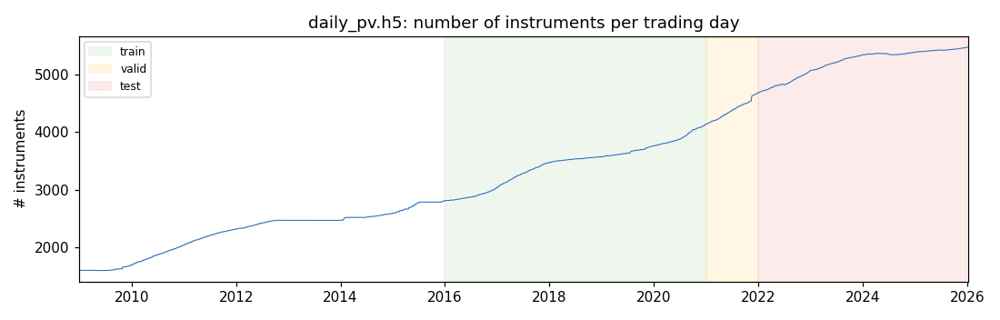
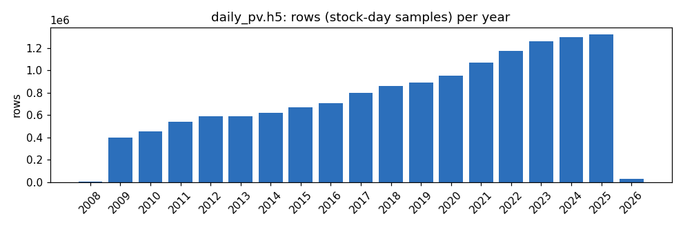
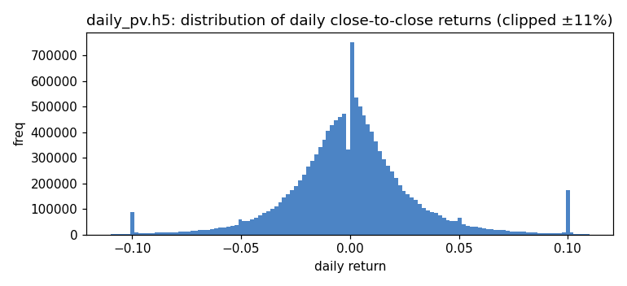
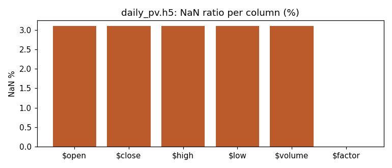
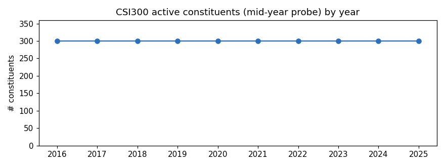

# 量化交易｜使用Qlib搭建一套回测系统（一）：日频量价数据eda分析

> 数据来源：HuggingFace 数据集 **`QuantaAlpha/qlib_csi300`**（A 股、CSI 300，apache-2.0）。
> 用途：QuantaAlpha 因子挖掘与回测的统一数据底座，Qlib 的 train/valid/test 全部基于此。
> 本文所有数字由 `eda_analysis.py` 实跑产出（汇总见 `eda_summary.json`，图见 `eda_images/`）。

---

## 0. 一句话总览

`hf_data/` 同时提供**两种数据形态**：① 预计算好的 **HDF5 价量面板**（`daily_pv.h5` 主用 / `daily_pv_debug.h5` 冒烟），是因子物化的主入口；② 标准 **Qlib 二进制库** `cn_data/`（日历 + 成分名单 + 逐股特征），供 `qlib.init` + `D.features/D.instruments` 调用。两者覆盖同一市场，互为补充。

| 形态 | 路径 | 体积 | 角色 |
| :--- | :--- | :--- | :--- |
| HDF5 面板 | `daily_pv.h5` / `daily_pv_debug.h5` | 380 MB / 1.4 MB | 因子计算主入口（`pd.read_hdf(key="data")`） |
| Qlib 二进制库 | `cn_data/`（解压自 `cn_data.zip` 492 MB） | — | 标准 Qlib 存储：日历/成分/特征 |

---

## 1. 文件清单与背景介绍

### 1.1 数据集背景

`hf_data/` 是 QuantaAlpha 项目对外发布的量化数据集（HuggingFace: **`QuantaAlpha/qlib_csi300`**），目标是为「LLM 驱动的 Alpha 因子挖掘 + Qlib 回测」提供一份**开箱即用、口径统一**的 A 股日频数据底座。它的设计意图有三点：

- **覆盖完整训练/验证/测试周期**：价量数据从 2008 年底延续到 2026 年初，足以支撑论文里 train(2016–2020) / valid(2021) / test(2022–2025) 的全部划分；
- **双形态供给**：既给出预计算的 HDF5 面板（直接 `pd.read_hdf` 即可算因子），又给出标准 Qlib 二进制库（`qlib.init` 后用 `D.features`/`D.instruments`），兼顾"轻量脚本"与"标准框架"两类用法；
- **可复现与可追溯**：附 `README.md` 字段说明、point-in-time 成分名单与完整交易日历，保证不同人跑出的 split 与指标一致。

数据为**中国 A 股、日频（freq=day）**，价格为**复权口径**（详见 §5），并内置沪深300/中证500/中证1000 等指数行用于基准与超额收益计算。

### 1.2 目录结构与体积

```text
hf_data/                         总占用 ≈ 1.5 GB
├── daily_pv.h5                  398 MB   正式价量面板（HDF5）
├── daily_pv_debug.h5           1.3 MB   冒烟用小样本面板（HDF5）
├── cn_data.zip                  470 MB   Qlib 二进制库压缩包
├── cn_data/                     706 MB   解压后的 Qlib 标准数据
│   ├── calendars/              116 KB   交易日历（day.txt / day_future.txt）
│   ├── instruments/            7.1 MB   成分名单（csi300/500/800/1000/all…）
│   └── features/               699 MB   逐股特征（6,016 个标的目录）
├── README.md                   1.8 KB   官方字段与加载说明
├── .gitattributes                       Git LFS 配置
└── .cache/                              HuggingFace 下载缓存元数据
```

### 1.3 各文件详解（时间范围 / 条数 / 用途）

| 文件 | 体积 | 时间范围 | 条数 / 规模 | 字段或内容 | 用途 |
| :--- | :--- | :--- | :--- | :--- | :--- |
| **`daily_pv.h5`** | 398 MB | **2008-12-29 ~ 2026-01-09**（4,138 交易日） | **14,215,449** 行（stock-day）、**5,982** 标的 | `$open $close $high $low $volume $factor`（6 列，key=`data`，索引 `[datetime,instrument]`） | **正式实验主入口**：因子物化、训练、回测全部基于它 |
| **`daily_pv_debug.h5`** | 1.3 MB | 2018-01-02 ~ 2019-12-31（487 交易日） | 48,700 行、100 标的 | 同上 6 列 | **冒烟/调试**：快速验证流水线，结论不可外推 |
| **`cn_data.zip`** | 470 MB | — | 压缩包 | 打包的 `cn_data/` | 分发用，解压后得到下方 Qlib 库 |
| **`cn_data/calendars/`** | 116 KB | **2005-01-04 ~ 2026-01-09** | `day.txt` **5,106** 个交易日 | 全市场交易日历 | Qlib 时间轴基准 |
| **`cn_data/instruments/`** | 7.1 MB | 2005 ~ 2026 | `csi300` 934 只历史成分（15,598 段）、`all` 6,016 只 | 带 `纳入日/剔除日` 的 PIT 名单 | 选股票池（规避幸存者偏差） |
| **`cn_data/features/`** | 699 MB | 随个股上市起 | **6,016** 个标的、单股 **10** 字段 | `open close high low volume vwap amount change factor adjclose`（各一 `.bin`） | Qlib 标准取数 `D.features` |
| **`README.md`** | 1.8 KB | — | — | 加载示例 + 字段表 | 官方说明 |

---

## 2. HDF5 价量面板

两份文件 key 均为 `"data"`，索引为 `MultiIndex=[datetime, instrument]`，字段统一为 6 列：`$open $close $high $low $volume $factor`。

| 指标 | `daily_pv.h5`（正式） | `daily_pv_debug.h5`（冒烟） |
| :--- | :--- | :--- |
| 行数（stock-day） | **14,215,449** | 48,700 |
| 日期范围 | **2008-12-29 ~ 2026-01-09** | 2018-01-02 ~ 2019-12-31 |
| 交易日数 | **4,138** | 487 |
| 标的数 | **5,982** | 100 |
| 每日标的数（min/中位/max） | 1,605 / 3,292 / 5,473 | 恒为 100 |
| 内存占用 | 398 MB | 1.6 MB |

- `daily_pv.h5` 收录的是**全 A 股票池**（5,982 个标的，含指数），并非仅 CSI300；CSI300 是通过 `cn_data/instruments/csi300.txt` 在使用时筛出的子集。
- `daily_pv_debug.h5` 仅 100 标的 × 2018–2019，用于流水线冒烟，**不可**用于正式结果。

### 2.1 标的数量随时间增长



全市场标的数从 2009 年约 1,600 增长到 2025 年约 5,470，反映 A 股扩容。阴影标出 QuantaAlpha 通路 B 的 train/valid/test 三段（见 §6）。

### 2.2 样本量逐年分布



| 年份 | 行数 | 年份 | 行数 | 年份 | 行数 |
| :-- | --: | :-- | --: | :-- | --: |
| 2016 | 706,341 | 2019 | 891,830 | 2023 | 1,261,716 |
| 2017 | 801,260 | 2020 | 953,089 | 2024 | 1,296,662 |
| 2018 | 858,623 | 2021 | 1,066,344 | 2025 | 1,318,217 |

（2008 仅 1 个交易日、2026 仅 5 个交易日，为边界年份。）

### 2.3 字段描述统计（`daily_pv.h5`，复权口径）

| 字段 | 均值 | 标准差 | 1% | 中位 | 99% | 最大 |
| :--- | --: | --: | --: | --: | --: | --: |
| `$open` | 3.70 | 14.88 | 0.29 | 1.93 | 26.30 | 4,106.9 |
| `$close` | 3.71 | 14.93 | 0.29 | 1.93 | 26.33 | 4,199.4 |
| `$high` | 3.78 | 15.45 | 0.29 | 1.97 | 26.85 | 4,573.1 |
| `$low` | 3.63 | 14.49 | 0.28 | 1.89 | 25.81 | 3,927.9 |
| `$volume` | 3.17e8 | 1.12e10 | 1.74e4 | 3.50e5 | 9.19e6 | 2.75e12 |
| `$factor` | 0.308 | 0.471 | 0.009 | 0.180 | 1.84 | 49.18 |

- 价格列为**复权后价格**，`$factor` 为复权因子（保留以便回溯原始价）；指数行（如 `SH000300`）带有近 0 的哨兵 factor（约 0.001），与个股区分。
- 价格与成交量都呈**重尾**（均值 ≪ 最大值），右尾来自高价股与指数行，建模前的横截面 rank 归一化（CSRankNorm）正是为此。

### 2.4 日收益分布与数据质量



对 `$close` 按标的算日收益（裁剪 ±11%）后可见两个 A 股特征：

- **±10% 处的尖峰**：涨跌停板制度导致收益在 ±0.10 堆积，回测设 `limit_threshold=0.095` 正是处理此约束。
- **0 处的尖峰**：停牌/无成交日收益为 0。

---

## 3. 数据缺失情况



| 文件 | 价量列（OHLCV）缺失率 | `$factor` 缺失率 |
| :--- | :--- | :--- |
| `daily_pv.h5` | ~3.10% | 0.003% |
| `daily_pv_debug.h5` | ~2.32% | 0% |

价量缺失主要来自**停牌日与上市前**的占位行；`$factor` 几乎无缺失，是最稳的对齐键。预处理链 `Fillna → ProcessInf → DropnaLabel → CSRankNorm` 即针对这些缺失与异常设计。

---

## 4. Qlib 二进制库 `cn_data/`

### 4.1 交易日历

`calendars/day.txt` 共 **5,106** 个交易日，覆盖 **2005-01-04 ~ 2026-01-09**。每年约 240–246 个交易日：

| 年 | 交易日 | 年 | 交易日 | 年 | 交易日 |
| :-- | --: | :-- | --: | :-- | --: |
| 2020 | 243 | 2022 | 242 | 2024 | 242 |
| 2021 | 243 | 2023 | 242 | 2025 | 243 |

### 4.2 成分股名单（point-in-time）

`instruments/` 各文件以 `<代码> <纳入日> <剔除日>` 记录成分变更，`D.instruments(market=...)` 据此返回**任一时点的历史成分**，规避幸存者偏差。

| 名单 | 行数（成分期段） | 去重代码数 | 最早纳入 | 最晚剔除 |
| :--- | --: | --: | :--- | :--- |
| `csi300` | 15,598 | **934** | 2005-04-08 | 2026-01-11 |
| `csi500` | 21,500 | 1,745 | 2007-01-31 | 2026-01-11 |
| `csi800` | 57,604 | 1,965 | 2007-01-22 | 2026-01-11 |
| `csi1000` | 30,005 | 2,687 | 2014-10-31 | 2026-01-11 |
| `csiall` | 108,946 | 5,415 | 2011-08-31 | 2026-01-11 |
| `all` | 6,016 | 6,016 | 2005-01-04 | 2026-01-09 |



按每年年中（6-30）探针统计，CSI300 在 2016–2025 **每年恰好 300 只活跃成分**——历史上累计 934 只代码进出过指数，但任一时点维持 300 只，印证 point-in-time 机制正确。

### 4.3 逐股特征

`features/` 下 **6,016** 个标的目录，每股每字段一个 `.bin`，单股 **10** 字段：

```
open  close  high  low  volume  vwap  amount  change  factor  adjclose
```

比 HDF5 的 6 列更丰富（多出 `vwap / amount / change / adjclose`）。`daily_pv.h5` 落地时收敛为 6 列，用 `$factor` 替代 `vwap`。若因子需要 vwap/amount，应走 Qlib 二进制库而非 HDF5。

---

## 5. 复权机制详解：`$close` / `factor` / `adjclose`

本节回答三个常见疑问：什么是复权、`feature` 与 `daily_pv` 里的 `factor` 有何区别、`adjclose` 是什么。下述关系均由本数据集实测得到（茅台/平安/浦发三只样本一致）。

### 5.1 什么是复权

股票会发生**除权除息**（分红、送股、配股）。这些事件会让价格在某一天出现"人为跳空"——例如每股分红 1 元，股价次日机械下跌约 1 元，但投资者并没有真实亏损。若直接用挂牌价算收益率，会把这种跳空误判为下跌。

**复权**就是把除权除息造成的缺口抹平，使价格序列只反映真实涨跌，从而让收益率连续可比。常见两种口径：

- **后复权**：保持历史价格不变，把后续价格按累计分红送配向上放大（绝对价越往后越高）；
- **前复权**：以当前价为基准，把历史价格向下回调。

因子挖掘普遍使用复权价计算收益与因子，避免分红日的伪信号。

### 5.2 本数据集的四个价格量

| 量 | 含义 | 是否直接存储 | 计算/关系 |
| :--- | :--- | :--- | :--- |
| **真实成交价 raw** | 当日实际挂牌价（未复权） | 否（可还原） | `raw = $close / $factor` |
| **`$close`** | Qlib **归一化复权价**，每股首日 = 1.0 | 是（`daily_pv.h5` 与 `features/close.bin`） | `= adjclose / adjclose_首日` |
| **`adjclose`** | **后复权绝对价**（带量纲，RMB） | 是（仅 `features/`） | `= $close × adjclose_首日` |
| **`$factor`** | **复权因子**（换算桥梁） | 是（两个 store 均有） | `= $close / raw`，随时间增长 |

**实测样例（贵州茅台 `sh600519`）**：

| 时点 | `$close` | `factor` | `raw = close/factor` | `adjclose` |
| :--- | --: | --: | --: | --: |
| 首日(2001) | 1.0000 | 0.02743 | **36.45** | 59.27 |
| 末日(2026) | 202.23 | 0.14250 | **1419.10** | **11985.92** |

- `raw` 末值 **1419 元** 正是茅台真实股价量级；`adjclose` 末值 **11985 元** 正是市场熟知的"茅台后复权价"——两者交叉印证关系正确。
- `$close` 从 1.0 涨到 202，反映的是**含分红再投资的相对总收益**，不是真实股价，但最适合直接用于收益率/因子计算。

### 5.3 复权是如何实现的（factor 的作用）

实现核心是一列**复权因子 `factor`**：它逐日累乘除权除息的调整比例，把"真实挂牌价 `raw`"映射到"归一化复权价 `$close`"。

- 还原真实价：`raw = $close / $factor`；
- 得到后复权绝对价：`adjclose = $close × adjclose_首日`；
- `factor` 随时间单调增大（如茅台 0.0274 → 0.1425），增长部分即累计分红送配的贡献。

> 注：成交量同样被复权口径缩放，若需真实成交量也需用 `factor` 反算，价量乘积（成交额 `amount`）保持守恒。

### 5.4 三个问题

1. **`feature/factor` 与 `daily_pv/$factor` 有区别吗？**
   **没有区别，是同一个复权因子，逐行数值完全相等**（实测：浦发 1.54799 = 1.54799、平安 0.82513 = 0.82513、茅台 0.14250 = 0.14250）。`daily_pv.h5` 的 `$close/$factor` 与 `features/` 的 `close/factor` 同源同值，只是封装形式不同（HDF5 面板 vs Qlib 二进制）。

2. **`adjclose` 是什么？**
   是**后复权绝对价**（带 RMB 量纲），等于归一化复权价乘以首日基准：`adjclose = $close × adjclose_首日`。它与 `$close` 携带等价信息（仅相差一个常数缩放），区别在于 `adjclose` 有真实价格量纲、`$close` 归一化到首日 1.0。`daily_pv.h5` 落地时省去了 `adjclose`（可由 `$close` 还原）。

3. **如何拿真实成交价？** `raw = $close / $factor`（茅台得 1419、平安得 11.46，均与现实一致）。

---


## 6. 使用建议与注意事项

1. **正式实验用 `daily_pv.h5`，冒烟用 `daily_pv_debug.h5`**；后者只有 100 股、2018–2019，结论不可外推。
2. **复权口径**：`$close` 为归一化复权价（首日=1），真实成交价 `= $close/$factor`，详见 §5；跨标的比较前建议做横截面归一化（CSRankNorm）。
3. **成分要用 PIT 名单**：直接用 `daily_pv.h5` 全池会引入非 CSI300 标的与幸存者偏差，需 `D.instruments('csi300')` 过滤。
4. **涨跌停与停牌**：收益在 ±10% 与 0 处有结构性堆积，回测须保留 `limit_threshold` 与停牌过滤。
5. **vwap/amount 等字段**：HDF5 不含，需从 `cn_data/features/` 取。
6. **标签前视**：标签 `Ref($close,-2)/Ref($close,-1)-1` 需要未来两日数据，切分 test 末端（2025-12-26）时注意日历右边界（数据延至 2026-01-09，足够计算）。

---

## 附：复现脚本

- `eda_analysis.py`：本文所有统计与图表的生成脚本（依赖 `pandas`、`matplotlib`、`tables`）。
- `eda_summary.json`：机器可读的完整统计结果。
- `eda_images/`：5 张图（标的数时序、逐年行数、缺失率、日收益分布、CSI300 成分数）。
