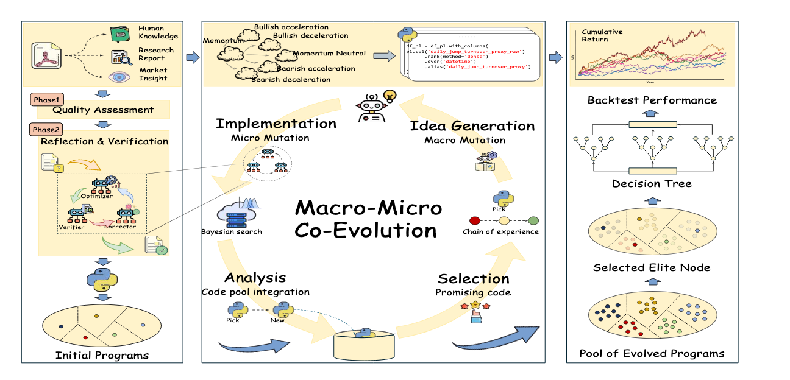
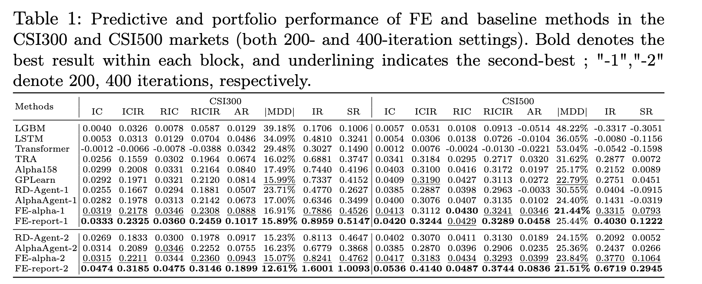

# 量化交易｜FactorEngine 论文学习笔记
> **论文全称**：FactorEngine: A Program-level Knowledge-Infused Factor Mining Framework for Quantitative Investment  
> **作者**：Qinhong Lin, Ruitao Feng, Yinglun Feng, Zhenxin Huang, Yukun Chen, Zhongliang Yang, Linna Zhou, Binjie Fei, Jiaqi Liu, Yu Li  
> **发表**：arXiv (2026) 

## 一、一句话总结

这篇论文提出了 **FactorEngine（FE）**，一个将因子表示为 **图灵完备的 Python 程序**，并通过 **宏-微协同进化（Macro-Micro Co-evolution）** 框架来持续优化因子的自动化挖掘系统。它将因子逻辑的语义探索（由 LLM 负责）与参数的具体数值调优（由贝叶斯搜索负责）**完全解耦**，同时引入了一个**多智能体知识引导模块**，将金融研究报告转化为可执行的初始种子因子。实验表明，FactorEngine 在预测稳定性（IC/ICIR）和组合收益（超额年化收益）上相比基线实现了显著提升（IC 提升 58%，超额收益提升 126%）。


> **图 1：FactorEngine（FE）整体架构概览**（图片占位）

## 二、符号定义

- **$\mathbf{X}_{t - L + 1:t}$（历史特征张量）**：
  - **含义**：在回看窗口  $L$ 内，全市场股票的所有原始特征数据。
  - **结构**：$mathbb{R}^{N \times L \times M}$。
    -  $N$ = 股票数量（横截面维度）。
    -  $L$ = 回看窗口长度（时间序列维度）。
    -  $M$ = 特征数量（如 OHLCV 等）。
- **$\mathbf{Y}$（未来收益向量）**：
  - **含义**：模型需要预测的**目标变量**。
  - **结构**： $\mathbf{Y} \in \mathbb{R}^{T \times N}$，其中  $y_{t,i}$ 表示第  $t$ 天第  $i$ 只股票在未来  $l$ 日内的收益率。
- **$\mathcal{P}$（程序搜索空间）**：
  - **含义**：与之前 Alpha Jungle 论文中受限的数学运算符空间 \$mathcal{A$ 不同，FactorEngine 将搜索空间扩展为**所有符合接口规范的 Python 可执行程序**构成的集合。
  - **优势**：支持条件判断（if/else）、循环迭代等复杂控制流，实现图灵完备的因子表达。

## 三、问题定义

论文将程序级因子挖掘定义为一个在**高维代码空间**中寻找最优可执行程序的优化问题。

**核心挑战**：传统的符号因子挖掘受限于预定义的数学运算符集（ $+, -, \times, \div, \text{Ma}, \text{Std}$ 等），**表现力有限（Bounded Expressiveness）**，难以建模复杂的市场交互逻辑（如条件分桶、动态回看窗口等）。同时，现有的 LLM 因子挖掘框架（如 AlphaAgent、RD-Agent）存在严重的 **效率瓶颈**：它们依赖 LLM 同时处理逻辑推理（宏观）和参数数值搜索（微观），导致大量的 Token 消耗和极慢的收敛速度。

**形式化定义**：
寻找一个程序  $P$（即因子函数），它接收市场历史数据  $X_{t-L+1:t}$ 作为输入，输出对未来收益  $Y_t$ 的预测信号。优化目标为最大化其评估指标集合（如 IC、ICIR 等），该过程可抽象为：
$$
\max_{P \in \mathcal{P}} \mathcal{F}(P)
$$
其中  $\mathcal{F}$ 是基于回测绩效的综合评估函数。

> **总结 FactorEngine 解决的问题**：如何在**不牺牲可解释性**（保留代码逻辑）的前提下，突破传统数学表达式的表现力天花板，并**大幅提升 LLM 在因子挖掘中的算力利用率**（将 LLM 从繁重的参数调优中解放出来）。

## 四、相关工作

论文将现有的因子挖掘方法分为三类，并指出它们各自的局限性：

| 门派 | 代表方法 | 核心做法 | 论文批评的致命缺陷 |
| :--- | :--- | :--- | :--- |
| **传统符号派** | GPlearn, AutoAlpha, AlphaEvolve | 基于遗传编程（GP）在预定义的运算符空间中组合数学公式。 | **表现力受限**：无法实现复杂的条件分支或循环逻辑，难以捕捉动态市场结构。 |
| **深度学习黑盒派** | LSTM, Transformer, FactorVAE | 利用神经网络自动提取特征表示，输出连续值预测。 | **不可解释**：无法提供显式的因子表达式，基金经理难以信任；且容易过拟合。 |
| **LLM 驱动派（前代）** | AlphaAgent, RD-Agent, FAMA | 利用 LLM 生成、修复和优化因子代码或表达式。 | **逻辑与参数耦合**：LLM 既要改逻辑又要调参数，导致搜索效率极低（Token 成本高，迭代慢），且参数极易陷入局部最优。 |

## 五、论文贡献

#### 创新点 1：提出“程序级（Program-level）”超启发式搜索范式
- **之前的同行**：将因子限定为数学公式树（Symbolic Tree），节点只能是预定义的运算符。
- **这篇论文的创新**：将因子定义为**可执行的 Python 代码片段**。这使得因子可以包含复杂控制流（如 `if volume > threshold`）、自定义中间变量和多种数据处理逻辑，极大地扩展了因子的表现空间。
- **工程约束**：为了保持可执行性和可比性，FactorEngine 对代码接口进行了严格约束（如定义输入输出格式、限制使用的库），确保生成的程序是“可审计、可回溯”的。

#### 创新点 2：引入“宏-微协同进化（Macro-Micro Co-evolution）”
- **之前的同行**：LLM 直接生成包含具体数值（如 `period=20`）的完整代码。
- **这篇论文的创新（核心架构分离）**：
    1.  **宏观（Macro）**：LLM 只负责“逻辑变异”（比如把“移动平均”改成“指数加权平均”，或者新增一个条件判断分支），**专注于语义推理**。
    2.  **微观（Micro）**：具体的参数数值（如窗口大小 `5` 还是 `20`，权重 `0.3` 还是 `0.7`）完全交给本地的 **贝叶斯搜索（Bayesian Optimization）** 自动遍历。
    -   *此举彻底将 LLM 从繁重的数值调优中解放出来，大幅节省 Token 消耗，同时利用贝叶斯搜索的高效性精准定位最优参数。*

#### 创新点 3：知识引导的多智能体引导（Knowledge-Infused Bootstrapping）
- **之前的同行**：大多从随机初始因子或简单的数学公式开始迭代。
- **这篇论文的创新**：设计了一套**闭循环（Closed-loop）多智能体系统**，能够直接读取金融研究报告（PDF），自动提取核心金融逻辑，校验逻辑一致性，最终生成可执行的 Python 种子因子代码。
- **效果**：种子因子自带金融理论“基因”（如价值投资、动量因子逻辑），显著提升了初始因子库的质量，使得后续进化起点更高，收敛更快。

## 六、算法

FactorEngine 的算法流程遵循一个**树结构的进化搜索（Tree-based Evolution）**范式，同样包含基于 UCT 的选择、LLM 驱动的变异生成、本地执行评估与反馈，但在“生成”环节引入了**宏-微分离**机制。

总体算法流程如下：

#### 1. 选择阶段（Selection）：基于 UCT 的节点选取
- **树结构维护**：FactorEngine 同样将因子组织成树状结构（\$mathcal{P$），每个节点是一个已评估的可执行程序。
- **节点价值定义**：节点  $v$ 的价值  $Q(v)$ 被定义为其**子树内所有节点评估分数的经验平均值**（反映历史潜力）。
- **UCT 准则**：与 Alpha Jungle 类似，采用 UCT 公式平衡探索与利用：
  $$
  UCT(v) = Q(v) + c \sqrt{\frac{\ln N_{\text{parent}(v)}}{N_v}}
  $$
  选择 UCT 值最高的节点作为当前进化的父代。

#### 2. 宏观逻辑进化与微观参数调优（Macro & Micro Evolution）
这是 FactorEngine 区别于 Alpha Jungle 最核心的环节，它将“生成新因子”分解为两个独立的步骤：

- **Step A：经验链（Chain of Experience, CoE）驱动的宏观变异**
  - **上下文构建**：系统不仅提供当前节点的代码，还检索历史进化路径（CoE）。特别地，系统会筛选出 3 条**高绩效但低重叠（Overlap）**的路径作为示例。
  - **路径评分**：通过计算候选路径与当前进化链的**覆盖度（Coverage Score）**以及路径平均分（Effectiveness Score），最终加权得到路径总分  $S_{\text{total}}(p_i) = S_{\text{eff}}(p_i) - \gamma S_{\text{cov}}(p_i)$。这确保了 LLM 参考了优秀经验且避开了同质化路径。
  - **LLM 动作**：LLM 综合分析环境反馈与经验链，输出自然语言的**修改思路（Idea）**和对应的**代码差异（SEARCH/REPLACE diff）**。
  - **关键约束**：LLM 仅需提供**参数搜索范围**（如 “`period` 应在 5 到 30 之间”），而**不**直接给出具体数值。

- **Step B：基于贝叶斯搜索的微观参数调优**
  - **资源分离**：这一阶段**完全不由 LLM 参与**，全流程在本地计算资源上执行。
  - **优化目标**： $\theta^* = \arg\max_{\theta \in \Theta} f(P, \theta)$。
  - **执行策略**：采用**期望提升（Expected Improvement, EI）**准则指导参数采样：
    $$
    EI(\theta) = \int_{-\infty}^{\infty} \max(y^* - y, 0) \cdot p(y|\theta) dy
    $$
  - **并行加速**：利用多进程并行执行不同参数配置下的因子回测，极大地缩短了微调时间。

#### 3. 评估与反馈（Evaluation & Feedback）
- **评分函数（Fitness Score, FS）**：在验证集上计算综合得分，作为进化的奖励信号：
  $$
  FS = \frac{1}{4} (IC \times 10 + ICIR + RIC \times 10 + RICIR)
  $$
  其中  $RIC$ 即 RankIC， $RICIR$ 即 RankICIR。
- **精英筛选**：在滚动评估窗口下，仅保留评分高于 0.4 且排名前 5 的因子节点，以及每个节点下排名前 10 的参数配置，写入因子库。

#### 4. 反向传播（Backpropagation）
- 更新选中节点及其祖先节点的访问计数  $N(v)$ 和平均价值  $Q(v)$。
- 重复上述过程，直至达到预设的进化迭代轮次（200 或 400 轮）。

## 七、评估方法

论文采用了一套**预测能力 + 组合绩效 + 效率质量**三位一体的复合评估体系：

#### 1. 预测能力评估（Predictive Performance）

- **信息系数（IC）**：衡量预测值与真实收益的**皮尔逊相关系数**。
- **ICIR（Information Coefficient Information Ratio）**：IC 的时间序列均值与标准差之比：
  $$
  ICIR = \frac{\text{mean}(IC)}{\text{std}(IC)}
  $$
  用于评估因子预测能力的**时间稳定性**（值越高越稳健）。
- **秩信息系数（RIC）**：即 **RankIC**，衡量预测排名与真实收益排名的**斯皮尔曼秩相关系数**。
- **RICIR（Rank IC Information Ratio）**：RIC 的时间序列均值与标准差之比。

#### 2. 组合盈利能力评估（Portfolio Performance）

- **年化收益（AR, Annualized Return）**：投资组合净值的复合年化几何增长率。
- **年化超额收益（AER, Annualized Excess Return）**：组合相对市场基准（如沪深 300）的超额部分复合年化值。
- **信息比率（IR, Information Ratio）**：超额收益除以跟踪误差（超额收益的标准差）。
- **夏普比率（SR, Sharpe Ratio）**：单位总风险（波动率）获得的超额收益，论文报告年化值： $SR_{\text{ann}} = \sqrt{252} \times \frac{\text{mean}(r_t)}{\text{std}(r_t)}$。
- **最大回撤（MDD, Maximum Drawdown）**：组合净值从历史峰值到谷底的最大亏损幅度。

#### 3. 搜索效率与可执行性评估（Efficiency & Executability）

- **Token 效率与运行成本**：统计不同框架（AlphaAgent, RD-Agent, FE）在单次实验中的 API 调用次数、Token 消耗量、总耗时（小时）及折算美**元成本**。
- **可执行比率（Executable Ratio）**：生成的因子代码能够成功通过语法检查并运行的百分比。
- **Debug 调用占比**：用于代码调试修复的 API 调用占比，反映生成代码的初始质量。

#### 4. 因子多样性评估（Diversity Analysis）

- **多维缩放（MDS）可视化**：将因子间的相关系数矩阵投影到二维空间。论文通过观察因子点的**空间分散程度（如“圆形分散”模式）**以及计算**回转半径（Radius of Gyration, RoG）**来量化因子集的非冗余程度。

#### 5. 衰减分析（Alpha Decay Analysis）

- **年度 IC/RIC 趋势**：逐年观测测试集上因子的 IC 变化，衡量因子有效性随时间衰减的速度。论文特别关注 2021 年后因子表现是否仍有回升（表明策略适应性）。

## 八、实验设置和实验结论

实验设计旨在回答三个核心研究问题：
- **（Q1）** FactorEngine 在预测与交易层面是否优于现有的传统方法及 LLM 代理方法？
- **（Q2）** 宏-微协同进化（贝叶斯搜索）与经验链（CoE）组件是否有显著贡献？
- **（Q3）** FactorEngine 是否能生成更多样化且衰减更慢的因子？

#### 1. 数据集的选取与预处理
- **市场数据**：来源于 Qlib 平台的全市场 A 股数据，重点分析 **沪深 300（CSI 300）** 与 **中证 500（CSI 500）** 成分股。
- **特征**：仅使用 **OHLCV**（开盘、最高、最低、收盘、成交量）原始量价数据。
- **防泄漏严格拆分**：
  - **挖矿阶段**：训练 2008-2012、验证 2013、回测校验 2014。
  - **模型评估阶段**：训练 2008-2014、验证 2015-2016、测试 **2017-2024**。
  - **知识引导防泄漏**：仅使用 **2017 年以前** 发布的金融研究报告进行种子因子提取，确保测试期内无报告知识泄露。

#### 2. 基线模型（Baselines）的选取
- **传统机器学习/时序模型**：LightGBM（LGBM）、LSTM、Transformer。
- **金融专用模型**：TRA（时序路由适配器）。
- **传统符号挖掘**：GPlearn（遗传编程）。
- **手工经典因子库**：**Alpha158**（Qlib 内置的 158 个手工因子）。
- **前沿 LLM 代理方法**：**AlphaAgent**、**RD-Agent-Quant**（为了保证公平，所有代理方法均统一使用 Gemini-2.5-Pro 作为基座模型）。

#### 3. 关键超参数与约束设置
- **迭代预算**：分别进行了 **200 轮** 和 **400 轮** 进化实验，每轮生成 1 个因子。
- **初始种子**：
  - **FE-alpha**：使用一组手工精选因子（如 `corr5`, `resi5` 等 5~10 个）作为种子。
  - **FE-report**：使用从金融报告中提取的因子作为种子。
- **组合模型融合**：将各方法生成的前沿因子与 **Alpha158** 合并，共同训练下游 LightGBM 模型。
- **交易策略**：每日滚动持有 Top-50 股票，持有期 5 天，计入双边手续费（0.015%）、印花税（0.05%）及冲击成本（0.08%）。

#### 4. 实验内容与核心结论

**实验 1：预测能力与交易表现对比（回应 Q1）**
- **观测指标**：IC、ICIR、RIC、RICIR、AR、IR、MDD、夏普比率。
- **核心结论**：
  - **绝对领先**：在所有实验设置下，FE-report（基于报告引导）取得了最高的 IC（CSI300 达 **0.0474**，CSI500 达 **0.0536**）和最高的超额年化收益（CSI300 达 **18.99%**）。
  - **定量对比**：相比 Alpha158，FactorEngine 在 IC 上实现了 **58%** 的提升，在超额年化收益（AR）上实现了 **126%** 的提升。
  - **市场适应性**：传统模型（LGBM/LSTM）在 CSI500 上甚至出现了负超额收益，而 FE 始终保持稳健的正向收益。



**实验 2：消融研究与多样性分析（回应 Q2）**
- **贝叶斯微调消融**：对比“w/ Bayes”和“w/o Bayes”。结果显示，加入贝叶斯搜索后，因子最优适应度（Fitness）从约 0.25 跃升至约 0.38，且收敛速度显著加快（见图 5 左）。证明了**将参数搜索交给贝叶斯是大幅提升因子质量的必要环节**。
- **经验链（CoE）消融**：在 Prompt 中移除 CoE（仅使用 Top-k 示例）后，RIC 和 IR 均出现下降。验证了“从失败和曲折历史中学习”的 CoE 机制对提升策略稳健性至关重要。
- **多样性（MDS 可视化）**：FE-alpha 的因子在 MDS 二维投影中呈现明显的“**圆形分散（Circular Dispersion）**”模式，且回转半径（RoG）最大。相比之下，AlphaAgent 和 RD-Agent 的因子分布较为集中，表明 FE 挖掘出的因子具有更强的**非冗余性和互补性**。

**实验 3：因子衰减与效率分析（回应 Q3）**
- **衰减分析**：在 2017-2024 的测试期内，所有因子的 IC 均有衰减。但 FE-report 在 2021 年后依然保持了极高且平稳的 IC 水平，甚至出现回升，而其他基线波动极大（见图 4）。
- **资源效率**：
  - **Token 与成本**：FE 在 200 轮迭代中的运行成本为 **12.0 美元**，略高于 AlphaAgent（11.6 美元），但远低于 RD-Agent（16.9 美元）。
  - **可执行性**：FE 生成的因子代码**可执行比率高达 99%**，且仅需 32% 的 API 调用用于调试（Debug），显著优于 AlphaAgent（51%）和 RD-Agent（68%）。这表明 FE 的代码生成质量极高，几乎一次性通过语法校验。


## 九、它具体训练了什么

**FactorEngine 的微观参数调优，是利用贝叶斯优化（Bayesian Optimization）训练一个不断更新的概率代理模型（Surrogate Model），来精准推测和寻优因子程序中“一组”具体数值参数（如窗口期、权重系数等）的最佳组合。该过程完全由本地高性能计算执行，与 LLM 的逻辑推理完全解耦。**


#### 1. 底层算法：贝叶斯优化（Bayesian Optimization）

微观参数调优的底层算法是 **贝叶斯优化**，论文明确其实现支持：
- **TPE（Tree-structured Parzen Estimator）**
- **高斯过程（Gaussian Process）**

#### 2. 优化的目标函数

对于给定的因子程序  $P$ 及其参数向量  $\theta \in \Theta$，优化目标是找到使因子评估分数  $f(P, \theta)$ 最大化的参数组合：

$$
\theta^* = \arg\max_{\theta \in \Theta} f(P, \theta)
$$

其中：
-  $\theta$：因子程序中的可调参数向量（如 `[窗口期, 权重1, 权重2, 衰减系数]`）
-  $f(P, \theta)$：评估函数，返回该因子在验证集上的 **Fitness Score（FS）**：
  $$
  FS = \frac{1}{4} \left( IC \times 10 + ICIR + RIC \times 10 + RICIR \right)
  $$

#### 3. 训练对象：概率代理模型（Surrogate Model）

这里的“训练”特指**训练一个代理模型来近似黑盒目标函数  $f(P, \theta)$**。

| 概念 | 解释 |
| :--- | :--- |
| **为什么需要代理模型？** | 每评估一组参数（即运行一次完整回测）涉及大量数据 I/O 和矩阵运算，成本极高。若暴力穷举（Grid Search / Random Search），计算量不可接受。 |
| **训练数据从哪来？** | 从参数空间中随机采样若干组  $\theta$（如 5~10 组），送入回测引擎得到对应的 FS，构成初始训练集  $\{(\theta_i, y_i)\}_{i=1}^n$。 |
| **如何训练？** | 用这些数据对拟合一个概率模型（如高斯过程 GP）。该模型能够输出：**(1)** 对任意新参数  $\theta$ 的 FS 预测均值  $\mu(\theta)$；**(2)** 该预测的不确定性（方差） $\sigma^2(\theta)$。 |
| **训练的演进本质** | 随着迭代次数增加，采样点不断增多，代理模型的后验分布持续更新，其对目标函数  $f(P, \theta)$ 的近似越来越精确——这一过程即为“训练”的数学实质。 |

#### 4. 如何决定下一步采样：期望提升（Expected Improvement, EI）

代理模型训练完成后，通过最大化 **采集函数（Acquisition Function）** 来决定下一次该尝试哪组参数。论文采用 **期望提升（Expected Improvement, EI）**：

$$
EI(\theta) = \int_{-\infty}^{\infty} \max(y^* - y, 0) \cdot p(y|\theta) \, dy
$$

| 符号 | 含义 |
| :--- | :--- |
|  $y^*$ | 当前已观测到的最佳 FS 分数 |
|  $y$ | 代理模型预测的 FS 分数（随机变量） |
|  $p(y|\theta)$ | 代理模型给出的参数  $\theta$ 对应的 FS 概率分布 |

**EI 的平衡机制**：
- **利用（Exploitation）**：倾向于选择预测均值  $\mu(\theta)$ 高的区域（大概率有好结果）
- **探索（Exploration）**：倾向于选择预测方差  $\sigma^2(\theta)$ 大的区域（不确定性高，可能有隐藏极值）

EI 最大的那组  $\theta$，即为下一轮真实回测的候选参数。


#### 5. 调优对象：一组参数，而非单个参数

微观调优**不是**孤立地逐个调整单一参数，而是**联合优化一组参数的整体最优组合**。

在 FactorEngine 的 Prompt 设计（附录 A.6）中，LLM 被要求明确定义需要调优的参数名称、类型和搜索范围。例如：

```json
{
  "w_v": {"type": "float", "low": 0.3, "high": 0.9},
  "N_r": {"type": "int", "low": 5, "high": 30}
}
```

这代表贝叶斯优化会在**二维连续-离散混合空间**中，同时搜索：
- `w_v`（权重系数）：在 0.3 到 0.9 之间连续变化
- `N_r`（回看窗口）：在 5 到 30 之间取整数值

#### 6. 为什么要联合优化？（多参数交互效应）

贝叶斯优化的核心优势在于它能捕捉**参数间的交互效应（Interaction Effects）**：

| 场景 | 孤立调参（错误） | 联合调参（正确） |
| :--- | :--- | :--- |
| 窗口期=5 时，最优权重可能是 0.3 | 固定窗口=10，只调权重 | 同时变化两个参数，发现 (窗口=20, 权重=0.7) 才是全局最优 |
| 窗口期=30 时，最优权重可能升至 0.7 | 得到局部次优解 | 找到全局最优组合 |

因此，微观调优是在高维空间中寻找**全局最优的  $\theta$ 向量**，而非多轮单变量扫描。


```
输入：因子程序 P，LLM 划定的参数范围 Θ = {θ₁, θ₂, ...}
输出：最优参数组合 θ* 及对应的最优适应度 FS*

初始化：
  从 Θ 中随机采样 n 组 θ → 运行回测 → 获得 n 个 FS 值
  → 构成初始训练集 D = {(θᵢ, FSᵢ)}

循环（直到达到预算轮次）：
  1. 用 D 训练/更新代理模型（GP 或 TPE）
  2. 对 Θ 中的所有候选 θ，计算 EI(θ)
  3. 选择 θ_new = argmax EI(θ)
  4. 将 θ_new 送入回测引擎，获得 FS_new
  5. 将 (θ_new, FS_new) 加入 D
  6. 若 FS_new > FS*，更新 FS* = FS_new，θ* = θ_new

返回：θ* 和 FS*
```

