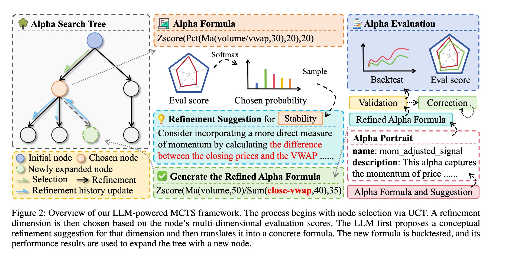
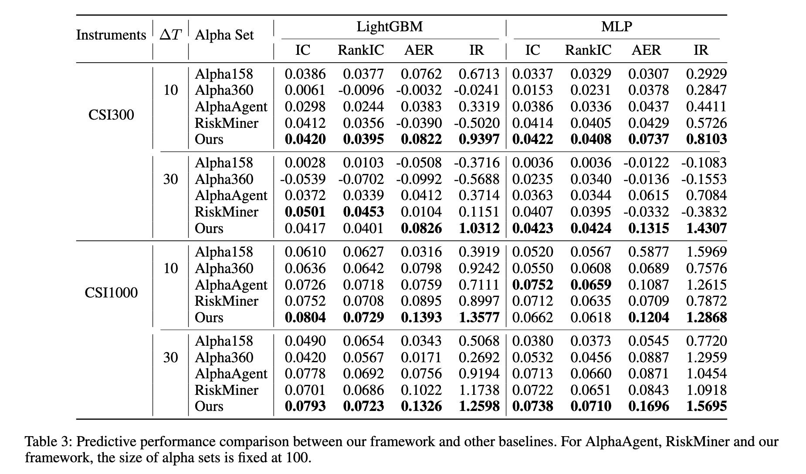

# 量化交易｜Navigating the Alpha Jungle 论文学习笔记
> **论文全称**：Navigating the Alpha Jungle: An LLM-Powered MCTS Framework for Formulaic Factor Mining  
> **作者**：Yu Shi, Yitong Duan, Jian Li（清华大学交叉信息研究院）  
> **发表**：AAAI（2026） 

## 一、一句话总结

这篇论文把 **大语言模型（LLM）** 和 **蒙特卡洛树搜索（MCTS）** 结合起来，自动搜索、迭代改进**可解释的数学公式型 Alpha 因子**，并用金融回测的多维度反馈来指导搜索方向，最终挖出的因子在预测能力和可解释性上都优于遗传编程、强化学习等方法。

## 二、符号定义

- **$\mathbf{X}$ (市场历史张量)**：
  - **含义**：整个股市的历史数据库。
  - **结构**：是一个三维数组 $\mathbb{R}^{T \times n \times m}$。
    - $T$ = 交易天数（时间轴）。
    - $n$ = 股票数量（横截面轴，比如沪深300有300只票）。
    - $m$ = 特征数量（比如开盘价、收盘价、成交量等）。
- **$\mathbf{Y}$ (未来收益矩阵)**：
  - **含义**：我们**想要预测的目标**（即标准答案 Label）。
  - **计算**：$y_{i,t}$ 表示股票 $i$ 在 $t$ 日之后的未来一段时间的收益率（比如未来10天的涨幅）。
- **$\tau$ (Lookback Window，回看窗口)**：
  - **含义**：计算因子时，需要往前看多少天的历史数据。
  - **举例**：如果计算“过去20日的平均收盘价”，那么 $\tau = 20$。

## 三、问题定义

论文将量化因子挖掘定义为一个 **双层优化问题（Bilevel Optimization Problem）**，并指出了传统解法面临的两大“致命伤”。

**1. 数学上的定义（用术语怎么说）：**
我们要在浩瀚的搜索空间 $\mathcal{A}$ 中，找到一组最优的因子集合 $\mathcal{F}^*$。这组因子经过下游组合模型 $g$（比如LightGBM）融合后，能让预测指标 $\mathcal{L}$（比如RankIC）最大。
$$
\mathcal{F}^* = \arg \max_{\mathcal{F}\subset \mathcal{A}} \mathcal{L}(g^{*}(\mathcal{F}), \mathbf{Y})
$$
*通俗说*：就是要找出“一组公式”，它们合在一起时，预测股价最准。

**2. 但论文认为，现有的解法存在两个“硬伤”：**

-   **硬伤一：搜索效率极低（Search Inefficiency）**。
    -   传统方法（如遗传编程GP）是在 $\mathcal{A}$ 空间里“瞎猫碰死耗子”。为了找到一个好因子，可能需要生成和回测几十万乃至上百万个候选者。
    -   **后果**：极大的算力浪费，且因为尝试次数太多，极易发现**虚假相关性（Spurious Relationships）**，导致因子在实盘（Out-of-sample）中严重**过拟合**。

-   **硬伤二：因子极其缺乏可解释性（Poor Interpretability）**。
    -   传统AI挖出的公式（如论文举例的 `Add(Mul(-0.01, volume), Log(Log(close)))`）存在**量纲不一致**的问题（成交量（股数）加上价格的对数，在金融学上毫无意义）。
    -   **后果**：基金经理看不懂公式背后的经济逻辑，不敢实盘投入资金，导致模型虽然回测好看，但无法落地。

> **总结论文定义的问题**：如何在**不限制定向搜索次数**的前提下，高效地从 $\mathcal{A}$ 中找出 **既具备高预测能力（高RankIC/IR），又拥有符合金融直觉（可解释）** 的因子公式。

## 四、相关工作

论文将现有的“同行”分为三大门派

| 门派 | 代表方法 | 他们的做法（怎么做） | 论文批评的致命缺陷 |
| :--- | :--- | :--- | :--- |
| **传统符号派** | **GP（遗传编程）**、**AutoAlpha** | 随机组合数学运算符（+、-、*、/），让它们“交配变异”，筛选出回测表现最好的后代。 | **无意义变异**：大量生成如 `Std(Less(...))`（对真假值求标准差）的荒唐公式，数学上成立但逻辑崩溃；且搜索极其低效。 |
| **强化学习派** | **AlphaGen**、**AlphaForge** | 训练一个强化学习智能体，让它学着逐步“搭建”公式树，或者用生成式网络直接生成因子。 | **黑盒不可控**：生成过程缺乏人类金融知识的引导，容易陷入局部最优，且AlphaForge的公式深度极大，完全无法解读。 |
| **普通LLM直接生成派** | **CoT（思维链）**、**ToT（思维树）**、**FAMA** | 直接给GPT喂提示词（Prompt），让它“一步一步思考，给我写出几个好的因子公式”。 | **缺乏反馈闭环**：LLM只是凭“记忆”生成公式，写完后就算错了也不知道为什么错。它不会利用回测的**量化反馈**来修正自己的下一步行动，且极易生成抄袭训练数据中的已知因子（数据泄露风险）。 |

## 五、论文贡献

这篇论文最大的贡献，就是**将“LLM的推理能力”与“MCTS的试错反馈机制”做了深度融合**，提出了三个极具颠覆性的创新点：

#### 创新点 1：提出了“LLM + MCTS”的主动搜索范式（核心骨架）
-   **之前的同行**：把LLM当成“一次性抄写工”，写完就结束了。
-   **这篇论文的创新**：把LLM放进了一个 **“选择 -> 扩展 -> 评估 -> 反向传播”** 的永久循环中。
-   **关键突破（Virtual Expansion）**：传统MCTS只扩展叶子节点（没走过的路）。这篇论文允许**对任意节点（包括表现不错的老因子）进行再次扩展**。这意味着，一个优秀的因子可以被LLM反复“雕琢”优化，直至极致。

#### 创新点 2：引入“维度引导的定向修复”（最精华的算法细节）
-   **之前的同行**：让LLM随机改代码，或者笼统地让它“提高收益”。
-   **这篇论文的创新（对应公式3和5）**：
    1.  系统算出该因子的 **“多维成绩单”**（有效性、稳定性、换手率、多样性、过拟合风险）。
    2.  **专打短板**：通过Softmax计算，成绩最差的维度（比如“换手率太高”）有最大概率被选中。
    3.  **先写方案，再写代码**：LLM必须先针对“换手率太高”写出一段**人类可读的金融逻辑改进建议**（Alpha Portrait），再根据这段建议去生成具体的数学公式。
    -   *此举确保了AI的每一次修改，都是有明确金融意图的，而不是瞎试。*

#### 创新点 3：动态基准评估与结构多样性控制（FSA）
-   **动态基准（Relative Ranking，公式6-7）**：同行们喜欢用固定阈值（如IC必须大于0.03）。但论文指出，早期好因子少，0.03很难；后期好因子多了，0.03又太简单。因此他们采用**百分位排名**，新因子的分数取决于它在“现有优秀因子库”里能排老几。这保证了标准永远水涨船高。
-   **频繁子树避免（FSA，公式11-12）**：为了防止所有生成的因子都长得一模一样（同质化），系统会统计现有优秀因子库中最常出现的“公式片段”（如 `Ma(close, t)`），并强行拉入**黑名单（禁止生成）**。强迫LLM去探索冷门但可能有效的结构，极大地提升了因子集的多样性。

## 六、算法

本研究提出的 LLM-MCTS 框架，将因子挖掘重构为基于树的序贯决策过程，旨在通过结构化的探索与利用权衡，实现高效且可解释的符号回归。

但是从整体上看其算法流程遵循MCTS的四阶段循环，具体设计如下：

#### 1. 选择阶段（Selection）：基于UCT的探索-利用权衡
框架以LLM生成的初始种子因子为根节点构建搜索树 $\mathcal{T}$。在每次迭代中，节点选择依据 **上限置信区间（Upper Confidence Bound for Trees, UCT）** 则进行，该准则通过质量项与探索项的和来评估动作价值：

$$
a^* = \arg\max_{a \in A(s)} \left( Q(s,a) + c \sqrt{\frac{\ln N_s}{N_{s'}}} \right)
$$

其中，$Q(s,a)$ 表示在节点 $s$ 下执行动作 $a$ 后子树所发现的最大奖励值（即最高Alpha得分），$N_s$ 与 $N_{s'}$ 分别为父节点与子节点的访问次数，$c$ 为探索常数。

**创新突破**：不同于标准MCTS仅扩展叶节点，本框架引入**虚拟扩展（Virtual Expansion）** 机制，允许对任意内部节点进行再次优化。此举确保了高潜力因子在尚未达至局部最优之前，能够获得持续的迭代修正，从而提升收敛质量。

#### 2. 扩展阶段（Expansion）：维度导向的生成机制
该阶段是框架中实现“主动学习”的核心环节，区别于传统随机变异，扩展过程由性能短板驱动：

- **维度采样（Dimension Sampling）**：每个节点 $s$ 均关联一个多维评估向量 $\mathbf{E}_s = [e_1, \dots, e_q] \in [0, e_{\text{max}}]^q$，各维度表征有效性、稳定性、换手率、多样性及过拟合风险。根据Softmax函数计算各维度被选中的概率，得分较低的维度（即性能短板）将获得更高的修正优先级。该机制确保优化方向具有明确的针对性，避免了算力在无关维度上的浪费。

- **双阶段LLM生成范式**：在确定需修正的维度后，LLM的首个任务是生成一段**文本化改进建议（Refinement Suggestion）**，旨在以人类可理解的金融直觉描述优化逻辑；其次，基于该文本建议，LLM将其转化为结构化的**伪代码表达式（Alpha Formula Generation）**，并通过语法验证与迭代纠错机制确保输出的合规性。

#### 3. 评估阶段（Evaluation）：基于相对排序的绩效度量
为解决绩效评估标准随有效因子库积累而动态变化的问题，本研究摒弃了固定阈值评估法，转而采用 **相对百分位排名（Relative Percentile Ranking）** 机制：

$$
R(f, m, \mathcal{F}_{zoo}) = \frac{1}{|\mathcal{F}_{zoo}|} \sum_{f' \in \mathcal{F}_{zoo}} \mathbb{I}(m(f) < m(f'))
$$

其核心逻辑在于，因子 $f$ 在某一维度上的得分 $e_i$ 完全由其相对于当前有效因子库 $\mathcal{F}_{zoo}$ 的排名所决定：$e_i(f) = 1 - R(f, m_i, \mathcal{F}_{zoo})$。这种方法实现了评估基准的自动适应，并维持了持续的竞争压力。特别地，对于过拟合风险维度的评估，框架引入独立的LLM作为评审专家，依据表达式的复杂性、参数数量及修改历史进行定性打分，提供了超越纯数值统计的泛化能力先验约束。

#### 4. 反向传播（Backpropagation）与动态预算（Dynamic Budget）
新生成因子的综合得分 $S(f_{new})$ 沿搜索路径回溯，更新所有祖先节点的统计数据。值得注意的是，$Q(s,a)$ 的更新采用 **最大值更新（Maximum Update）** 策略，而非平均值，即 $Q(s_k, a_k) \leftarrow \max(Q(s_k, a_k), S(f_{new}))$，以确保路径价值能精准反映其子树内蕴含的最优潜力。同时，若 $S(f_{new})$ 突破了当前树内记录，系统将按预设增量增加该树的搜索预算，实现对高潜力区域的深度优先分配。

#### 5. 结构多样性调控：频繁子树避免（Frequent Subtree Avoidance）
为缓解迭代优化过程中的结构同质化问题，该框架引入了频繁子树避免机制。该机制首先对 $\mathcal{F}_{zoo}$ 中所有因子进行抽象语法树（AST）解析，并提取“根基因（Root Gene）”——即叶子节点均为原始输入特征的最小子树结构。通过计算各抽象模式的支持度（Support）：

$$
\text{Support}(\bar{g}) = \frac{1}{|\mathcal{F}_{zoo}|} \sum_{f' \in \mathcal{F}_{zoo}} \mathbb{I}(\bar{g} \subseteq \bar{\mathcal{G}}(f'))
$$

支持度排名前 $k$ 的频繁模式将被动态收录至**禁止结构集合（Forbidden Structures）**。在后续LLM生成指令中，系统将强制要求新生成的表达式不得包含这些已被过度开发的符号结构。该约束通过强迫搜索向 $\mathcal{A}$ 空间中冷门但潜力未证实的区域转移，显著提升了因子集的整体多样性与探索效率。

## 七、评估方法

#### 1 预测能力评估（Predictive Performance）

此类指标用于衡量挖掘出的因子集合对股票未来收益的**预测准确性**，是评判因子有效性的核心统计学依据。

#### 信息系数（Information Coefficient, IC）
- **定义**：IC 衡量在第 $t$ 个时间截面，因子预测得分 $f_{i,t}$ 与下一期实际收益率 $r_{i,t+1}$ 之间的**皮尔逊线性相关系数**。它反映了因子预测值与真实值之间的线性吻合程度。
- **计算方法**：
  $$
  \text{IC}_t = \frac{\sum_{i=1}^{N_t} (f_{i,t} - \bar{f}_t)(r_{i,t+1} - \bar{r}_{t+1})}{\sqrt{\sum_{i=1}^{N_t} (f_{i,t} - \bar{f}_t)^2} \sqrt{\sum_{i=1}^{N_t} (r_{i,t+1} - \bar{r}_{t+1})^2}}
  $$
  最终报告值为全时间序列上的均值：$\text{IC} = \frac{1}{T} \sum_{t=1}^T \text{IC}_t$。

#### 秩信息系数（Rank Information Coefficient, RankIC）
- **定义**：RankIC 衡量因子预测得分排名与未来实际收益率排名之间的**斯皮尔曼秩相关系数**。与 IC 相比，RankIC 对极端离群值（如因黑天鹅事件导致的暴涨暴跌）具有更强的鲁棒性，更关注因子对股票优劣顺序的判别能力。**该指标是论文中最核心的预测能力评判标准**。
- **计算方法**：
  $$
  \text{RankIC}_t = \text{Corr}\left( \text{rank}(f_{1,t}, \dots, f_{N_t,t}),\ \text{rank}(r_{1,t+1}, \dots, r_{N_t,t+1}) \right)
  $$
  最终报告值为时间序列均值：$\text{RankIC} = \frac{1}{T} \sum_{t=1}^T \text{RankIC}_t$。

#### 2. 交易盈利能力评估（Trading Performance）

此类指标通过模拟真实交易场景（扣除交易成本），评估因子在实际投资组合管理中的**经济价值**。

#### 年化超额收益（Annualized Excess Return, AER）
- **定义**：AER 衡量依据因子信号构建的投资组合，相对于市场基准（如沪深300指数）每年能够获得的**算术平均超额收益**。它直接反映了策略的绝对赚钱能力。
- **计算方法**：在每个调仓日，选取预测得分最高的 $k$ 只股票构成等权投资组合。设 $r_{s,t+1}^e$ 为个股相对基准的超额收益，则投资组合在 $t+1$ 期的超额收益率为 $R_{p,t+1} = \frac{1}{k} \sum_{s \in \text{TopK}_t} r_{s,t+1}^e$。最终，$\text{AER} = \left( \frac{1}{T_p} \sum_{j=1}^{T_p} R_{p,j} \right) \times P$，其中 $P$ 为年度调仓周期数（如日频 $P=252$）。

####  信息比率（Information Ratio, IR）
- **定义**：IR 衡量策略承担每单位主动风险所能获得的超额收益补偿。它是评估策略**风险调整后表现**的黄金标准，数值越高代表策略的收益来源越稳健。论文中提出的框架在多个实验设置下取得了 $>1.2$ 的 IR，显著优于基线模型。
- **计算方法**：
  $$
  \text{IR} = \frac{\text{AER}}{\sigma(R_p) \cdot \sqrt{P}}
  $$
  其中 $\sigma(R_p)$ 为投资组合超额收益率序列的标准差（即跟踪误差）。

#### 3. 搜索效率与泛化能力评估（Search Efficiency & Generalization）

此类指标用于检验自动化挖掘算法的**计算经济学价值**以及**防止过拟合**的能力。

#### 搜索效率（Search Dynamics / Cumulative Effective Alpha Count）
- **定义**：该指标追踪在生成一定总量的候选因子后，能够通过有效性阈值（如 RankIC $\ge 0.015$ 且 RankIR $\ge 0.3$）并被收录进有效因子库 $\mathcal{F}_{zoo}$ 的**累计数量**。
- **计算方法**：绘制横轴为“生成的因子总数”，纵轴为“有效因子累计数量”的学习曲线。该曲线的斜率直接反映了算法的搜索效率。实验表明，论文提出的 MCTS 框架在相同生成量下，有效因子产出率显著高于 CoT、ToT 等基线。

####  样本内与样本外表现差异（In-Sample vs Out-of-Sample RankIC Gap）
- **定义**：衡量模型在训练期与测试期性能的**衰减程度**，是判断过拟合风险的核心诊断指标。
- **计算方法**：比较 Top-50 因子在训练集（2011-2020）和测试集（2021-2024）上的平均 RankIC。论文观察到，基线模型在样本内 RankIC 虚高，但在样本外急剧下滑；而论文方法通过多维约束与 FSA 机制，保持了样本内外 RankIC 的一致性，泛化差距显著缩小。

#### 4. 可解释性评估（Interpretability Evaluation）

- **定义**：鉴于传统的数值指标（IC/IR）无法反映因子的金融逻辑合理性，论文设计了一种基于 **LLM-as-a-Judge** 的评估方案，旨在量化因子表达式的**经济直觉可读性**。
- **计算方法**：从各方法挖掘出的因子中随机抽取等量样本，交由三个独立的 LLM（如 GPT-4.1, Gemini 等）依据预设标准进行排序。通过计算不同方法获取的平均排名来横向对比可解释性。结果表明，论文方法产出的公式在可解释性上显著优于传统 GP 与深度生成模型，因其避免了量纲混淆（如价格与成交量直接加减）和冗余嵌套。

#### 5. 消融实验评估维度（Ablation Study Metrics）

为了验证算法各模块的贡献，论文在表 1 中通过**逐步移除核心组件**来观察指标变化：

- **Effectiveness（有效性）**：仅使用基础 RankIC 反馈，MCTS 表现即优于随机搜索。
- **Turnover（换手率）**：纳入该维度后，虽然 IC 指标略有下降（因约束了交易自由度），但 **AER 和 IR 显著提升**，证明该约束有效削减了交易磨损成本。
- **Overfitting Risk（过拟合风险）**：引入 LLM 主观打分的正则化项后，样本外 RankIC 获得稳定提升。
- **FSA（频繁子树避免）**：在包含全部评估维度的基础上，进一步加入 FSA 机制，结果表明 **IC、RankIC、AER、IR 均获得全面提升**，验证了结构多样性约束对提升因子集整体质量的必要性。

#### 6. 成本-性能分析（Cost-Performance Analysis）

为了确保比较的公平性，论文引入了 **货币化的成本度量**，将算法运行时长与 LLM 的 Token 消耗统一换算为美元成本。实验表明，尽管论文框架的单次运行成本高于传统 GP，但在“单位成本所能获得的 IR 增益”这一效率指标上，论文方法展现出极高的性价比，且可通过更换轻量级 LLM（如 Gemini-flash）在极小成本下仍保持显著的 IR 优势。

## 八、 实验设置和实验结论

实验设计旨在回答三个核心研究问题（RQs）：
- （Q1） 算法在预测与交易层面的绝对性能表现；
- （Q2） 各核心模块（MCTS、多维反馈、FSA）的独立贡献度；
- （Q3） 挖掘出的因子在可解释性上的相对优势。

#### 1. 数据集的选取与预处理
- **主数据集（中国A股市场）**：数据来源于Qlib平台，涵盖 **沪深300指数（CSI 300）** 成分股（代表大盘蓝筹）与 **中证1000指数（CSI 1000）** 成分股（代表中小盘），旨在验证模型对不同市值风格股票池的适应性。
- **泛化性测试数据集（美国市场）**：选取 **S&P 500** 成分股，用于检验算法在不同市场微观结构下的迁移能力。
- **特征与标签**：底层特征包含每日的开盘价、最高价、最低价、收盘价（OHLC）、成交量及成交量加权平均价（VWAP）。预测目标设定为 **10日** 与 **30日** 的远期收益率。
- **时间划分**：严格遵循 **时序划分（Chronological Split)** 原则，避免未来信息泄漏。训练集为 2011/01/01 至 2020/12/31，测试集为 2021/01/01 至 2024/11/30。

#### 2. 基线模型（Baselines）的选取
为确保评估的全面性与公平性，论文选取了来自不同技术流派的代表算法：

| 技术流派 | 基线模型名称 | 核心特征简述 |
| :--- | :--- | :--- |
| **传统符号回归** | **GP (Genetic Programming)** | 基于遗传编程的因子搜索基线。 |
| **深度符号优化** | **DSO (Deep Symbolic Optimization)** | 利用深度学习的符号回归框架。 |
| **强化学习派** | **AlphaGen** | 基于强化学习生成因子集合的算法。 |
| **深度生成模型** | **AlphaForge** | 基于生成-预测架构的因子挖掘网络（仅使用其生成模块以保证公平）。 |
| **通用LLM推理** | **CoT (Chain-of-Thought)** | 标准思维链提示，引导LLM逐步生成因子。 |
| **通用LLM推理** | **ToT (Tree-of-Thought)** | 思维树提示，允许多路径探索。 |
| **LLM因子挖掘** | **FAMA** | 带有上下文示例和经验链的LLM驱动因子挖掘智能体。 |

此外，在扩展对比实验中，论文还引入了人工构建的经典因子库 **Alpha158** 与 **Alpha360**，以及近年提出的 **AlphaAgent** 和 **RiskMiner** 作为强参照基线。

#### 3. 评估指标体系
实验采用复合评估维度，兼顾统计预测能力与实盘经济价值（各指标的具体数理定义已在上一轮回复中详细展开）：
- **预测精度指标**：信息系数（IC）与秩信息系数（RankIC）。
- **交易绩效指标**：年化超额收益（AER）与信息比率（IR）。
- **算法效率指标**：单位成本下的IR增益、有效因子累计数量。
- **解释性指标**：基于第三方LLM排序的因子逻辑合理性评分。

#### 4. 关键超参数与约束设置
- **搜索预算约束（Search Count）**：为了保证比较不受计算资源差异影响，对LLM类方法统一设置生成数量为 1,000、2,000、3,000 个因子；而对传统非LLM方法（如GP），则允许其生成至多 600,000 个因子（即LLM方法的200倍），以极限测试其搜索效率。
- **有效因子入库阈值（Effectiveness Criteria）**：RankIC $\ge 0.015$，RankIR $\ge 0.3$，日换手率 $\le 1.6$，且与库内现有因子最大相关性 $< 0.8$。
- **下游模型训练配置**：
  - **LightGBM**：32片叶子，200个估计器，最大深度8，学习率0.05，L1/L2正则化系数0.1。
  - **MLP**：3层隐藏层（维度 256-128-64），Dropout率0.3，Adam优化器，学习率0.001。
- **交易成本模拟**：在回测中计入 **0.15%** 的单边交易成本，以贴近实盘环境。

#### 5. 实验内容
#### 实验 1：预测能力与交易表现对比（回应 Q1）
- **观测指标**：LightGBM 与 MLP 在 IC、RankIC、AER、IR 上的数值。
- **关键发现**：在所有实验设置（不同股票池、不同预测周期、不同因子集大小）下，论文提出的框架均取得了一致且显著的性能领先。
- **代表性数据**：以 CSI 300 指数 10日预测为例，使用 100 个因子训练 LightGBM 模型时，本框架的 RankIC 达到 **0.0395**，IR 达到 **0.9397**；而在中证1000指数上，MLP模型的 IR 达到 **1.5695**。这一结果显著高于 CoT、ToT、FAMA 及传统 GP 基线。

#### 实验 2：消融研究——核心组件的贡献度分析（回应 Q2）
- **实验方法**：通过逐步移除或增加框架中的特定模块，观测性能变化。消融维度包括：MCTS搜索结构、多维反馈信号（有效性、多样性、换手率、稳定性、过拟合风险）以及FSA机制。
- **关键发现**：
  1. **MCTS结构有效性**：单纯使用 MCTS 即便只基于有效性反馈，其性能已优于 CoT 和 ToT，验证了结构化搜索优于线性/树状推理。
  2. **换手率约束的实盘价值**：纳入换手率（Turnover）维度后，虽然 IC 指标略有下降（因约束了因子自由度），但 **AER 和 IR 获得了大幅提升**，证明该约束有效削减了交易磨损。
  3. **FSA的全局增益**：在包含全部评估维度的基础上叠加 FSA 机制后，所有指标均获得进一步提升（如 LightGBM 模型的 IR 从 1.1121 升至 1.1792），证明结构多样性约束能够有效提升因子集的整体质量与泛化能力。

#### 实验 3：因子可解释性对比（回应 Q3）
- **实验设计**：从各方法挖掘的因子中随机抽样，交由 3 个独立的 LLM（如 GPT-4.1, Gemini）依据“是否具备合理经济逻辑”进行盲审排序，重复 50 次取平均排名。
- **关键发现**：
  - 论文方法的可解释性排名仅次于 CoT，但远高于 GP、DSO 和 AlphaForge。
  - **定性案例分析**：基线 GP 生成公式常出现量纲混乱（如 `Add(Mul(-0.01, volume), Log(Log(close)))`），在金融学上无法解释。而论文框架生成的公式（如 `Zscore(Ma(close - vwap, 20), 30)`）可以清晰解读为“捕捉收盘价相对日内平均成本（VWAP）的偏离程度”，具有明确的微观结构逻辑。

#### 实验 4：泛化性与搜索效率分析
- **美国市场验证**：在 S&P 500 数据集上的实验表明，本框架依然保持最高的 IC/RankIC 水平，证明其具有良好的跨市场泛化能力。
- **成本-性能分析（Cost-Performance）**：论文将服务器运行时长与 API 调用 Token 消耗统一换算为美元成本。结果显示，使用轻量级 LLM（如 Gemini-flash）时，本框架仅需 7.5 美元成本即可获得 **1.27 的信息比率（IR）**；且在主实验中，达到相同 IR 水平所需的成本显著低于其他 LLM 基线。
- **数据泄露检验**：论文设计了专项实验，直接要求 LLM 凭记忆输出“高收益因子”，结果其性能接近随机水平，远低于本框架的挖掘结果，有效排除了 LLM 预训练数据污染导致性能虚增的可能性。
