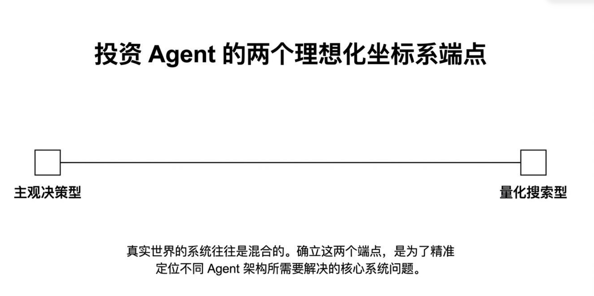

# 量化交易｜漫谈量化Agent的设计穹顶，从主观协作到Alpha“永动机”
> **课程**：人工智能在量化金融中的应用（清华大学    
> **主讲人**：李建（清华大学交叉学院教授）   
> **核心命题**：投资智能体（Investment Agent）不应是提示词技巧的延长线，而应是长期运行的、基于反馈持续进化的系统工程。

## 零、背景
端午节给自己放个假，坐高铁去天津溜达溜达。国内的高铁的乘坐体验太好了。

今天不谈数学和代码，从 high-level 的角度谈谈我对这一波agent量化交易的看法，我觉得此类判断类的文章要多写，我之前的很多判断基本都实现或者正在实现中。

在 Wei 提出 **RLVR（Reinforcement Learning from Verifiable Rewards）** 范式之后，LLM 的进化速度远超预期。我曾在一篇旧文中[^1]探讨过未来人类不易被 LLM 替代的两个方向，核心结论可归纳为五点：

1. **客观标准**：存在明确正确答案，对“好”的解决方案有广泛共识；
2. **验证速度**：能够快速验证，且评价百万级方案的时间成本不显著高于单个方案；
3. **并行化**：评价过程天然可并行；
4. **低噪声**：输出与最终评价高度相关，好答案总得高分（反面例子如“质子锁死地球科技”式的不可预测性）；
5. **反馈连续性**：长序列决策需要时刻（注意是时刻）获得中间反馈。

基于此判断，我此前将金融视为相对“安全”的领域——因为它天然偏离 RLVR 的适用条件。但近期 Agent 革命的核心方向，恰恰在于弥补 RLVR 的上述缺陷，这使得金融壁垒正在松动。

>多说一句，去年年底开始火起来的 OPD（on-policy-distillation）也是解决这几个问题的一个思路，培养科研taste很重要。

我们唯一能做的，是拥抱变化，并主动构建更先进的系统。

同样回顾最近风起的Agent革命也个个都是在解决和弥补RLVR的缺陷，这个的出现导致金融也不再是什么绝对安全的地方了，但是我们拥抱变化。

本文主线是对清华大学内部课件《人工智能在量化金融中的应用》第五讲的学习与整理，系统梳理当前 **Agent4Fin** 的研究前沿与局限。


## 一、课程概览：投资 Agent 的两个理想化坐标端点



| 维度 | 端点一：主观决策型 Agent | 端点二：量化搜索型 Agent |
| :--- | :--- | :--- |
| **决策主体** | LLM Agent 给出最终决策（模拟投研团队） | LLM Agent 写出量化策略代码，代码执行给出最终决策 |
| **输入特征** | 信息高度复杂、繁杂且异质（新闻、研报、宏观数据） | 标准化市场历史数据（OHLCV、Panel Data） |
| **系统设计重心** | **分工与协作**（Handoff、角色隔离） | **持续探索、状态积累与基于反馈的进化**（长期运行） |
| **评价体系** | 逻辑链条完整性、信息广度 | 严格的回测验证（IC、IR、Sharpe） |

> 真正带来突破的，不是“永远不犯错”，而是每一轮实验都能把问题暴露出来，让下一轮系统更强。（SpaceX 式的系统工程思维）

若读者留意我近期的量化笔记，会发现我的工作恰好覆盖了这两个端点：一套基于 **Harness + Skills** 的多智能体投研系统，以及一套全自动的 Alpha 挖掘系统。

当前业内所有 Agent4Fin 实践，基本可视为这两个端点的混合与变体。

在各位读者大家自己的量化投研的系统时，也可主动设计自己的系统处于这个坐标中的位置。接下来对这两个端点进行详细的解释。


## 二、端点一：主观决策型智能体（Subjective Decision Agent）

### 2.1 单体 Agent 的系统性困境
投资决策涉及宏观、行业、公司、新闻、舆情等异质信息，每种信息需要不同的处理工具、判断框架和更新频率。将全部任务交由单体全能模型处理，必然导致 **注意力丢失** 和 **工具幻觉**——模型会在不同类型任务间反复切换，上下文被无关信息污染，最终输出不可靠。

单智能体方面比较出名的工作是之前的大模型炒股比赛，文章在【】这里，事后来看我的当时的判断是正确的：

```
还记得《流浪地球2》刚上映那会儿，我第一次看到 MOSS 的时候，

那种震撼至今难忘——它能实时重写操作系统、理解人类语言、甚至构建数字生命。

那时我还以为，这样的“人工智能”至少要几十年后才会出现。

结果转眼之间，Claude和Cursor、已经能帮我们写代码，Sora已经能生成不错的视频了（是不是数字生命？）。

从 0 到 1 的突破已经完成，而从 1 到 100 的奔跑，正在进行。

让我不禁想起——

1886 年，卡尔·本茨驾驶着世界上第一辆汽车驶过德国曼海姆的街头。

那天，围观的人群惊恐地四散奔逃，

因为那辆冒着烟的“铁马”太吵、太快、太不可思议。

一个世纪之后，我们再次迎来了新的“铁马”——

这次，它不是汽缸，而是神经网络；

不是轮胎的轰鸣，而是算力的轰鸣。

今天，我们质疑 AI 是否真的理解市场；

明天，也许那些不会使用“方向盘”的人类交易员，

会像不会驾驭蒸汽机的车夫一样，被历史悄然淘汰。

但在敬畏的同时，我们也要保持清醒。

我最喜欢的一个学者型作家纳西姆·塔勒布（Nassim Taleb）在《随机漫步的傻瓜》中写道一个经典的比喻：

“一个醉酒的人在路灯下踉跄地走着，看起来似乎在前进， 但他其实只是随机地晃动，偶尔向前一步，全靠运气。”

市场中无数看似聪明的模型、杰出的交易员、DeepSeek

很多时候，也不过是这位“醉酒的行人”。

他们的成功，也许只是随机波动中的一次幸运。

也许不是。

```

跟朋友闲聊的时候我提到，目前的 code agent已经无限接近于 MOSS 了，而马斯克的spaceX 也在快速的靠近 太空电梯。 

扯远了。仅仅过了半年，大模型做投资已经从一个“烂醉”的人逐渐走向了“有一些清醒但是仍旧酒醉”的人。接下来展开讲讲主观决策智能体的特点。（注：主观决策智能体不一定非要 多智能体合作，multi-agent 只是手段不是目的）。局限于当下的智能体技术，多智能体在整体上限上更高。

### 2.2 分布式协作的核心设计原则
将系统还原为真实的业务协作逻辑：
1. **责任明确**：角色边界清晰，各司其职（如宏观 Agent、行业 Agent、公司 Agent）。
2. **信息顺畅**：打破各自为战，高效共享上下文。
3. **协作清楚**：明确输入、判断与整合的上下游流程。
4. **相互制衡**：引入反 Thesis（对立观点 Agent）与风险约束，避免同向自我强化。
5. **追责复盘**：结论溯源，锁定信息路径与责任节点。

### 2.3 关键机制：Handoff（状态流转）
- **错误示范**：盲目把看过的所有材料与完整对话原样丢给下一棒。
- **正确范式**：交接的是高度提炼的**结构化状态（State）**，而非聊天记录。
  - 关键变化（Key Changes）
  - 未确认假设（Unverified Hypotheses）
  - 风险点追踪（Risk Tracking）
  - 下一步责任（Next Steps）

### 2.4 MCP 协议（模型上下文协议）
提供标准、稳定的工具接入接口，彻底解耦工具层与上下文层，拒绝脆弱的硬编码对接，消除私有接口带来的“面条代码”。

### 2.5 风控护栏（Guardrails）必须显式植入
> **绝对不要指望模型自己“懂事”**。必须在系统架构中设置硬性约束。

典型的分层风控架构（五层）：
- **Layer 1**：信息入口（新闻、行情、研报）
- **Layer 2**：专题研究（宏观/行业/公司 Agent）
- **Layer 3**：对立观点层（风险审查 Agent）
- **Layer 4**：决策整合（主理人 Agent + 人工介入节点）
- **Layer 5**：执行与风控（审批闸门、动作预算控制、Kill Switch）

> 这个方向的思路解决的是RLVR中的 1、3、5的缺陷问题，贡献了思路，但是仍未完全解决。

## 三、端点二：量化搜索型智能体（Quantitative Search Agent）

### 3.1 核心并非“预测”，而是“探索”
面对一个长周期、开放式、无标准答案的研究课题，系统必须具备持续产生中间状态、保留上下文、并根据反馈不断推进的能力。此前我已多次调研 Alpha 搜索相关论文，此处不再展开数学细节。

这种开放式、无标准答案的探索问题，一般的建模方式是部分观测的马尔可夫决策，这个方面我之前也有一些科普文章：
【】
除了UCB外还有使用贝叶斯进行建模的思路，这个之后会补充分享。

| 维度 | 执行型 Agent（常见） | 研究型 Agent（量化） |
| :--- | :--- | :--- |
| **目标设定** | 明确具体（查数据、下单） | 高度开放（挖掘有效信号、构建稳健策略） |
| **路径规划** | 已知流程，路径清晰 | 需在研究过程中通过试错确立 |
| **评价体系** | 直接、短期标准验证 | 依赖长期历史数据与多重约束反馈 |
| **失败价值** | 低（重试即可） | 高（失败转化为后续研究的输入变量） |

### 3.2 量化的真正壁垒：低成本、高频率的试错能力
- **剥离真实资金风险**：策略可通过历史数据和模拟环境快速检验。
- **试错机制大于单一策略**：真正的竞争力不在于找到某一个固定策略，而是建立一套**持续试错、持续筛选、持续优化**的探索机制。
- **失败的价值转化**：单个策略失效并不可怕，系统必须能把失败转化为后续研究的输入变量。

> 目前的很多工作把这种能力成为“自主进化”，我对这个方向的称呼的宣传持负面态度，目前的agent离自主进化差距非常远。
### 3.3 量化 Agent 的三层核心能力架构
1. **长时间运行（Long-term Execution）**：打破单次对话局限，Agent 具备在后台独立推演、长期守护进程的能力。
2. **中间状态管理（State Management）**：不仅要记录最终成功的策略，更要记录废弃的假设、具体的实验结果与完整的筛选路径。
3. **基于反馈的进化（Feedback-Based Evolution）**：回测不仅是验证工具，更是下一轮探索的方向舵。动态调整假设参数，让后续每一次计算都建立在过去经验的边界之上。


## 四、Claude Code Agent 的 Harness 设计哲学
> 说句题外话，harness是最近才刚火起来，而清华大学已经在课件中引用和讲解了，这个速度太厉害了。
> 
> **Agent 产品 = Model + Harness**。Model 负责感知/推理/决策，Harness 提供让模型能“干活”的工作环境。


### 4.1 Harness 的五要素
Harness = Tools + Knowledge + Observation + Action Interfaces + Permissions
- **Tools**：文件、Shell、Browser、数据库
- **Knowledge**：文档、规范、最佳实践
- **Observation**：Diff、日志、状态、传感器
- **Action Interfaces**：CLI / API / UI 交互
- **Permissions**：沙箱、审批、信任边界

> Harness engineer 的任务不是“把模型写聪明”，而是把 Agent 的手、脑外记忆、边界与协作机制搭好。

### 4.2 四大核心 Harness 机制
| 机制 | 解决的问题 | 实现要点 |
| :--- | :--- | :--- |
| **Loop（循环）** | 模型碰不到真实世界 | "One loop & Bash is all you need"。循环持续运行，直到模型不再调用工具。 |
| **Planning（规划）** | 多任务中模型会丢失进度、跳步 | 先列步骤再动手，完成率翻倍。Harness 让模型不偏航，但不替它画航线。 |
| **SubAgent（子智能体）** | 上下文臃肿，工具结果永久留在上下文 | 子 Agent 用独立 messages[]，不污染主对话。父 Agent 只需一个结论（如 "pytest"）。 |
| **Compression（压缩）** | 上下文窗口有限，读30个文件轻松破100k Token | 三层压缩策略（摘要/丢弃/索引），换来无限会话。核心是“干净的记忆”。 |

### 4.3 长周期智能体典型故障与系统级解法
| 故障模式 | 系统级解法 |
| :--- | :--- |
| 过早宣布整个项目完工 | 建立带有初始 false 状态的 JSON 特征清单 |
| 留下充满 Bug 的烂摊子 | 建立初始 Git 仓库与行动日志，结束必写详细 Commit |
| 单个功能过早标记为“完成” | 建立严苛的测试基准文件，强制端到端自测 |
| 浪费大量 Context 摸索运行 | 编写标准的 init.sh 脚本，Session 首个动作执行它 |


## 五、总结

> **现代 Agent 最危险的地方，不是它偶尔答错，而是它在错误的时候还能继续往下做事。**

量化投资型 Agent 的终极形态，是**作为一个长期运行的探索系统，更快地试错、更清晰地积累状态，并在反馈中持续进化**。它并非试图一次性找到 Alpha，而是建立一台**寻找 Alpha 的永动机**。

**关键启示**：
1. **Harness > 模型本身**：搭好 Agent 的手、脑外记忆、边界与协作机制，比调参更重要。
2. **状态管理 > 上下文长度**：长流程的难点不在于记忆容量，而在于“如何精准地丢弃”。
3. **反馈闭环 > 单点生成**：无论是 AlphaEvolve 的演化循环、FactorMAD 的辩论迭代，还是 AlphaHunter 的 MCTS 反向传播，**系统必须能利用回测结果修正下一轮行动**。
4. **可解释性是实盘的生命线**：公式必须拥有金融直觉（如 `close - vwap` 代表微观结构偏离），而非毫无意义的数据拼凑。